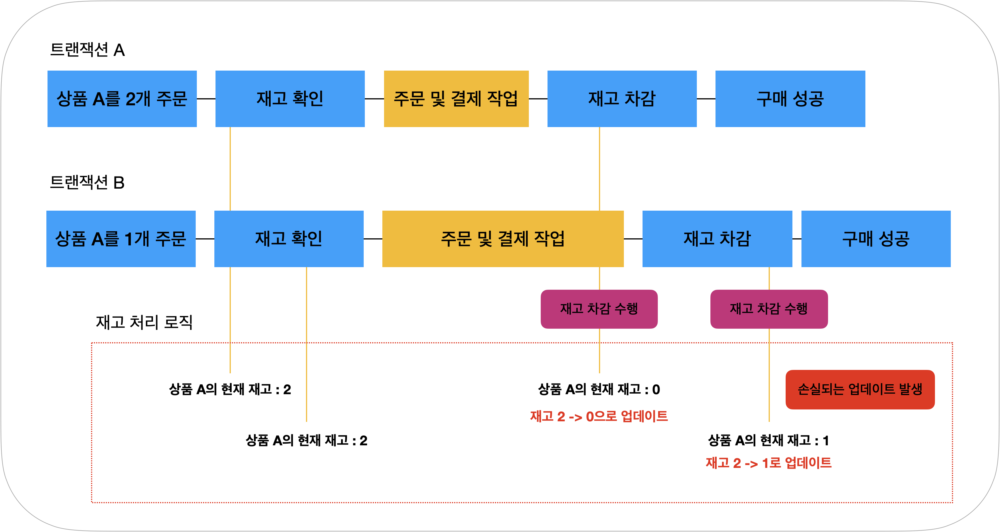
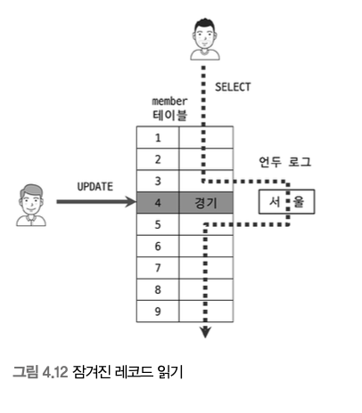
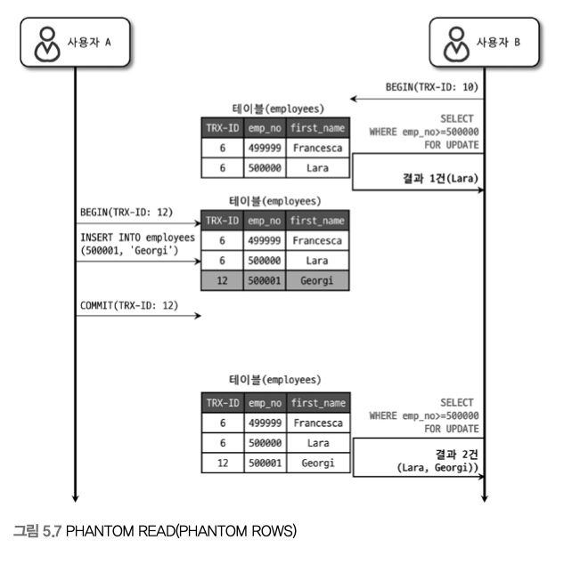
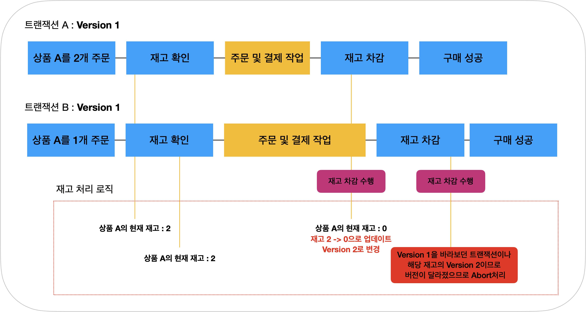
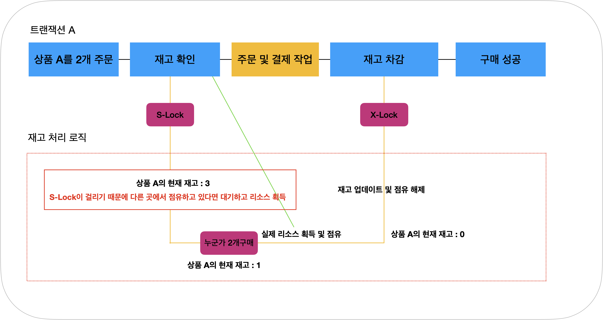
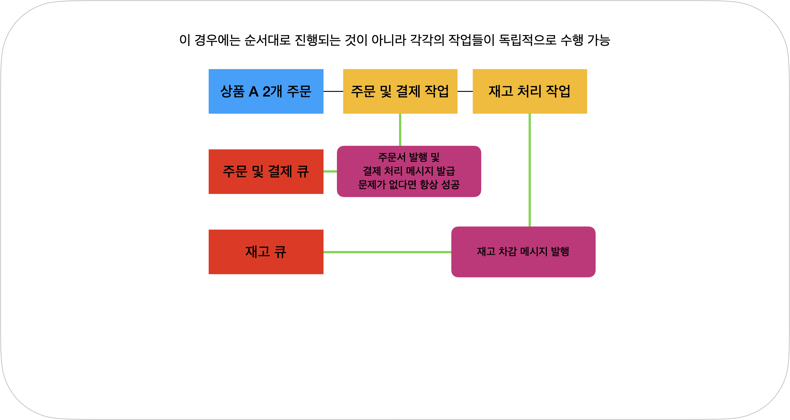
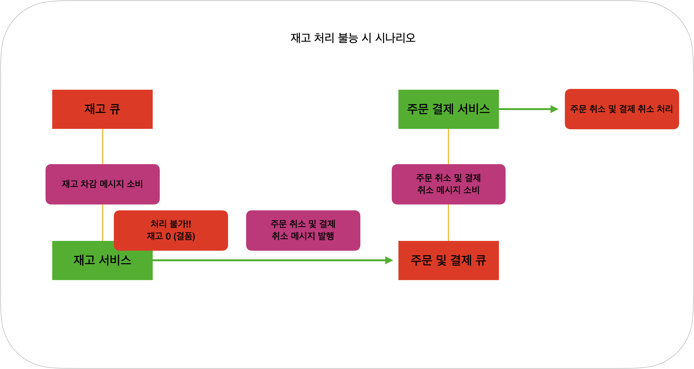
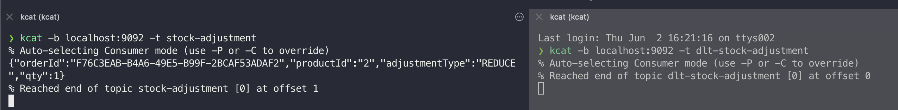
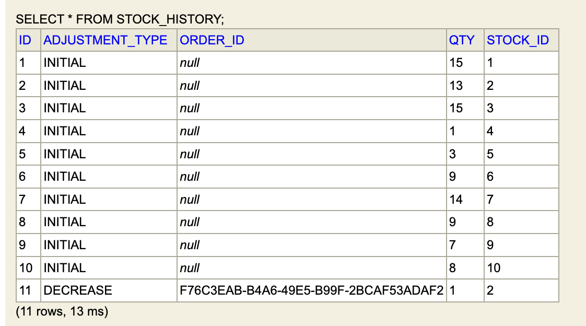
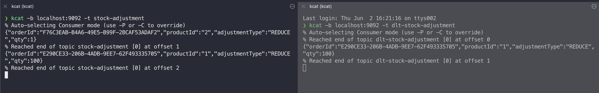

```toc
```

# 개요

사실 분산트랜잭션[^1]과 아직 MSA[^2]에 대해서는 모르는 부분이 너무나 많다.

이 글을 쓰게된 이유는 주문 <-> 재고 서비스 간의 동시성 제어(Concurrency Control)[^3]관련해서 궁금한 점이 생겼고 실제로 이 상황에서 어떻게 처리할 수 있을지 궁금해져서 찾게 되었다.

그러다가 어쩌다 보니 분산 트랜잭션을 구현한 아티클을 보게 되었다. 

[REST 기반의 간단한 분산 트랜잭션 구현](https://github.com/YooYoungmo/article-tcc)라는 글이였고, 작성자인 유영모님께서 아주 자세한 설명이 담긴 아티클과 예제 코드를 공유를 해주셔서 이를 기반으로 설명해보고자 한다. 

대부분의 내용은 오히려 유영모님의 TCC 패턴 시리즈 글을 보는 것이 도움이 될 것이라고 생각한다. 

1. [REST 기반의 간단한 분산 트랜잭션 구현 - 1편](https://www.popit.kr/rest-%EA%B8%B0%EB%B0%98%EC%9D%98-%EA%B0%84%EB%8B%A8%ED%95%9C-%EB%B6%84%EC%82%B0-%ED%8A%B8%EB%9E%9C%EC%9E%AD%EC%85%98-%EA%B5%AC%ED%98%84-1%ED%8E%B8/)
2. [REST 기반의 간단한 분산 트랜잭션 구현 - 2편 (TCC Cancel, Timeout)](https://www.popit.kr/rest-%EA%B8%B0%EB%B0%98%EC%9D%98-%EA%B0%84%EB%8B%A8%ED%95%9C-%EB%B6%84%EC%82%B0-%ED%8A%B8%EB%9E%9C%EC%9E%AD%EC%85%98-%EA%B5%AC%ED%98%84-2%ED%8E%B8-tcc-cancel-timeout/)
3. [REST 기반의 간단한 분산 트랜잭션 구현 - 3편 TCC Confirm(Eventual Consistency)](https://www.popit.kr/rest-%EA%B8%B0%EB%B0%98%EC%9D%98-%EA%B0%84%EB%8B%A8%ED%95%9C-%EB%B6%84%EC%82%B0-%ED%8A%B8%EB%9E%9C%EC%9E%AD%EC%85%98-%EA%B5%AC%ED%98%84-3%ED%8E%B8-tcc-confirmeventual-consistency/)
4. [REST 기반의 간단한 분산 트랜잭션 구현 - 4편 REST Retry](https://www.popit.kr/rest-%EA%B8%B0%EB%B0%98%EC%9D%98-%EA%B0%84%EB%8B%A8%ED%95%9C-%EB%B6%84%EC%82%B0-%ED%8A%B8%EB%9E%9C%EC%9E%AD%EC%85%98-%EA%B5%AC%ED%98%84-4%ED%8E%B8-rest-retry/)

이렇게 잘 설명된 글이 존재하는데 나는 어떤 글을 쓸 것인지 궁금해할 것이다. 

이번에 내가 다루고자하는 내용은 아래와 같다.

1. 동시성 문제가 발생한 이유
2. 해결 방법
3. 분산 트랜잭션은 무엇인지
4. 메시지를 소비할 수 없는 상황에서 처리할 수 있는 방법

어려운 내용이다보니 틀린 내용이 많을 수도 있다. 
이 부분 감안하고 봐주시면 좋을 것 같다. 

# 동시성 문제 해결 전략 - 스프링으로 구현한 TCC패턴

+ STEP 1. 주문 <-> 재고 서비스에서의 동시성 문제
    + STEP 1.1 동시성 문제 해결 전략
      + STEP 1.1.1 낙관적 락(Optimistic Lock)
      + STEP 1.1.2 비관적 락(Pessimitic Lock)
      + STEP 1.1.3 단일쓰레드 메시지 큐 도입
+ STEP 2. 분산 트랜잭션(Distributed Transaction)이란? 
+ STEP 3. 카프카를 사용한 TCC 패턴 적용
  + STEP 3.1 최종적 일관성(Eventaul Consistency)란? 
  + STEP 3.2 스프링 카프카 예외 처리 및 재시도 매커니즘
+ STEP 4. REFERENCE

## STEP 1. 주문 <-> 재고 서비스에서의 동시성 문제

이커머스 시스템을 단순화해서 생각해보자. 실제 비지니스 환경에서는 아래와 같이 진행될 것이다. 

1. 사용자가 장바구니 담음 
2. 사용자 결제 요청 
3. 주문서 데이터 생성
4. 재고 처리
5. 결제 처리

여기 흐름에서 궁금한 점은 만약 재고 처리하는 도중에 결품인 것을 확인된다면? 결제는 성공했는데 어떻게 처리할지 등이 궁금할 것이다.

일단 이를 이해하기 앞 서 간단하게 주문 재고 서비스를 만든다고 가정하자.

그렇다면, 주문이 되면 재고 서비스에 해당 상품의 재고값을 업데이트하는 식으로 처리할 수 있을 것이다. 

하지만, 멀티쓰레드 환경에서 하나의 상품에 대해서 다량의 주문 요청이 들어올 경우에 갱신분실(Lost Update) 문제가 발생 할 수 있다.

예시 시나리오를 한번 봐보자. 

<p align="center">
    
</p>
<p align="center">
    <em>그림 1. 갱신 분실</em>
</p>


위의 그림처럼 **트랜잭션 A가 트랜잭션 B** 전에 미리 처리가 된다면, 재고 값을 2에서 1로 업데이트하려고 하기 때문에 갱신 분실이 발생한다. 

이를 해결하는 방법은 여러가지가 있을 것이다. 그 중에서 낙관적 락(Optimistic Lock)[^4], 비관적 락(Pessimistic Lock)[^5]이 대표적일 것이다.

이번 챕터에서는 이러한 처리 방법의 장단점을 알아보고 메시지 큐를 통해서 처리하는 방법등을 알아보고자 한다. 

## STEP 1.1 동시성 문제 해결 전략
### STEP 1.1.1 낙관적 락(Optimistic Lock)

먼저, 낙관적 락이다.

낙관적 락은 MVCC(Multi Version Concurrency Control)[^6]처럼 버전을 명시하는 방식이다.
이를 위해서 먼저, MVCC에 대해서 간략하게 이해를 하고 넘어가야할 필요가 존재한다.

DB 벤더는 Mysql 기준으로 설명하도록 하겠다. 

MVCC는 Mysql InnoDB 스토리지 엔진 사용 시 언두로그를 활용하여 레코드 마다 여러개의 버전(Multi Version)을 동시에 관리하는 것을 뜻한다.

이를 통해서 Mysql은 잠금없는 일관된 읽기(Non-Locking Consistent Read)를 구현한다.
용어가 어려울 수 있는데 INSERT와 연결되지 않은 순수한 읽기는 다른 트랜잭션의 작업과 관계없이 항상 잠금을 대기하지 않고 읽는다는 뜻이다. 

즉, 어떤 트랜잭션에서 서울이라는 값을 경기로 업데이트 한 후 아직 커밋을 안했더라도 변경 전 값인 '서울'을 언두로그에 읽어서 일관되게 읽게끔 하는 방식이다.

<p align="center">
    
</p>
<p align="center">
    <em>Real MySQL 8.0, p.103, 백은빈, 이성욱 저</em>
</p>

낙관적 락은 MVCC와 비슷하게 처리된다. 버전을 통해서 위의 상황같이 동시에 작업이 들어와도 Version이 다를 경우에는 트랜잭션이 어보트되서 갱신분실을 막을 수가 있다. 

MVCC와 낙관적 락의 어떻게 보면 문제 해결 전략자체는 비슷하다고 볼 수 있으나 MVCC는 언두 레코드 자체에 잠금을 걸 수 없는 문제가 있어서 순수한 읽기가 아닌 `SELECT ~ FOR UPDATE` 와 같은 구문에는 원본 레코드의 값을 가져와서 팬텀 리드가 발생할 수 있다. 

아래와 비슷하게 처리된다고 볼 수 있다. 

<p align="center">
    
</p>
<p align="center">
    <em>Real MySQL 8.0, p.182, 백은빈, 이성욱 저</em>
</p>

그렇다면 낙관적 락은 어떻게 처리되는가? 
실제로 버전 컬럼이 존재하고, 이 버전을 토대로 트랜잭션이 진행되는데 먼저 진행된 트랜잭션으로 인해 버전이 변경되었고, 다음 트랜잭션은 이전 버전을 기준으로 수행 되기때문에 이 트랜잭션은 어보트된다. 

<p align="center">
    
</p>
<p align="center">
    <em>그림 2. 낙관적 락</em>
</p>


낙관적 락은 이름 그대로 낙관적인 락킹방법이다. 
> 먼저 자원에 락을 걸어서 선점하지말고 충돌 날 때 처리하자

라는 **낙관적인** 방법론에서 탄생한 기법이라고 볼 수 있다. 

그렇다면 이 낙관적 락으로 처리를 못할 케이스도 존재할까? 

위에서 설명한 흐름을 다시 가져와보자.

1. 사용자가 장바구니 담음 
2. 사용자 결제 요청 
3. 주문서 데이터 생성
4. 재고 처리
5. 결제 처리

결제 요청 후에 재고 처리할 때, 만약 결제 처리가 API를 통해서 이뤄진다면 이 순서대로 이뤄지는 것이 아닐 수도 있다. 즉, 이미 결제가 성공된부분은 어떻게 처리할 것인가? 에 대한 문제가 존재한다. 

이를 위해 원자적으로 프로세스를 순차적으로 처리하는 방식을 쓸 수 있다. 
이 때 사용할 수 있는 것이 비관적 락이다.

### STEP 1.1.2 비관적 락(Pessimitic Lock)

비관적 락은 말 그대로 직접 락을 걸어서 하나의 작업만 처리되게끔 보장하는 것이다.
하지만, 락을 직접 걸기 때문에 만약 고객들이 몰리는 상황에서는 느린 주문 경험을 사용자가 얻게 될 것이다.

<p align="center">
    
</p>
<p align="center">
    <em>그림 3. 비관적 락</em>
</p>


그렇다면 이 비관적 락처럼 하나의 작업만 처리하지만 보다 빠르게 처리할 수 없는 방법이 없을까? 

바로, 단일 쓰레드 메시지 큐(Redis와 같은 것들)을 도입함으로써 해결 할 수 있다. 

### STEP 1.1.3 단일 쓰레드 메시지 큐 도입

Redis가 6.0 부터 Thread I/O를 제공하여 멀티쓰레드로 돌아가나? 라고 생각할 수 있지만 대부분의 명령들은 메인쓰레드(싱글쓰레드)에서 동작을 한다. 

따라서, 원자적인 작업을 지원한다. 또한, 단일 쓰레드여서 불필요한 락이나 컨텍스트 스위칭과 같은 부분에 대해서 고려하는 점이 최소화되다보니 비관적 락을 쓰는거보다 빠르게 처리할 수 있다. 

<p align="center">
    
</p>
<p align="center">
    <em>그림 4. 단일 쓰레드 메시지 큐</a></em>
</p>


그래서 최종적으로 아래와 같은 흐름대로 처리할 수 있다. 

1. 사용자가 장바구니 담음 
2. 사용자 결제 요청 
3. 주문서 데이터 생성 및 큐에 적재
4. 결제 처리 & 재고 처리 (각각 따로 처리)
5. 결품이 발생하면 해당 주문서를 취소처리

<p align="center">
    
</p>
<p align="center">
    <em>그림 5. 단일 쓰레드 메시지 큐 - 실패 시나리오</a></em>
</p>

이러한 방식으로도 접근 할 수 있다고 생각한다. 

기본적으로 어떤 방식으로 주문 <-> 재고 서비스 간에서 동시성 제어를 할 수 있는지 알아보았다. 

서론에서도 말했지만, 틀린 내용이 존재할 수 있다고 생각하니 이 부분 양해바란다.

위 방식은 어떻게 보면 최종적 일관성과 분산 트랜잭션 방식을 사용한 것인데 각각 서비스들이 분산된 환경에서 이 트랜잭션들을 처리하는 방법을 알기 위해 분산 트랜잭션과 최종적 일관성에 대해 알아보고자 한다.

## STEP 2. 분산 트랜잭션(Distributed Transaction)이란? 

이 부분은 [DDIA(Designing Data-Intensive Applications, 데이터 중심 어플리케이션 설계)](https://dataintensive.net/)라고 부르는 책의 9장을 많이 참고하였다. 

처음에 분산 트랜잭션을 이해할 때는 DB가 분산되어 있는 상황에서 해당 트랜잭션을 관리하는 것으로 알고 있었다. 

그러나 수 많은 예시들 TCC패턴이나 사가(Saga)패턴을 보면 메시지를 발급해서 커밋 롤백 처리를 하는 것도 보았다. 

정확한 예시는 이 책을 보고 알게되었는데 크게 분산 트랜잭션은 두 가지로 분류된다.

1. 데이터베이스 내부 분산 트랜잭션 
  + 어떤 분산 데이터베이스(복제나 파티셔닝을 사용하는)는 데이터베이스 노드 사이의 내부 트랜잭션을 지원한다. 이 경우 트랜잭션에 참여하는 모든 노드는 동일한 데이터베이스 소프트웨어를 실행한다. (즉 전자의 예시)

2. 이종 분산 트랜잭션 
  + 두 가지 다른 벤더의 데이터베이스 혹은 카프카와 레디스와 같은 메시지 큐와 데이터베이스 사이의 트랜잭션 등으로 구성된 환경에서의 트랜잭션 (후자의 예시)

이번에 주로 다룰 내용은 이종 분산 트랜잭션이다.
메시지 큐를 통해서 재고차감 메시지를 발급하고 이를 컨슘하는 시스템이라 보면 될 것 같다. 

이제 이에 대해서 설명하고자 한다. 

# STEP 3. 카프카를 사용한 TCC 패턴 적용
## STEP 3.1 최종적 일관성(Eventaul Consistency)란? 

이 부분은 서두에서 말한 것과 같이 대부분의 코드와 매커니즘을 유용모님께서 작성한 컬럼에서 가져왔다. 원래 이 코드 자체에도 주문, 재고, 결제 서비스가 존재하지만 나는 여기서 주문, 재고 서비스만 가져왔다. 

자세한 부분은 [REST 기반의 간단한 분산 트랜잭션 구현](https://github.com/YooYoungmo/article-tcc)을 참고하자.

여기서 중점적으로 볼 사항은 **최종적 일관성(Eventual Consistency)**[^7]이다.

위에서 말한거처럼 만약, 각각 서비스들이 외부 API로 처리될 경우에 결제가 실패할 경우에는 재고를 다시 늘려줘야하고, 결제가 성공했으나 결품일 경우에는 결제 취소를 해줘야할 것이다. 

<p align="center">
    
</p>
<p align="center">
    <em><a href="https://www.popit.kr/rest-%EA%B8%B0%EB%B0%98%EC%9D%98-%EA%B0%84%EB%8B%A8%ED%95%9C-%EB%B6%84%EC%82%B0-%ED%8A%B8%EB%9E%9C%EC%9E%AD%EC%85%98-%EA%B5%AC%ED%98%84-3%ED%8E%B8-tcc-confirmeventual-consistency/">REST 기반의 간단한 분산 트랜잭션 구현, 유영모, 2018</a></em>
</p>

이때 카프카와 같은 메시지 브로커를 둬서 처리할 수가 있다. 최종적 일관성에 대한 내용도 본문에 존재하지만, 여기서도 간략하게 설명하자면 분산 시스템 환경에서는 일관성이 일시적으로 깨질 수 있는 상황들이 존재한다. 

단일 시스템 환경에서는 강력한 트랜잭션으로 묶어서 관리가 되기때문에 **강한 일관성(Strong Consistency)** 으로 묶일 수 있다. 

하지만, 분산 시스템에서는 이렇게 강한 일관성을 유지하려면 확장성과 성능의 문제가 생긴다. 
아래의 그림을 참고해보자. 

<p align="center">
    
</p>
<p align="center">
    <em><a href="https://cloud.google.com/datastore/docs/articles/balancing-strong-and-eventual-consistency-with-google-cloud-datastore?hl=ko">Conceptual Depiction of Replication with Strong Consistency, Google Cloud</a></em>
</p>

강한 일관성은 어떤 데이터를 최신 데이터로 복제를 수행할 때 항상 최신값을 유지하지만 복제가 완료될 동안에는 클라이언트가 접근을 할 수 없는 문제가 발생한다. 

그에 반해 최종적 일관성의 흐름은 아래와 같다. 

<p align="center">
    
</p>
<p align="center">
    <em><a href="https://cloud.google.com/datastore/docs/articles/balancing-strong-and-eventual-consistency-with-google-cloud-datastore?hl=ko">Conceptual Depiction of Replication with Eventual Consistency, Google Cloud</a></em>
</p>

최신 값이 복제 중이지만 클라이언트는 오래된 값을 볼 수가 있다. 이렇게 함으로써 보다 유연한 확장이 가능하고, 성능도 어느정도 확보를 할 수 있다. 

위의 아티클에도 설명이 되어있지만, **최종적 일관성은 몇 명이 좋아요를 눌렀는지?** 와 같은데에서 사용할 수 있고, 강한 일관성은 **게이머가 한 전투 세션에서 획득한 경험치**와 같은 것으로 볼 수 있다.

즉, 적절한 트레이드 오프가 필요하고, 분산 환경에서는 성능과 확장성 때문에 이러한 최종적 일관성을 적절하게 수용하고 있다고 볼 수 있다.

**결국 지금은 일관성이 깨졌지만, 언젠가는 일관성이 맞춰진다**는 것이 최종적 일관성의 모토라고 볼 수 있을 것같다.

이를 실제 비즈니스 세계에 대입을 하면 요즘날 구독 서비스라고 볼 수도 있을 것 같다. 
유영모님도 나와 비슷한 경험을 원문에 적어두었는데 내가 겪은 최종적 일관성의 경험은 스포티파이를 이용하면서 였다. 

원래 결제되던 카드의 만료기한이 다되었고 귀찮아서 변경을 안했는데 계속 결제 재시도와 이메일로 알림이 왔었다. 하지만 서비스는 계속 되길래 그냥 썼었는데 어느 순간 재시도도 멈췄고 서비스 자체도 이용을 못하게 막았다. 그 후에 내가 다시 새로운 카드로 결제를 해서 서비스를 이용할 수 있었다. 

즉, 이 사용자가 결제가 제대로 이뤄지진 않았지만 언젠가 다시 결제를 하겠지라는 개념이라 볼 수 있고, 이것이 최종적 일관성이 아닐까 생각이 든다. 

아무튼, 위와 같이 카프카를 둬서 최종적 일관성을 유지할 수 있게끔 처리를 하였다고 볼 수 있다. 

하지만 기존 코드에서는 아쉽게도 서비스 단에서 잘못된 메시지가 발급될 경우에 대한 처리가 되어있지는 않았다. (현 재고보다 많은 수량의 주문이 요청이 오면 -로 재고가 잡혀버린다.)

이 부분을 어떻게 처리할까 궁금했고, 사실 대부분의 코드는 비슷하고 이러한 처리 부분만 변경했다고 볼 수 있다고 생각한다. 

이제 이 부분에 대한 내용을 끝으로 이 포스팅을 마무리 지으려고 한다. 

## STEP 3.2 스프링 카프카 예외 처리 및 재시도 매커니즘

카프카와 같은 메시지브로커에는 데드레터 큐[^8]라는 개념이 존재한다. 
이는 올바르게 처리되지 못한 메시지를 저장하기 위한 큐라고 볼 수 있다.

즉, 올바르게 처리되지 못한 메시지를 데드레터라고 볼 수 있다. 

이를 테면, 우리 서비스에는 원래 적용되지 않았던 가용 재고보다 많은 재고의 요청 메시지가 제공된다면 이는 익셉션을 발생시킬 것이다. 이를 단순하게 커밋을 처리할 수 있지만, 이를 바로 커밋하기 보다는 데드레터 큐에 발급해서 로그를 남기는 용도로도 활용할 수 있을 것이다. 

또한, 네트워크 순단이나 기타 등의 문제로 올바른 메시지여도 처리를 못하는 케이스들이 존재할 것이다. 
이를 위해서 백오프를 둬서 재시도를 처리해야하고, 이때 처리가 안된다면 데드레터 큐로 옮기는 것이 올바를 것이다.

정리를 하자면 아래와 같을 것이다. 

1. 카프카에서 재고 차감 요청 발급
2. 네트워크 순단 혹은 잘못된 요청이 들어온 경우 익셉션이 발생
3. 백오프 처리
4. 백오프 처리까지 못한 경우 데드레터 큐에 발급

참고로, [Kafka Consumer retry 및 deadletter 처리 방법](https://daddyprogrammer.org/post/15087/kafka-consumer-retry-deadletter/)와 같은 좋은 아티클이 존재하였지만, 스프링 카프카 버전이 올라감에 따라 `retryTemplate` 과 `recoveryRollback` 등의 기능들이 _deprecated_ 되었다. 

이 예제의 버전 기준은 `spring-kafka 2.8.5` 라고 말씀드릴 수 있다. 

먼저, `KafkaListener`에 사용할 `ContainerFactory`의 설정이 필요하다. 

```java
... 중략 ...
    @Bean
    public KafkaListenerContainerFactory<ConcurrentMessageListenerContainer<String, String>> kafkaListenerContainerFactory() {
        ConcurrentKafkaListenerContainerFactory<String, String> factory = new ConcurrentKafkaListenerContainerFactory<>();
        factory.setConsumerFactory(consumerFactory());
        factory.setCommonErrorHandler(kafkaListenerErrorHandler());
        factory.getContainerProperties().setAckMode(AckMode.MANUAL_IMMEDIATE);
        return factory;
    }

    @Bean
    public CommonErrorHandler kafkaListenerErrorHandler() {
        DefaultErrorHandler defaultErrorHandler = new DefaultErrorHandler(
            new DeadLetterPublishingRecoverer(template, DEAD_TOPIC_DESTINATION_RESOLVER),
            new FixedBackOff(1000, 3));

        defaultErrorHandler.setCommitRecovered(true);
        defaultErrorHandler.setAckAfterHandle(true);
        defaultErrorHandler.setResetStateOnRecoveryFailure(false);

        return defaultErrorHandler;
    }

    private ConsumerFactory<String, String> consumerFactory() {
        return new DefaultKafkaConsumerFactory<>(this.properties.buildConsumerProperties());
    }
... 중략 ...
```

이 설정 부분에서 컨테이너 팩토리에 `CommonErrorHandler`와 `ConsumerFactory`를 주입해준 것을 볼 수 있다. 또한, `AckMode.MANUAL_IMMEDIATE`로 두었는데 이는 [committing-offsets](https://docs.spring.io/spring-kafka/reference/html/#committing-offsets) 부분에 자세히 나와있다. 

각 옵션의 값은 아래와 같다. 

+ Spring Kafka 수동 커밋 옵션 설명

| 구분             | 내용                                                                                                   |
|------------------|--------------------------------------------------------------------------------------------------------|
| RECORD           | 리스너가 오프셋 처리 후 반환 시 커밋                                                                   |
| BATCH            | poll()에 의해 반환된 모든 레코드가 처리되면 오프셋을 커밋 (enable.auto.commit = false 시 기본 값)      |
| TIME             | poll()에 의해 반환된 모든 레코드가 처리되고, 마지막 커밋 이후의 ackTime이 초과되면 오프셋을 커밋       |
| COUNT            | poll()에 의해 반환된 모든 레코드가 처리되고, 마지막 커밋 이후의 ackCount 레코드를 받으면 오프셋을 커밋 |
| COUNT_TIME       | TIME 및 COUNT와 유사하지만 두 조건 중 하나가 true인 경우 커밋                                          |
| MANUAL           | 메시지 리스너에서 acknowledge()로 처리됨을 알리며, 그 후 BATCH와 동일한 의미가 적용. (poll() 처리 이후에 커밋이 된다.)                    |
| MANUAL_IMMEDIATE | 리스너에서 Acknowledgement.acknowledge() 메서드를 호출하면 즉시 오프셋을 커밋. (poll()의 모든 레코드가 아니라 단일 레코드 커밋)                         |

따라서, 메시지가 요청이 들어올 때마다 `Acknowledgement.acknowledge()` 을 호출해서 직접 커밋을 수행한다.  `ConsumerFactory`는 빌드 설정값을 받아서 컨슈머 팩토리를 만드는 부분이다.

예외 처리의 핵심은 `factory.setCommonErrorHandler(kafkaListenerErrorHandler());` 부분이다.
이 메서드만 따로 때서 다시 봐보자.

+ kafkaListenerErrorHandler()

```java
@Bean
    public CommonErrorHandler kafkaListenerErrorHandler() {
        DefaultErrorHandler defaultErrorHandler = new DefaultErrorHandler(
            new DeadLetterPublishingRecoverer(template, DEAD_TOPIC_DESTINATION_RESOLVER),
            new FixedBackOff(1000, 3));

        defaultErrorHandler.setCommitRecovered(true);
        defaultErrorHandler.setResetStateOnRecoveryFailure(false);

        return defaultErrorHandler;
    }
```

여기서 `DefaultErrorHandler`를 만들 때, `DeadLetterPublishingRecoverer`와 `FixedBackOff`를 설정하는 것을 볼 수 있다. 

이 코드가 위에서 말한 예외처리의 핵심 코드이다. 

`DeadLetterPublishingRecoverer`는 `KafkaTemplate`과 `BiFunction` 을 주입받을 수 있다.
위에서 나온 코드의 `DEAD_TOPIC_DESTINATION_RESOLVER`는 아래와 같다.

```java
public static final BiFunction<ConsumerRecord<?, ?>, Exception, TopicPartition>
        DEAD_TOPIC_DESTINATION_RESOLVER = (cr, e) -> {
            log.error("[Send to dead letter topic]: {} - [Exception message] : {}" , cr.topic(), e);
            return new TopicPartition("dlt-" + cr.topic(), cr.partition());
        };
```

`DeadLetterPublishingRecoverer`뒤에 인자가 없을 경우에는 기본 값으로 설정되서 아래의 값으로 세팅된다.

```java
private static final BiFunction<ConsumerRecord<?, ?>, Exception, TopicPartition>
		DEFAULT_DESTINATION_RESOLVER = (cr, e) -> new TopicPartition(cr.topic() + ".DLT", cr.partition();
```

나는 여기서 로깅과 데드레터큐의 토픽네임을 변경하기 위해 커스텀했다고 보면 될 것 같다. 
DeadLetterPublishingRecoverer는 말 그대로 데드레터를 발급하는 리커버러(복구자)라고 볼 수 있을 것 같다. 

아마 스프링 카프카 도메인에서 `Recoverer`는 메시지를 처리하는 중에 어떠한 문제가 발생했을 때 복구하는 용도로 사용되는 것 같다.

그리고 백오프를 볼 차례인데 `new FixedBackOff(1000, 3)` 와 같이 두었는데 `FixedBackOff`는 말 그대로 고정값 백오프를 처리하는 객체이다. 나는 1초마다 최대 3번의 재시도를 하게끔 두었다.

백오프 중에서는 지수 백오프(Exponential Backoff)[^9]도 많이 사용하니 참고해보자.

스프링 카프카에서는 지수 백오프를 [ExponentialBackOffWithMaxRetries](https://docs.spring.io/spring-kafka/docs/current/api/org/springframework/kafka/support/ExponentialBackOffWithMaxRetries.html) 객체를 활용하여 구현할 수 있다.


그 후에 에러 핸들러의 옵션들에 대해서는 다음과 같다.

1. defaultErrorHandler.setCommitRecovered(true)
    + 리커버리가 되면 오프셋 커밋 처리
2. defaultErrorHandler.setResetStateOnRecoveryFailure(false) 
    + 복구 실패한 메시지에 대해서 다음 시도에 재시도할 건지? (서비스 재부팅이 잦은 개발환경에서는 끄는게 마음이 편한듯)

자세한 코드는 [BrewageBear - tcc-pattern-example](https://github.com/brewagebear/blog-example/tree/main/tcc-pattern-example)을 확인해보고 실행을 해보자. 


먼저, 해당 프로젝트 폴더로 진입 후에 `cd infrastructure && docker-compose up -d` 명령어를 치자
그렇다면, 아래와 같이 제대로 카프카 클러스터가 뜨는 것을 확인할 수 있다.

다음에는 `order-service` 와 `stock-service`를 실행한다. 
`stock-service`는 카프카 클러스터가 안뜬 상황이면 계속해서 에러로그를 내뿜을 것이다. 

그 이후에는 이제 `sample` 폴더로 들어가서 요청을 직접 수행해보자.
실제 확정 처리는 아래와 같이 요청 값에 따라서 id를 주어서 처리할 수 있다.

```sh
PUT http://localhost:8888/api/v1/stocks/{재고 확정 요청 id}
Content-Type: application/json
```

+ 정상적인 요청

```sh
POST http://localhost:8887/api/v1/orders
Content-Type: application/json

{
  "orderId": "1",
  "productId": "2",
  "qty": 1,
  "paymentAmt": 1
}
```

<p align="center">
    
</p>
<p align="center">
    <em>그림 6. 재고 차감 확정이 정상적으로 처리 된 경우 - 카프카</a></em>
</p>


위의 그림과 같이 `dlt-stock-adjustment` 토픽에는 메시지가 생성이 안됐고, 오프셋 커밋이 정상적으로 처리됨을 볼 수 있다. 

<p align="center">
    
</p>
<p align="center">
    <em>그림 7. 재고 차감 확정이 정상적으로 처리 된 경우 - 데이터베이스</a></em>
</p>

또한, DB에도 정상적으로 재고 처리되었음을 확인할 수 있다.


+ 비정상적인 요청 

<p align="center">
    
</p>
<p align="center">
    <em>그림 8. 재고 차감 확정이 비정상적으로 처리 된 경우 - 데드레터 발급</a></em>
</p>

위의 그림과 같이 `dlt-stock-adjustment` 토픽에 비정상적인 메시지가 생성됐고, 오프셋 커밋이 정상적으로 처리됨을 볼 수 있다. 

이때, 비정상적인 요청은 오프셋을 커밋을 하는 이유는 데드레터 큐에 이미 발급을 했기 때문에 커밋처리를 한다.

자세한 매커니즘은 `SeekUtils.seekOrRecover()`의 내부 메서드의 흐름을 파악해보면 알 수 있을 것이다.
이로써 간단하게 카프카 사용 시에 위와 같은 에러 처리 시에 데드레터로 처리하는 방법을 알아 보았다.

# 결론

동시성 문제의 발생원인부터 어떻게하면 이를 처리할 수 있는지에 대한 각각의 매커니즘과 분산 트랜잭션까지 알아보았다. 그리고 분산 트랜잭션에서 카프카를 사용할 때 서비스레이어 단에서 익셉션이 발생한 경우에 데드레터까지 처리하는 방법을 알아보았다. 

추가로 이 예제를 좀 더 발전 시켜서 배치를 붙여볼까 생각중이다. 

포스팅이 언제가 될지 모르기 때문에 위와 관련된 내용이 궁금하신 분들은 아래의 아티클을 추천한다.
[Exceptions and Retry Policy in Kafka](https://blog.devgenius.io/exceptions-and-retry-policy-in-kafka-6f0d3cf2c330) 카프카 어플리케이션에서 발생할 수 있는 에러들의 정의와 데드레터 등 다양한 내용을 담고 있다. 

이 중에서 내가 다음에 배치를 붙여서 작업할 내용은 

<p align="center">
    
</p>
<p align="center">
    <em><a href="https://blog.devgenius.io/exceptions-and-retry-policy-in-kafka-6f0d3cf2c330">Exceptions and Retry Policy in Kafka, Victor Alekseev, 2021</a></em>
</p>

위의 그림 중에 딜레이가 발생한 메시지나 실패한 메시지를 배치 처리를 통해서 재시도하는 처리를 해보려고 한다. 

긴 글인데 읽어주셔서 감사합니다.


# 레퍼런스

1. [동시성 문제 - 비즈니스 애플리케이션 (Part 3)](http://jaynewho.com/post/44)
2. [Eventual Data Consistency Solution in ServiceComb - part 3](https://servicecomb.apache.org/docs/distributed_saga_3/)
3. [Kafka Consumer retry 및 deadletter 처리 방법](https://daddyprogrammer.org/post/15087/kafka-consumer-retry-deadletter/)
4. [Exceptions and Retry Policy in Kafka](https://blog.devgenius.io/exceptions-and-retry-policy-in-kafka-6f0d3cf2c330)

[^1]:[Distributed transaction](https://en.wikipedia.org/wiki/Distributed_transaction)
[^2]:[Microservices](https://en.wikipedia.org/wiki/Microservices)
[^3]:[Concurrency Control](https://en.wikipedia.org/wiki/Concurrency_control)
[^4]:[Optimistic Concurrency Control](https://en.wikipedia.org/wiki/Optimistic_concurrency_control)
[^5]:[Database locks - Pessimistic locking](https://en.wikipedia.org/wiki/Lock_(computer_science))
[^6]:[Multiversion Concurrency Control](https://en.wikipedia.org/wiki/Multiversion_concurrency_control)
[^7]:[Eventual Consistency](https://en.wikipedia.org/wiki/Eventual_consistency)
[^8]:[Dead Letter Queue](https://en.wikipedia.org/wiki/Dead_letter_queue)
[^9]:[Exponential Backoff](https://en.wikipedia.org/wiki/Exponential_backoff)