```toc
```
# 개요
이전 포스팅 [시스템 콜과 자바에서의 시스템 콜 사용례](https://brewagebear.github.io/java-syscall-and-io/) 에서는 시스템 콜이 어떤 것이고, 자바에서 시스템 콜이 주로 발생하는 IO 처리에 대해서 알아보았다. 

이번 시간에는 이전 포스팅에서 다뤘던 문제점들을 자바 NIO가 어떻게 해결하였고, 더 나아가 멀티플렉싱 I/O를 자바에서 어떻게 구현할 수 있는지 알아보고자 한다. 

그리고 결론으로 블록킹 I/O와 논블록킹 I/O를 만든 채팅 어플리케이션 샘플을 보면서 I/O 모델에 대해서 간략히 설명하고자 한다.

이전 장에 내용을 간략히 복습하자면, 자바 I/O가 느린 고질적인 문제에 대해서 운영체제 수준의 기술(Native I/O)로 향상시킬 수 있다고 하였다. 그러한 기술들을 5가지로 분류하면 다음과 같았다.

1. 버퍼
2. Scatter/Gather
3. 가상메모리
4. 메모리 맵 파일
5. 파일 락

이렇게 볼 수가 있다. 이제 실제로 NIO에서 위의 기술들을 어떻게 활용하는지 알아보고자 한다.

# 자바 NIO의 동작원리 및 IO 모델
+ STEP 1. 바이트 버퍼(ByteBuffer) 
+ STEP 2. 채널(Channel)
    + STEP 2.1 ScatteringByteChannel, GatheringByteChannel
    + STEP 2.2 FileChannel
    + STEP 2.3 SocketChannel
+ STEP 3. 셀렉터(Selector)
    + STEP 3.1 기존의 네트워크 프로그래밍 모델의 단점
    + STEP 3.2 셀렉터의 구조와 동작원리
        + STEP 3.2.1 SelectableChannel(셀렉터블 채널)
        + STEP 3.2.2 SelectionKey(셀렉션 키)
        + STEP 3.2.3 Selector(셀렉터)
+ STEP 4. I/O 모델 및 간단한 채팅 어플리케이션 예제 

## STEP 1. 바이트 코드(ByteBuffer)
Buffer에 대한 사용법은 많은 블로그나 인터넷 도처에 널려있으니 구글링을 통해서 학습을 추천한다. 그 중에서 볼만하다고 여겨지는 것은 [Java NIO Buffer](http://tutorials.jenkov.com/java-nio/buffers.html) 라는 아티클이다.

여기서는 바이트버퍼( `ByteBuffer`)에 대해서만 설명하고자 한다.

**왜 바이트버퍼만 다루려고하는 것인가?** 

> 바이트버퍼가 시스템 메모리를 직접 사용하는 다이렉트 버퍼를 만들 수 있는 버퍼 클래스이기 때문이다.  

그렇다면 **왜? 바이트버퍼만 다이렉트 버퍼로 만들 수 있게 되었을까?**

> 운영체제가 이용하는 가장 기본적인 데이터 단위가 바이트고, 시스템 메모리 또한 순차적인 바이트들의 집합이기 때문이다.  

우리는 해당 메서드를 통해서 기존 `allocate()`  통해서 버퍼를 생성하는 것과 같이 다이렉트 버퍼를 만들 수 있다.

<p align="center">
    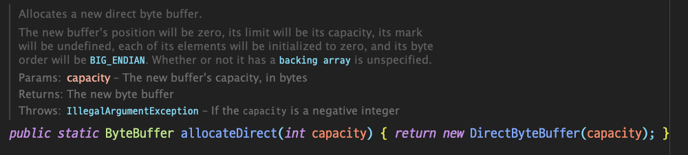
</p>
<p align="center">
    <em><a href="https://docs.oracle.com/en/java/javase/11/docs/api/java.base/java/nio/ByteBuffer.html#allocateDirect(int)">JDK 11 API Docs, java.nio.ByteBuffer.allocateDirect(int capacity)</a></em>
</p>

여기서, 이전 포스팅에서 오류가 있던 점을 알 수 있었는데 나는 자바에서의 시스템 콜 호출순서가 아래와 같다고 설명하였다.

`JVM -> JNI -> 시스템 콜 -> 커널 -> 디스크 컨트롤러 -> 커널 버퍼 복사 -> JVM 버퍼 복사`

하지만 그림으로 예시를 들었던 부분은 이러하였다.

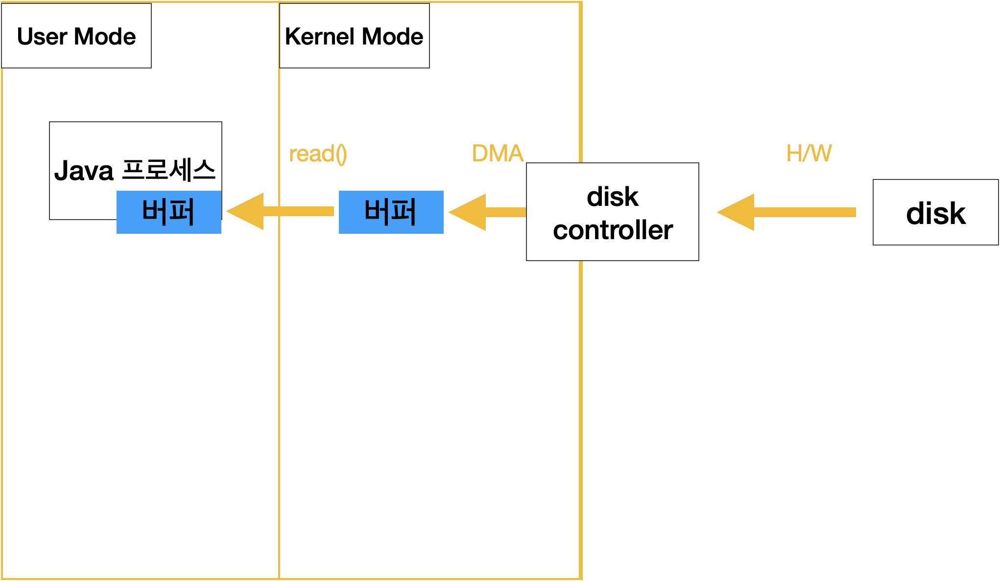

즉, NIO에서는 위의 플로우가 맞지만, Blocking I/O에서는 (NIO를 제외한 나머지가 모두 Blocking I/O이다.) 데이터가 커널영역에 있는 버퍼로 전송되고, 다시 또 이 버퍼의 값을 JVM의 버퍼로 옮기는 이중 작업이 발생하였다고 했다. 

따라서, 명확히하자면 아래와 같이 수정하는 것이 맞다고 본다.

`JVM -> 시스템 콜 -> 커널 -> 디스크 컨트롤러 -> 커널 버퍼 복사 -> JVM 버퍼 복사 `

NIO의 경우에서 `ByteBuffer` 를 `allocateDirect()` 메서드로 생성할 경우 아래와 같은 플로우로 진행된다.

`JVM -> 시스템 콜 -> JNI -> 디스크 컨트롤러 -> DMA -> 복사`

즉, 다이렉트로 시스템 메모리에 복사를 할 수 있다. 
그렇기 때문에 **바이트버퍼가 중요한 것**이다. 

위의 `allocateDirect()` 메서드를 살펴보면 아래와 같다.

```java
public static ByteBuffer allocateDirect(int capacity) {
    return new DirectByteBuffer(capacity);
}
```

즉 리턴 할 때 `DirectByteBuffer` 를 생성해주는데 이 녀석을 보면 아래와 같이 `MappedByteBuffer` 를 상속받는 놈임을 확인 할 수 있다. 

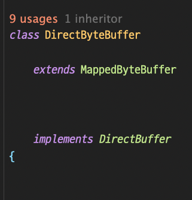

따라서, `ByteBuffer` 를 사용하면 보다 빠르게 읽고 쓰기가 가능해진다. 

여기서 또 한가지 궁금증이 생길 수 있다. 

그렇다면 **이 시스템 메모리를 어떻게 자바에서 사용가능한가**이다. 

이것도 JNI를 사용해서 처리되는 것일까?

그것은 아니다 JNI는 초기 시스템 메모리를 할당할때만 사용하고, JNI로 만들어진 시스템 메모리를 **자바 객체로 래핑해서 사용**한다.

즉, 우리는 래핑된 이 객체를 이용해서 직접적으로 시스템 메모리를 제어할 수 있고, 이것을 실제로 시스템 메모리에 반영된다. 그리고, 이 객체 또한 GC의 관리 대상이기 때문에 GC가 발생하면 래핑하고 있는 주소의 시스템 메모리도 동시에 안전하게 해제되는 것이다. 

공부를 하면서 느낀 점인데 정말 자바는 **추상화** 가 아주 잘된 언어인 것 같다.

또한, 이 **다이렉트 버퍼가 중요한 점이 한 가지**가 더 있다.
바로, 뒤에서 볼 **채널(Channel)의 타겟이 되는 것은 다이렉트 버퍼뿐**이라는 것이다.

논 다이렉트 버퍼를 채널의 타겟으로 설정하면 다음과 같은 일이 발생한다.

1. 논 다이렉트 버퍼를 채널에 전달
2. 임시로 사용할 다이렉트 버퍼를 생성
3. 논 다이렉트 버퍼에서 임시로 만든 다이렉트 버퍼로 데이터를 복사
4. 임시 버퍼를 사용해서 채널이 저수준 I/O를 수행
5. 임시 버퍼가 다 사용되면 GC한다. 

운영체제를 공부한 사람이라면 위의 문제가 어떤 문제를 발생하는 지 이해할 수 있을 것이다.

일단 먼저 딱 봐도 **기존 Blocking I/O와 비슷하게 작업되고 있을 뿐더러 실제 시스템 메모리를 임시로 만들고 해제하는 비용은 당연히 Heap 영역에 국한된 논 다이렉트 버퍼를 만드는 것보다 오버헤드가 상당히 발생**할 것이다. 

그래서 내부적으로 채널의 타켓으로 논 다이렉트 버퍼를 사용하면 결국에는 다이렉트 버퍼를 임시로 만드는 오버헤드가 발생하고, 읽고 쓰기 또한 Blocking I/O와 똑같으므로 사용할 필요가 없으니 다이렉트 버퍼를 사용하는게 좋은 것이다. 

그렇다면 논 다이렉트 버퍼는 사용하지 않아야하는가? 

이건 또 아니다.  소프트웨어 쪽에서는 유명한 명언이 있다.
> No Silver Bullet - Essence and Accident in Software Engineering  

**은총알은 없다**이다. 결국에는 트레이드오프인 것이다. 

하지만, 우리는 위에서 다이렉트 버퍼와 논 다이렉트 버퍼를 비교하면서 힌트를 얻었다.

1. **다이렉트 버퍼(Direct Buffer)**
	+ 장점 : 읽고 쓰기가 시스템 메모리를 사용하므로 매우 빠르다.
	+ 단점 : 시스템 메모리를 사용하기 때문에 할당 / 해제 비용이 다소 비싸다.
	
2. **논 다이렉트 버퍼(Non-Direct Buffer)**
	+ 장점 : 시스템 메모리가 아닌 Heap 영역에 생성되기 때문에 할당 / 해제 비용이 보다 저렴하다.
	+ 단점 : 두 번의 버퍼를 거치기 때문에 읽고 쓰기가 느리다. 


따라서, 일반적으로 성능에 민감하고 버퍼를 오랫동안 유지해서 사용할 필요가 있을 경우에는 다이렉트 버퍼를 사용하고, 그 외에는 논 다이렉트 버퍼를 사용한다.

다이렉트 버퍼와 논 다이렉트 버퍼의 차이는 친절하게 자바 스펙에 나와있으니 참고해보자. [ByteBuffer (Java SE 11 & JDK 11 )](https://docs.oracle.com/en/java/javase/11/docs/api/java.base/java/nio/ByteBuffer.html)


## STEP 2. 채널(Channel)

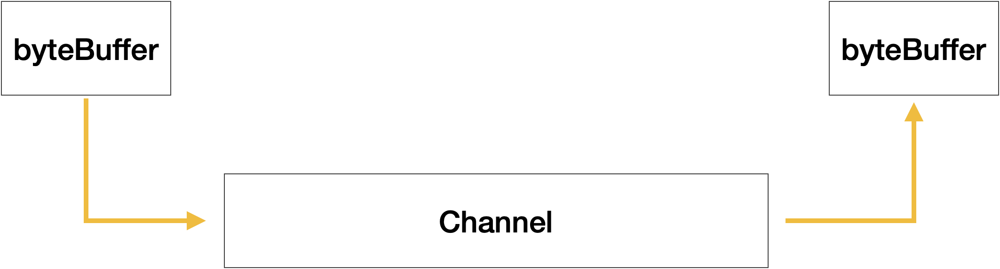

채널은 스트림과 상당히 유사하지만 채널이 **스트림의 확장이나 발전된 형태는 아니다.** 일종의 게이트웨이라 볼 수 있는데 단지 기존의 파일이나 소켓 등에서 사용하던 스트림을 네이티브 IO 서비스를 이용할 수 있도록 도와주는 메서드를 제공한다.

스트림과 차이점을 위주로 설명해보자면 (여기서 스트림은 자바 8의 스트림 API가 아닌 FileInputStream과 같은 스트림을 의미한다.)

1. 데이터를 받기 위한 타겟으로 바이트버퍼를 사용
2. 채널을 이용하면 운영체제 수준의 네이티브 IO 서비스들을 직간접적으로 사용할 수 있다.
	+ MMIO[^1] / 파일 락킹[^2] 등
3. 스트림과 달리 단방향 뿐만 아니라 양방향 통신도 가능하다.
	+ 항상 양방향 통신을 사용할 수는 있지 않다
		+ 소켓 채널은 양방향 통신을 지원하지만 파일 채널은 지원하지않는다.

우리가 다룰 채널은 **파일채널**과 **소켓채널**이다.

그 전에 이전 포스팅에서 봤던 `ScatteringByteChannel` 과 `GatheringByteChannel` 을 보고자 한다. 

채널의 대부분 클래스들은 인터페이스로 되어있는데 위의`ScatteringByteChannel` 과 `GatheringByteChannel` 도 마찬가지이다.

이렇게 인터페이스로 사용되는 이유는 확장성이 뛰어나고 유연한 시스템 구조를 갖게되는 점도 있지만, 무엇보다 자바의 핵심 원리인 **WORA(Write Once, Run Anywhere)** 를 이루기 위함이다. 

즉, 운영체제마다 I/O에 관련된 시스템 콜 명령어와 처리 루틴이 다르기 때문에 세부적인 구현은 각 운영체제에 맞춰서 구현하도록 한 것이다.

그러면 채널과 스트림의 차이와 인터페이스로 구현되어있는 이유를 알아봤으니 다음으로 네이티브 I/O 서비스를 사용하는 `ScatteringByteChannel` 과 `GatheringByteChannel` 를 알아보자.

### STEP 2.1 ScatteringByteChannel, GatheringByteChannel

이전 포스트에서 운영체제에서 지원하는 MMIO라는 기술을 알아보았다.

NIO의 채널에서는 효율적인 입출력을 위해 운영체제가 지원하는 네이티브 IO 서비스인 **Scatter/Gather**[^3]를 사용할 수 있도록 위의 인터페이스를 제공해주고 있다.

이 인터페이스를 사용함으로써 시스템 콜과 커널 영역에서 프로세스 영역으로 버퍼 복사를 줄여주거나 또는 완전히 없애줄 수 있다.

실제 코드는 [blog-example/GatheringWriteWithBuffer.java](https://github.com/brewagebear/blog-example/blob/main/nio-example/src/main/java/GatheringWriteWithBuffer.java) 와 [blog-example/ScatterBuffer](https://github.com/brewagebear/blog-example/blob/main/nio-example/src/main/java/ScatterBuffer.java)를 참고해보자.

### STEP 2.2 파일채널(FileChannel)

파일채널을 파일의 관련된 작업들을 지원하는 채널들로 아래의 특징을 갖고 있다.

1. `ByteChannel` 인터페이스를 구현한다.
	+ 이 인터페이스를 구현하므로 양방향성을 가질 수 있으나 항상 그런 것은 아니다.

2. `AbstactInterruptibleChannel` 추상 클래스를 구현하고 있다.
	+ 따라서, 비동기적인 방식으로 채널을 닫을 수 있게 되어 스레드와 채널 간의 상태불일치가 발생하지 않도록 보장해준다.

3. `ScatteringByteChannel, GatheringByteChannel` 을 구현한다. 
	+ 따라서, 보다 빠른 I/O 수행이 가능하다.

위는 구현에 관련된 특징이라면, 실제로 파일채널들이 갖는 특징은 다음과 같다.

1. **파일채널은 항상 블록킹 모드이며, 비블록킹 모드로 설정할 수 없다.**
2. **파일채널 객체는 직접 만들 수 없다.**
3. **대부분의 채널처럼 파일채널도 가능하면 네이티브 I/O 서비스를 사용하려한다.**
4. **파일채널 객체는 스레드에 안전하다. (thread-safe)**

#### STEP 2.2.1 파일채널의 특징

1. **파일채널은 항상 블록킹 모드이며, 비블록킹 모드로 설정할 수 없다.**

이 이유는 운영체제의 기능과 연관이 있는데 현대의 운영체제들은 강력한 캐싱과 프리패치 알고리즘으로 디스크의 I/O를 사용하지만, 비블록킹 모드를 사용할 경우 처리 루틴이 달라져서 이러한 기능들을 사용하는데 제한되기 때문이다.

그렇다면, 항상 파일채널은 블록킹 I/O로만 써야하는가? 

> 그렇지는 않다. 비동기 I/O로 처리할 수가 있다.  

비동기 I/O 모델은 포스팅 결론부에서 다룰 예정이니 일단 이런 방식이 있구나정도로 넘어가자.

2. **파일채널 객체는 직접 만들 수 없다.**

파일채널 객체는 이미 열려있는 파일 객체의 팩토리 메서드(`getChannel()`)를 호출해서 생성된다. 따라서, `FileIntputStream` 으로 생성된 채널은 **읽기**만, `FileOutputStream` 으로 생성된 채널은 **쓰기**만 가능하다.

3. **대부분의 채널처럼 파일채널도 가능하면 네이티브 I/O 서비스를 사용하려한다.**

이는 위에서 상속과 구현관련 특징에서도 있는데 `ScatteringByteChannel` 을 통해서 MMIO[^1]가 가능하고 운영체제 네이티브 I/O인 파일락킹[^2] 등을 지원한다는 뜻이다.

4. **파일채널 객체는 스레드에 안전하다. (thread-safe)**

같은 파일채널 인스턴스에 대해 여러 쓰레드들이 동시에 메서드를 호출해도 동기화 문제가 발생하지 않는다. 

이게 가능한 이유는 여러 쓰레드가 접근했을 때 만약 한 쓰레드가 파일 크기 또는 파일채널의 포지션을 변경하는 부분을 수행하는 메서드를 호출하면 다른 쓰레드들은 해당 작업을 마무리할 때까지 기다렸다가 수행하기 때문이다.

이 부분은 자바 공식문서에도 친절하게 설명되어있다.  [FileChannel (Java SE 11 & JDK 11 )](https://docs.oracle.com/en/java/javase/11/docs/api/java.base/java/nio/channels/FileChannel.html)

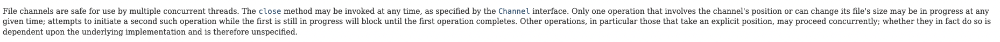

이제 파일채널의 중요한 속성들을 알아보고자 한다.

#### STEP 2.2.2 파일채널의 속성

1. **파일 락킹(File Locking)**

이전 포스팅에서 말한 바와 같이 공유 락(Shared-Lock, S-Lock)과 배타 락(Exclusive-Lock, X-Lock)이 있는데, 이 책에 나온 것으로 보면 일부 운영체제는 공유 락을 지원안한다고 하는데 이 책이 쓰인 게 벌써 18년이 지난 얘기로 그냥 뇌피셜로 공유 락은 요즘 다 지원하지 않을까? 생각은 해본다.

어쨋든 자세한 내용은 이전 포스팅에 달아뒀으니 중요한 특징만 살펴보겠다.

+ 파일 락킹은 채널이 아닌 파일을 대상으로 하는 것이다.
+ 동일한 JVM 내부의 여러 스레드 사이가 아닌 외부 프로세스 사이에서 파일의 접근을 제어하기 위함이다.

파일 락킹의 경우에는 채널에 락이 걸렸을 경우에 `FlieLock` 객체가 리턴이 되며, 이 객체 내부의 메서드들을 통해서 공유 락인지 아닌지(`isShared()`) 락을 해제할 것인지 (`release()`) 등을 처리할 수 있다.

자세한 사용법은 [FileLock (Java SE 11 & JDK 11 )](https://docs.oracle.com/en/java/javase/11/docs/api/java.base/java/nio/channels/FileLock.html) 을 참고해보자.

그렇다면 예시 코드를 한번 살펴보자.

+ 파일 락킹 예시

```java
public class FileLocking {

    public static void main(String[] args) {
        File file = new File("/Users/liquid.bear/Downloads/test.txt");

        try (FileChannel channel = new RandomAccessFile(file, "rw").getChannel()){
            try (FileLock lock = channel.lock(0, Long.MAX_VALUE, true)) {
                boolean isShared = lock.isShared();
                System.out.println("Is Shared Lock? : " + isShared);
            }
        } catch (IOException e) {
            e.printStackTrace();
        }
    }
}
```

위의 코드를 보면 `try-resource` 문으로 처리하여 `release()` 를 명시적으로 선언안해줘도 알아서 `release()` 가 된다. 이 부분이 궁금하면 실제 클래스를 까보기를 바란다. 

코드 자체는 채널을 가져오고 락을 걸어서 공유락이지 판단하고 릴리즈까지 하는 일련의 예시 코드라고 볼 수 있다.
 
2. 메모리 매핑

[MMIO](https://brewagebear.github.io/java-syscall-and-io/#step-214-%EB%A9%94%EB%AA%A8%EB%A6%AC-%EB%A7%B5-%ED%8C%8C%EC%9D%BC-memory-mapped-io)를 이전 포스팅에서 설명했었다. 파일 채널은 이를 지원을 한다.
추상 메서드인 `map()` 을 통해서 처리가 된다.

<p align="center">
    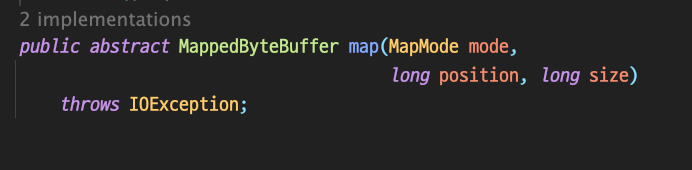
</p>
<p align="center">
    <em><a href="https://docs.oracle.com/en/java/javase/11/docs/api/java.base/java/nio/channels/FileChannel.html#map(java.nio.channels.FileChannel.MapMode,long,long)">JDK 11 API Docs, java.nio.channels.Filechannel.map()</a></em>
</p>

이때 인자를 보면 `MapMode` 객체를 받는 것을 확인할 수 있는데 이 객체는 세가지 상수 값을 갖는다.

1. `READ_ONLY` : 버퍼에서 읽기만 가능한 모드
2. `READ_WRITE` : 버퍼에서 읽기와 쓰기 모두 가능한 모드
3. `PRIVATE` : 읽기와 쓰기 둘다 가능하지만 쓰기를 할 경우 복사본을 만들어 변경 내역을 별도로 보관하여 원본 파일에는 적용되지 않는다. 

이렇게 `map()`  메서드를 통해서 MMIO를 구현할 수 있다. 하지만, 주의할 점은 위에서 파일 락킹 같은 경우에는 `release()` 를 통해서 해제되지만, 매모리 매핑은 해제를 할 수 없고, 한번 생성되면 GC가 발생할 때까지 남아있게 된다.

이렇게 설계 된 이유는 보안문제와 성능문제 때문이라고 한다.

메모리 매핑의 예시 코드는 다음과 같다.

```java
...
private void initFileBuffer(int size, File file) throws FileNotFoundException {
    int bufferCount = size / FILE_BLOCK_SIZE;
    size = bufferCount * FILE_BLOCK_SIZE;

    try (RandomAccessFile fileData = new RandomAccessFile(file, "rw")) {
        fileData.setLength(size);
        ByteBuffer fileBuffer = fileData.getChannel()
            .map(MapMode.READ_WRITE, 0L, size);

        divideBuffer(fileBuffer, FILE_BLOCK_SIZE, fileQueue);

    } catch (IOException e) {
        e.printStackTrace();
    }
}
...
```

어떤 파일의 버퍼를 만드는데 이때 빠른 I/O 처리를 하기 위해서 사용할 수 있다.

이 예시는 단순한 버퍼 풀을 만든 예제인데 전체 코드는 [blog-example/ByteBufferPool](https://github.com/brewagebear/blog-example/blob/main/nio-example/src/main/java/ByteBufferPool.java) 를 참고해보자.

3. 채널 간 직접 전송

채널은 버퍼를 거쳐서 처리할 수도 있지만 **채널 사이에서 다이렉트로 데이터를 전송할 수도 있다.** 

이런 기능은 `transTo()` 메서드와 `transFrom()` 메서드를 통해서 가능하다.

그렇다면 속도는 얼마나 빠를지 궁금하다.

이전 포스팅과 마찬가지로 다양한 버퍼 복사 방식과 채널 직접 전송과의 차이를 비교해보자.

+ 파일의 크기와 같은 버퍼 사용 시 파일 복사 속도

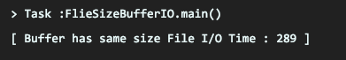

+ 메모리 매핑 사용 시 파일 복사 속도

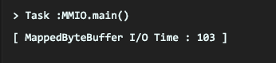

+ 논 다이렉트 바이트 버퍼 사용 시 파일 복사 속도

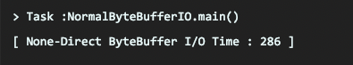

+ 다이렉트 바이트 버퍼 사용 시 파일 복사 속도

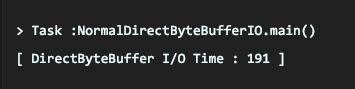

+ 채널 직접 전송 시 파일 복사 속도

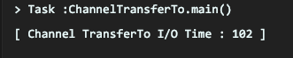

이를 통해서 채널 직접 전송 시 파일 복사 속도는 메모리 매핑을 사용하는 것보다 조금 나은 성능을 갖는다고 알 수 있다. 

500MB 파일을 복사하는 것으로 예제 코드를 짰으며, 전체 코드는 [blog-example/nio-example - nio_copy](https://github.com/brewagebear/blog-example/tree/main/nio-example/src/main/java/nio_copy)  이곳을 참고해보자.


### STEP 2.3 소켓채널(SocketChannel)

이전에는 파일채널에 대해서 알아보았다. 이제 채널의 양대산맥 중에 하나인 소켓채널에 대해서 알아보고자 한다.

소켓채널은 파일채널과 비교하여 몇 가지 다른 특징이 존재한다.

1. **비블록킹 모드 지원**
2. **SelectableChannel을 상속해서 Selector와 함께 멀티플렉스 I/O(=I/O 멀티플렉스)가 가능**

기존 소켓이나 I/O를 통한 네트워크 프로그래밍의 가장 큰 문제는 **블록킹이 된다**는 점이었다.

**이 때문에, 멀티쓰레드 모델을 사용하게 되었지만, 이 모델은 클라이언트당 쓰레드 한 개를 사용해야 하므로 자원을 비효율적으로 사용하게 되었다. 하지만, 많은 클라이언트들이 접속해서 사용해야 될 쓰레드의 개수가 많아지면서 쓰레드 컨텍스트 스위칭 오버헤드가 많아지면서 성능 저하를 가져왔다.** (그래서 현대에서는 쓰레드풀 모델을 사용한다.) 

하지만, 논블록킹 소켓채널이 도입됨에 따라 멀티플렉스 I/O를 지원하는 셀렉터가 도입되어서 기존의 문제가 해결되었다.

참고로, 소켓 채널은 별다른 설정을 하지 않으면 기본적으로 **블록킹 모드로 설정**된다.
따라서 아래와 같이 논블록킹 모드로 바꿔줘야한다.

```java
SocketChannel socketChannel = SocketChannel.open(new InetSocketAddress("host ip", port));
socketChannel.configureBlocking(false);
```

소켓 채널을 실제 사용해서 간단한 논블록킹 채팅프로그램을 만들었는데 이는 셀렉터를 본 다음 결론에 넣을 예정이니 그때 같이 참고하면 될 것같다.

이제 대망의 셀렉터를 볼 차례이다.

## STEP 3. 셀렉터(Selector)
셀렉터는 리액터(Reactor) 패턴[^4]  중에서 리액터의 역할을 하는 놈이다.

리액터 패턴의 상세한 부분은 주석을 달아놓은 링크를 참고하고, 여기서는 간략하게 설명하고자 한다.

요즘 날 네트워크 프로그래밍을 하다보면 나오는 개념 중에 하나가 바로 이벤트 주도 아키텍처(Event-driven Architecture)[^5]일 것이다. 리액터 패턴도 그 아키텍처의 구성요소 중에 하나인데, 이 패턴은 이벤트 중심의 어플리케이션이 하나 이상의 클라이언트로부터 하나의 어플리케이션으로 동시에 전달되는 서비스 요청들을 나눠 각 요청에 상응하는 서비스 제공자에게 구별해서 보내준다.

좀 더 깊게 설명하면, 클라이언트들의 모든 요청을 앞단의 큐에 저장하고 큐를 모니터링하는 스레드에 이벤트를 보낸다. 그러면 큐를 모니터링하는 스레드는 큐에 저장된 요청을 적절한 로직으로 보내서 해당 요청을 처리하게 한다.

어? 이거 어디서 본 방식 같은데라고 생각할 수 있다. 이러한 방식을 채택해서 개발자에게 제일 친숙한 것이 바로 **Node.js의 이벤트 루프(Event Loop)**[^6] 이다.


<p align="center">
    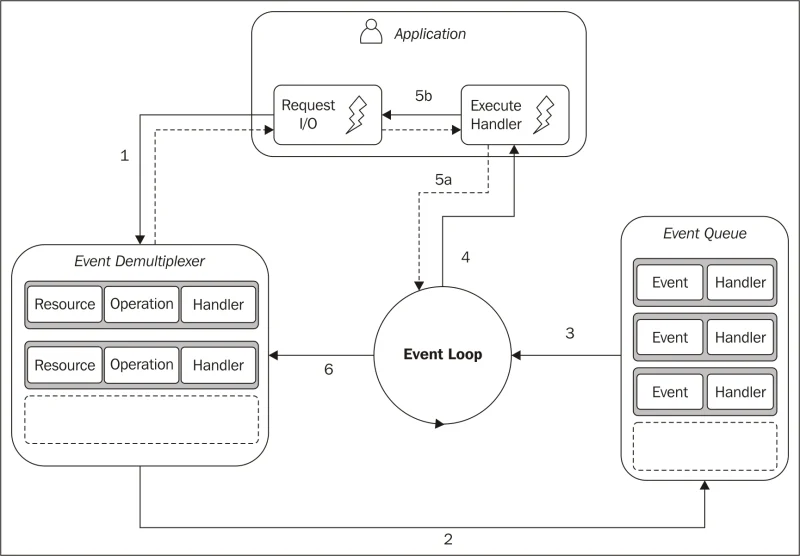
</p>
<p align="center">
    <em><a href=https://medium.com/@nicomf1982/reactor-pattern-en-node-js-4f25ee703299">Nicolas Fernandez, Reactor pattern en Node.js</a></em>
</p>

이 또한, 따로 찾아보기를 권장하며 (범위를 벗어나기에) 우리가 중점으로 두어야할 내용은 이벤트 주도 아키텍처에서 리액터 패턴이라는 것이 존재하고, 셀렉터는 바로 이 리액터 패턴을 구성하는 요소 중에 리액터를 담당하는 놈이라고 이해하면된다.

즉, **여러 채널의 셀렉션키를 자신에게 등록하게 하고 등록된 채널의 이벤트 요청들을 나눠서 적절한 서비스 제공자에게 보내 처리하는 것**이다. 

이것을 통해 바로 **I/O 멀티플렉싱**[^7]를 가능하게 해준다.

이제, 기존의 네트워크 프로그래밍 모델의 단점과 셀렉터의 동작원리에 대해서 알아보고자 한다.

### STEP 3.1 기존의 네트워크 프로그래밍 모델의 단점 

여기서 말하는 기존 네트워크 프로그래밍 모델은 멀티 쓰레드 모델이다. 
그러나, 쓰레드 풀을 사용하는 모델은 아님을 알고 봐줬으면 좋겠다.

과거 `CGI` 를 사용하던 시절에는 멀티 쓰레드가 아닌 멀티 프로세스 모델로 각각 프로세스들이 띄워졌었다. 그러나, 프로세스는 쓰레드에 비해 컨텍스트 스위칭 비용이 훨씬 비쌌다. 그래서 자바를 통한 멀티 쓰레드 모델은 각광을 받았었다.

허나, 이러한 멀티쓰레드 모델도 다음과 같은 문제점을 지녔다. 

1. 많은 쓰레드 생성에 따른 스레드 컨텍스트 스위치 부하
	+ 당연히 프로세스보다 쓰레드의 컨텍스트 스위치 비용이 싸긴 하지만 수많은 쓰레드가 쌓였을 경우에는 무시를 못한다.

2. 쓰레드 자체가 CPU와 고유 스택을 갖는 데 따른 컴퓨터 리소스 부하
	+ 쓰레드가 프로세스의 문맥자체를 공유하긴 하지만 스택은 별도로 존재하기 때문에 많은 쓰레드가 생길 경우 이 문제도 무시를 못한다.

3. 클라이언트의 빈번한 접속과 종료에 따른 많은 가비지 생성 문제
	+ 서버를 통해 주고받는 데이터는 대부분 일회성이다. 이전 포스팅에서 본 내용처럼 두번의 버퍼를 나눠쓰기 때문에 이 과정에서 많은 가비지가 생성이 된다. 그리고 접속이 빈번하면 쓰레드의 생성과 소멸에 따른 가비지도 많을 것이다.

4. 클라이언트가 접속할 때마다 매번 쓰레드를 생성하는 부담
	+ 요즘은 쓰레드 풀 모델을 사용해서 이런 문제가 좀 완화되었다고 하지만, 우리가 중점으로 볼 내용은 멀티 쓰레드 모델이므로 1번 요청당 1번 쓰레드가 생성한다 생각하면 많은 부담이 될 수 있다고 느껴진다. 
	
5. 서버의 OOM(OutOfMemoryException) 발생 문제
	+ 당연히 수많은 쓰레드가 생기면 OOM이 발생할 수 있다. 그렇기 때문에 **쓰레드 풀 모델이 각광 받은 것**이다. 즉, 1번의 문제(쓰레드 컨텍스트 스위칭)과 5번의 문제(OOM) 때문에 요즘날 쓰레드 풀 모델을 사용한다 생각하면 된다.  그러나, 쓰레드 풀 모델을 사용한다해도 **확장성 문제**는 어쩔 수 없다. 

이러한 문제 때문에 I/O 멀티플렉싱 모델이 주목받기 시작한 것이다.


### STEP 3.2 비블록킹 모델과 셀렉터 동작원리

위에서 왜 I/O 멀티플렉싱 모델이 탄생했는지 알아보았다.
이러한 모델을 만들기위한 핵심적인 기능들은 크게 세가지로 볼 수 있다.


<p align="center">
    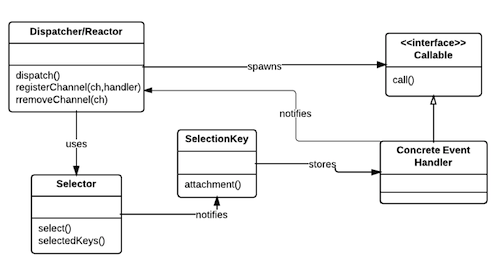
</p>
<p align="center">
    <em><a href="https://github.com/kasun04/nio-reactor">kasun04 - github, Java NIO - Reactor</a></em>
</p>

1. 셀렉터(Selector)  : 리액터 패턴에서 리액터 역할을 해주는 객체 
	+ 셀렉션키(SelectionKey) 에 등록된 채널들이 발생시킨 이벤트에 대해 적절한 핸들러로 요청을 분기시키는 역할을 한다. 

2. 셀렉터블채널(SelectableChannel) : 셀렉터에 등록할 수 있는 채널들은 이 클래스를 상속받는다. 우리가 볼 예제는 소켓채널 클래스이므로, 셀렉터에 등록할 수 있다. 

3. 셀렉션키(SelectionKey) : 특정 채널과 셀렉터 사이에서 해당 이벤트에 대한 내용에 대한 정보를 들고 있는다. 이 값을 토대로 이벤트 요청을 처리한다.

위의 내용을 토대로 전체적인 흐름을 보자면

1. 채널을 셀렉터에 등록하면 이 등록에 관련된 채널과 셀렉터와 연관 정보를 갖고 있는 셀렉션키가 셀렉터에 저장되고, 리턴된다.

2. 위의 셀렉션키를 토대로 어떤 채널이 자신이 등록한 모드에 대해 동작할 준비가 되면 셀렉션키는 그 준비상태를 내부적으로 저장한다.

3. 소켓 서버의 예시를 들자면 클라이언트를 `accept`할 준비가 되면 셀렉션키는 **준비상태**가 된 것이고, 이 때 셀렉터가 `select()` 메서드를 호출해서 자신에게 등록된 모든 셀렉션키를 검사하여 준비상태이면, 하나씩 순서대로 꺼내서 요청한 이벤트에 대해 적절하게 처리한다.

이제 이 동작원리를 토대로 하나씩 살펴보자.

#### STEP 3.2.1 SelectableChannel

앞에서 말한 바와 같이 이 **클래스를 상속받은 클래스**만이 셀렉터에 등록이 될 수 있다하였다.

우리가 살펴 볼  `SelectableChannel` 의 기능은 2가지인데 **첫 번째는 소켓채널에서 본 논블록킹 모드 활성화 기능**이고 **두 번째는 어떻게 셀렉터에 등록하는 기능**이다. 

첫 번째의 경우에는 소켓채널에서 알려줬으니 두 번째 기능을 알아보고자 한다.

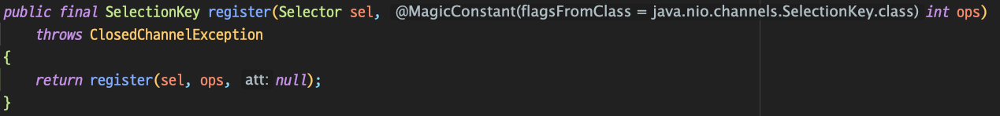
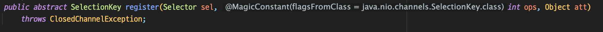

위 두개의 `register()` 메서드를 통해서 채널을 셀렉터에 등록을 할 수 있다.
세번째 인자인 `Object att` 는 셀렉션키를 다룰 때 설명하고자 한다.

여기서 `ops` 는 이벤트의 모드라고 볼 수 있다. 셀렉터에 등록할 수 있는 이벤트 모드들은 4가지가 있다.

1. **OP_READ** : 서버가 클라이언트의 요청을 `read` 할 수 있을 때 발생하는 이벤트
2. **OP_WRITE** : 서버가 클라이언트의 응답을 `write` 할 수 있을 때 발생하는 이벤트
3. **OP_CONNECT** : 서버가 클라이언트의 접속을 허락했을 때 발생하는 이벤트 
4. **OP_ACCEPT** : 클라이언트가 서버에 접속했을 때 발생하는 이벤트 

위의 이벤트들은 셀렉션키에 상수로 등록되어있다.

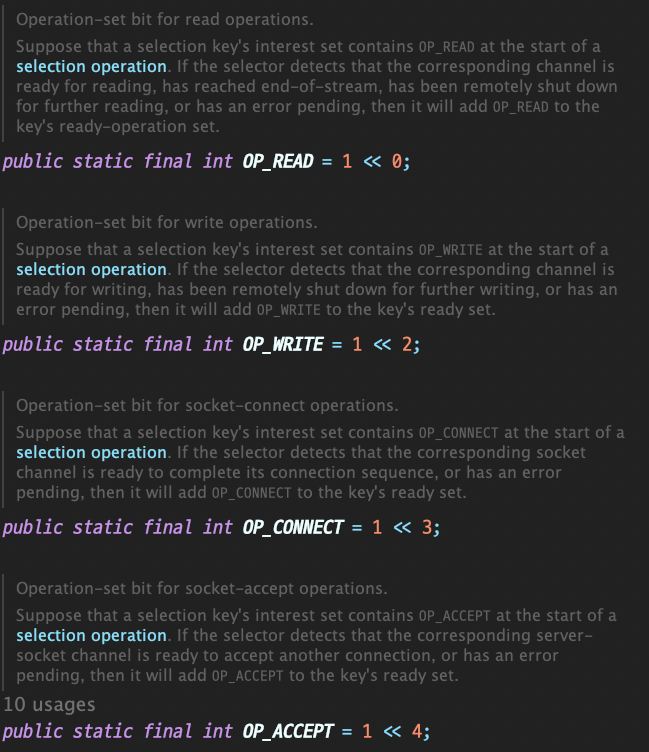

그래서 아래와 같은 코드로 채널을 셀렉터에 등록할 수 있다.

```java
// 셀렉터 생성
Selector selector = Selector.open();
// 서버소켓 채널 생성
ServerSocketChannel server = ServerSocketChannel.open();
server.configureBlocking(false); // 논블록킹 모드 활성화

ServerSocket socket = server.socket();
SocketAddress addr = new InetSocketAddress(port);
socket.bind(addr); // 소켓 생성 후 해당 주소에 바인드

// 셀렉터에 생성된 ServerSocketChannel과 ACCEPT 이벤트 등록
server.register(selector, SelectionKey.OP_ACCEPT); 
```

각 채널 구현체마다 등록될 수 있는 이벤트는 다른데 아래와 같다.

| 채널 구현체         | 등록할 수 있는 이벤트         |
|---------------------|-------------------------------|
| ServerSocketChannel | OP_ACCEPT                     |
| SocketChannel       | OP_CONNECT, OP_READ, OP_WRITE |
| DatagramChannel     | OP_READ, OP_WRITE             |
| Pipe.SourceChannel  | OP_READ                       |
| Pipe.SinkChannel    | OP_WRITE                      |

여러 개의 이벤트를 등록할 수 있는 채널은 아래와 같이 여러개의 이벤트도 등록할 수 있으며, 하나의 셀렉터의 여러개의 채널도 등록할 수 있다.

+ 하나의 셀렉터에 여러 이벤트와 채널 등록
```java
Selector selector = Selector.open();

SocketChannel channel1 = SocketChannel.open();
channel1.configureBlocking(false);
SocketChannel channel2 = SocketChannel.open();
channel2.configureBlocking(false);
ServerSocketChannel server = ServerSocketChannel.open();
server.configureBlocking(false);

server.register(selector, SelectionKey.OP_ACCEPT);
channel1.register(selector, SelectionKey.OP_READ);
channel2.register(selector, SelectionKey.OP_READ | SelectionKey.OP_WRITE);

Set<SelectionKey> keys = selector.keys();

for (SelectionKey key : keys) {
    System.out.println(key.channel().getClass() + " " + key.interestOps());
}
```


결과를 살펴보면 아래와 같다.

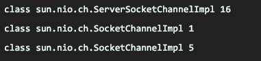

그림으로 보면 다음과 같을 것이다.

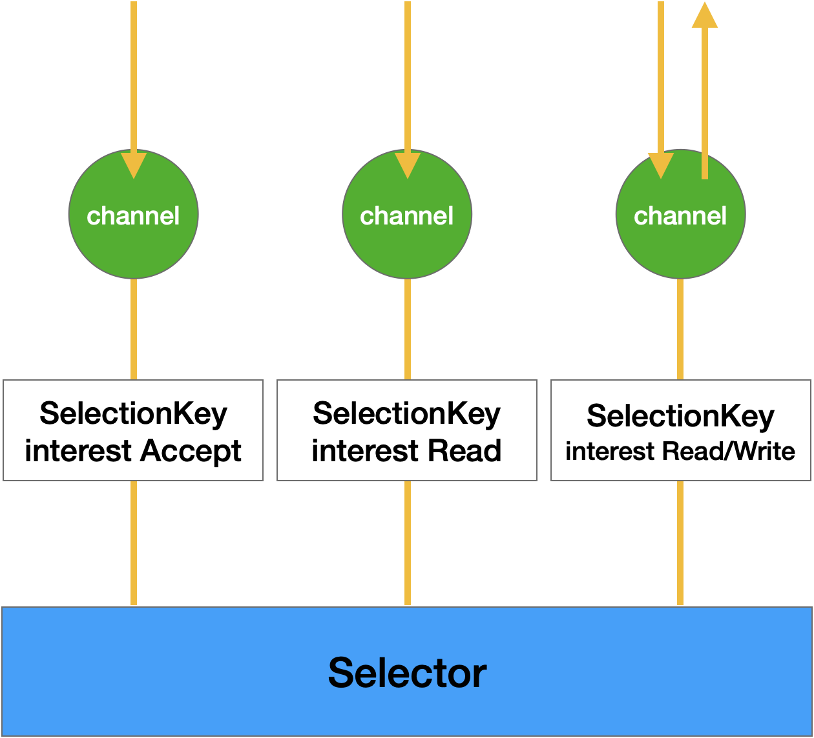

셀렉터는 이렇게 이벤트가 발생한 채널들만 선택해서 각 이벤트에 맞는 동작을 하도록 모든 이벤트들에 대한 컨트롤러 역할을 한다.

#### STEP 3.2.2 SelectionKey

**어떤 채널이 어떤 셀렉터에, 어떤 이벤트 모드로 등록됐는지, 그 등록한 이벤트를 수행할 준비가 되어있는지에 대한 정보들을 담고 있는 객체**이다.

즉, 이벤트 처리에 대해서 셀렉터와 채널 사이에서 도와주는 역할을 하는 객체이다.

셀렉션키에는 크게 두가지 집합이 존재한다.

1. **interest set**
2. **ready set** 

**interest set**은 위에서 여러 채널과 이벤트를 등록하는 예시 코드를 보여줬는데 이 코드에서 `key.interestOps()` 라는 호출부가 존재한다.

코드를 보면 알겠지만 이 정보들은 `register` 할 때 등록했던 상수들 값이다. 따라서 **interest set**은 **셀렉터에 등록한 이벤트 정보를 담는 집합**이라고 알고 있으면 된다. 

**ready set**은 **채널에서 이벤트가 발생하면 그 이벤트들을 저장하는 집합**이다.

즉, 셀렉션키는 **interest set** 과 **ready set**을 활용하여 이벤트 핸들링을 도와주는 역할을 한다. 

채널의 `register()` 부분에서 세번째 인자인 `att`
는 본 챕터에서 설명을 한다고 하였다.


이 인자는 셀렉션키에 참조할 객체를 추가하는 메서드고 해당 키에 참조할 객체가 있으면 그 객체를 리턴하고, 없으면 null을 리턴한다. 

이 인자는 `attachement()` 메서드로 가져올 수 있으며, `register()` 로 등록이 가능하지만 `attach()` 메서드로도 등록할 수 있다.

이 메서드의 사용 이유는 클라이언트마다 특정 세션 값 부여 및 접속을 오래 유지하지 않은 클라이언트에 그 처리를 담당하는 핸들러를 붙여서 사용하는 등의 용도로 사용된다고 한다.

그러나, `attach()` 메서드로 첨부된 객체는 GC의 대상이 아니므로, 셀렉션키가 삭제될 때 같이 삭제해줘야 메모리 누수가 발생안한다.

#### STEP 3.2.3 Selector

셀렉터는 위에서 언급한 바와 같이 **등록된 채널들이 발생시킨 이벤트에 대해 적절한 처리 핸들러로 요청을 분기해주는 컨트롤러 역할**을 한다.

위에서 셀렉터에 대한 내용은 많이 언급했으니 중요한 특징만 설명하고자 한다.

셀렉터 또한 등록된 이벤트를 처리하기 위해서는 자신에게 등록된 채널과 연관된 셀렉션키에 대해서 알고 있어야할 것이다.  

그러므로 셀렉터 내부에는 셀렉션키에 대한 집합을 가지고 있다.
이 집합은 크게 세 가지이며, 셀렉터 내부에서는 아래의 집합들을 관리한다.

1. **등록된 키 집합(Registered Key Set)**
	+ 셀렉터에 등록된 모든 셀렉션키의 집합이다. 하지만 이 집합에 있는 모든 키가 유효하지는 않다. 
	+ 메서드 : `Selector.keys()` 
	
2. **선택된 키 집합(Selected Key Set)**
	+ 선택된 키 집합 ⊂ 등록된 키 집합
	+ 셀렉션키가 수행 준비상태가 되서 **ready set**이 비어있지 않은 키들이 `Selector.select()` 메서드에 호출되서 선택됐을 때 이 집합에 추가된다.
	
3. **취소된 키 집합(Cancelled Key Set)**
	+ 취소된 키 집합 ⊂ 등록된 키 집합
	+ 등록을 해제하고 싶을 때 `SelectionKey.cancel()` 메서드로 등록을 취소할 수 있는데 이 키는 바로 유효하지 않은 키로 설정되고 취소된 키 집합에 추가된다.

주의사항으로는 셀렉터는 쓰레드 세이프하지만, 세 가지 키 집합은 쓰레드 세이프하지 않으므로, 멀티쓰레드 환경에서 이 키에 접근하고자 하면 반드시 **동기화 처리**를 해줘야한다.

이제 셀렉터의 동작 원리에 대해서 살펴보고자 한다.
셀렉터는 `select()` , `poll()` 과 같은 시스템 콜을 래핑한 것이다.

실제 사용 방식은 `select()` 메서드를 호출하면서 사용되는데 다음과 같은 방식으로 동작한다.

+ **셀렉터 동작 방식**
+ **취소된 키 집합을 체크한다. ··· ①**
	+ 만약 집합이 비어 있지 않다면 
		+ 이 집합에 저장된 각각의 키들은 셀렉터가 관리하는 세가지 집합에서 모두 삭제되어 각 키와 연관된 채널이 셀렉터에서 등록이 해제된다. 
	
+ **등록된 키 집합을 체크한다. ··· ②**
	+ 만약 **ready set**이 비어있지 않은 셀렉션키가 존재한다면
		+ 등록된 키 집합에 넣는다. (이미 존재한다면 그 키를 업데이트 처리만 한다.)
		
+ **셀렉터가** `selectedKeys()` **메서드를 호출한다. ··· ③**
	+ 저장된 선택된 키 집합을 가져오고, 그 안에 저장된 셀렉션키의 이벤트 형식에 따라 적절한 핸들러에게 처리를 넘긴다.

① ~ ③의 동작과정을 반복하면서 진행하는데 그 실행 시점과 블록킹 여부 차이만 있다.

셀렉터가 제공하는 `select` 함수는 총 세가지이다. 

1. `select()` 
	+ 블록킹되는 메서드이며, 선택된 키 집합이 비어있다면 키가 추가될 때까지 블록킹 된다. 그러다가 사용할 수 있는 키가 추가되면 ① ~ ③을 실행한다.

2. `select(long timeout)` 
	+ 밀리세컨드마다 `select()` 함수와 동일하게 처리된다.  따라서, 해당 시간마다 블록킹이 된다.

3. `selectNow()` 
	+ 논블록킹 메서드이다. 따라서 이용 가능한 채널이 없으면 0을 리턴하고, 아니면 마찬가지로 등록된 키 집합안에 들어있는 셀렉션키의 개수를 리턴한다. 

그리고 추가로, `wakeup()` 메서드는 쓰레드가 블록킹 되어있는 경우 이 블록킹된 쓰레드를 깨우는데 사용한다. 

이제 실제 간단한 채팅프로그램 예시를 통해 기존 네트워크 모델과 어떻게 다른지 더 나아가 I/O 모델이 무엇인지 정리 후에 이 포스팅을 마치고자 한다. 


## STEP 4. 간단한 채팅 어플리케이션 예제 및 I/O 모델
### STEP 4.1 I/O 모델

자 이제 어떻게 보면 이 포스팅의 핵심 주제로 왔다. 
IO / NIO를 다루면서 자주 했던 말은 블록킹과 논블록킹이었다. 

이것들은 I/O 모델이라는 개념에 속해있다.
이번 포스팅에서는 4가지 I/O 모델을 다루려고한다.

1. **블록킹(Blocking) I/O 및 동기(Synchronous) I/O 모델**
2. **논블록킹(Non-Blocking) I/O 모델**
3. **비동기(Asynchronous) I/O 모델**
4. **I/O 다중화(Multiplexing) 모델**

+ **블록킹(Blocking) I/O 및 동기(Synchronous) I/O 모델**

<p align="center">
    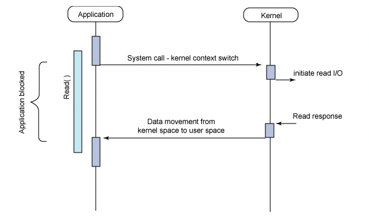
</p>
<p align="center">
    <em><a href="https://grip.news/archives/1304">그립뉴스, 논-블로킹 I/O, 비동기 I/O 차이 이해하기</a></em>
</p>

위의 그림을 보면 알겠지만 어플리케이션은 커널의 응답이 올 때까지 **블록킹** 된다. (다른 작업을 하지 못한다.) 

이전 포스팅에서 말한 시스템 콜의 예시로 들면 **사용자 모드에서 커널 모드로 전환 후에 작업을 처리하여 다시 사용자 모드로 돌아올 때 까지 작업이 차단**되는 것이다.

당연히, 우리 똑똑한 어르신들은 이러한 응답을 대기하는 유휴시간이 발생하기 때문에 이 시간을 줄일 수 없을까? 고민을 하게 되었고 그렇게 나온 I/O 모델이 논블록킹 I/O 모델이다.

+ **논블록킹(Non-Blocking) I/O 모델**

<p align="center">
    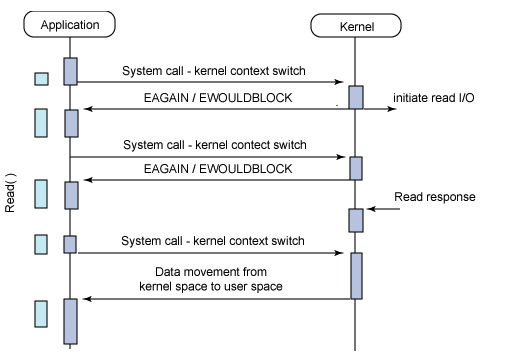
</p>
<p align="center">
    <em><a href="https://grip.news/archives/1304">그립뉴스, 논-블로킹 I/O, 비동기 I/O 차이 이해하기</a></em>
</p>


논 블록킹은 위에서 보는 바와 같이 시스템 콜이 발생된 뒤에 이 응답이 끝날때 까지 기다리는 것이 아니라 제어권이 다시 어플리케이션에게 전달되는 것을 확인할 수 있다. 
이때 주기적으로 I/O의 처리 가능한 상태를 판단하면서 다른 일을 수행한다.

풀링[^8] 통신 방식과 흡사하다고 생각하면 된다. 

그렇다면, 비동기 I/O 모델이랑은 어떻게 다른 것일까?

+ **비동기(Asynchronous) I/O 모델**


<p align="center">
    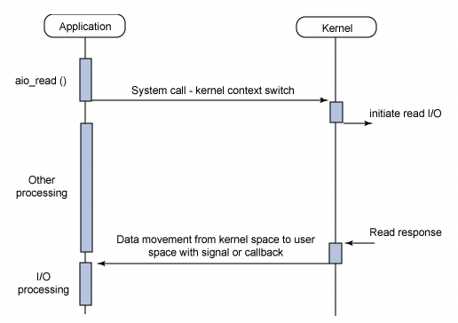
</p>
<p align="center">
    <em><a href="https://grip.news/archives/1304">그립뉴스, 논-블로킹 I/O, 비동기 I/O 차이 이해하기</a></em>
</p>

가장 큰 차이점은 논블록킹 I/O 모델처럼 주기적으로 처리 여부를 응답하는 것이 아니라 커널에 시스템 콜을 한 뒤에 어플리케이션은 계속 다른 일을 하다가 커널이 **콜백** 으로 완료여부를 알려준다. 즉, **I/O 처리가 완료가 된 타이밍에 결과를 회신하는 모델**이다.

차이점을 정리하자면 비동기 I/O 모델은 완료를 했을 때 통지를 하지만 논블록킹 I/O 모델은 처리가 가능한 상태를 판단하면서 처리한다. 

이제 I/O 다중화 모델만 남아있는데 이를 더 잘 이해하기 위해서는 논블록킹 I/O의 단점을 살펴보는 것이 좋다.

위에서 말한 것과 같이 이는 풀링 방식과 매우 흡사하다고 하였다. 즉, **시스템 콜이 계속해서 요청될 수 있는 단점이 존재하는 것**이다.

그래서 옛 성인들께서는 이를 필요할 때만 호출하게끔 하면 더 좋은 성능을 얻을 수 있게 될 것이라고 판단하였다.

위의 단점이 안 와닿을 수 있기에 스타벅스 사이렌 오더를 만든다 가정해보자.

이를 논블록킹 서버로 만들었다면, 우리에게 계속 귀찮게 **"야 너 주문할 커피 있어?"** 라고 알림이 올 것이다. 

하지만, 이를 필요한 시점에만 물어보게끔 할 수 있다면? 
즉, 이벤트를 등록해두는 것이다. 

**"사용자 커피 주문 요청"** 이라는 이벤트를 등록해두고 없으면 호출을 안하다가 내가 사이렌 오더를 통해서 주문 요청을 하면 이 이벤트가 등록이 될 것이고, 이 때 처리를 하면 될 것이다.

이게 바로 **I/O 다중화 모델** 이다.

+ **I/O 다중화 모델**

<p align="center">
    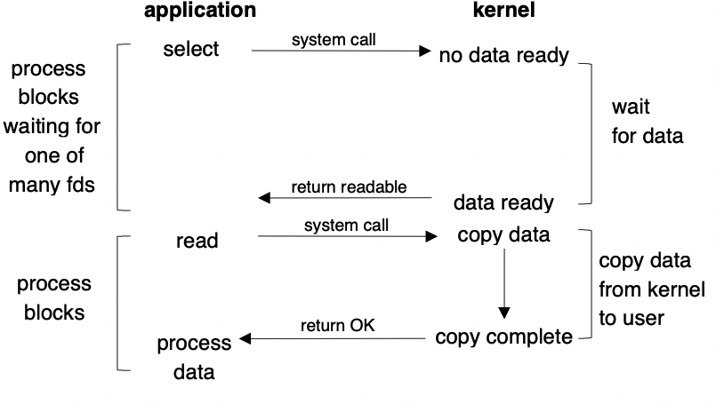
</p>
<p align="center">
    <em><a href="https://www.cs.toronto.edu/~krueger/csc209h/f05/lectures/Week11-Select.pdf">University of Toronto, I/O Multiplexing</a></em>
</p>

우리가 봤던 셀렉터와 셀렉션키 등의 개념을 기억하면서 위의 그래프를 살펴보자.  **select** 시스템 콜은 `Selector.select()` 라고 볼 수 있을 것이며 **data ready** 부분은 셀렉션키의 **ready set** 이 존재하는 경우일 것이다.

즉, 우리가 공부한 NIO는 **I/O 다중화 모델**을 구현할 수 있는 객체들이다.
이러한 개념들을 출발하여 오늘날 I/O 모델의 중심이라 볼 수 있는 이벤트 주도 아키텍처(Event-Driven Architecture)[^5]나 사가 패턴(Saga Pattern)[^9]등이 탄생하였다고 볼 수 있다.


### STEP 4.2 간단한 채팅 어플리케이션 IO & NIO 예제

코드는 너무 길다보니 링크로 대체하고 설명을 해보고자한다.
1. [멀티쓰레드 I/O - 채팅프로그램 예제](https://github.com/brewagebear/blog-example/tree/main/nio-example/src/main/java/simple_chatting_example/io) 
2. [멀티플렉스 I/O - 채팅프로그램 예제](https://github.com/brewagebear/blog-example/tree/main/nio-example/src/main/java/simple_chatting_example/nio)

멀티쓰레드 I/O를 먼저 보면 `ChatThread` 를 통해서 클라이언트와 통신한다.
클라이언트 쪽을 보면 `InputThread` 와 `Client` 를 분리해뒀는데 이렇게 분리한 이유는 메인 쓰레드가 키보드로부터 입력을 받을 때 블록킹이 발생하므로 `InputThread` 로 입력처리를 나눈 것이다.

멀티플렉스 I/O를 보면 여기서는 `ChatThread` 하나만 존재한다. 
이는 단순하게 쓰기 작업을 위한 쓰레드이다. 블록킹이 발생하지 않으므로 `InputThread` 는 존재하지 않는다.

이게 가장 큰 차이라고도 볼 수 있다.

클라이언트가 입력을 처리하는 부분의 코드 블록만 가져와서 차이를 보자.

+ InputThread.java (IO 예제)
```java
public class InputThread extends Thread {

    private Socket socket = null;
    private BufferedReader reader = null;

    public InputThread(Socket socket, BufferedReader reader){
        this.socket = socket;
        this.reader = reader;
    }

    public void run() {
        try {
            String line = null;
            while ((line = reader.readLine()) != null) {
                System.out.println(line);
            }
        } catch (Exception ignored) {
        } finally {
            try {
                if (reader != null) {
                    reader.close();
                }
            } catch (Exception ignored) {
            } try {
                if (socket != null) {
                    socket.close();
                }
            } catch (Exception ignored) {
            }
        }
    }
}
```

+ Client.java (NIO 예제)
```java
...
  private void startReader() {
        System.out.println("Reader is started..");
        try {
            while (true) {
                // 셀렉터의 select() 메서드로 준비된 이벤트가 있는지 확인한다.
                selector.select();
                Iterator<SelectionKey> iterator = selector.selectedKeys().iterator();

                while (iterator.hasNext()) {
                    SelectionKey key = iterator.next();

                    if (key.isReadable()) {
                        read(key);
                    }
                    iterator.remove();
                }
            }
        } catch (Exception e) {
            log.warn("start()", e);
        }
    }
...
```

원래 기존에 블록킹이 되기 때문에 별도의 쓰레드를 둬서 처리한 부분을 셀렉터로 처리하여 블록킹이 발생하지 않게 처리가 가능함을 볼 수 있다.

# STEP 5. 정리 및 결론

이 포스팅을 시작했을 때는 단순하게 시스템 콜의 실제 사용례를 자바에서 알고 싶어서 시작하였고, 그러다보니 I/O 쪽에서 많이 쓰인다는 것을 알게되었다.

이전 포스팅에서는 왜 기존 자바 I/O가 느린 이유와 NIO가 대두되게된 원인들을 설명하였으며, 이번 포스팅에서는 이전 포스팅에서 기존 I/O들이 지원하지 않았던 네이티브 I/O 서비스들을 NIO가 지원하면서 I/O 성능을 끌어올렸음을 알 수 있었다.

하지만, 거기서 끝나지 않고 네트워크 프로그래밍과 결합하여 I/O 모델들이 다양한데 기존 I/O 방식은 블록킹이 되다보니 논블록킹 I/O 모델의 채널과 I/O 멀티플렉싱을 위한 멀티플렉서인 셀렉터를 토대로 I/O 멀티플렉싱 모델까지 알아보았다. 

요즘날에는 스프링 웹 플럭스나 네티에 대해서 많은 개발자들이 관심을 갖고 있다. 

이번 기회에 I/O 멀티플렉싱과 논블록킹 I/O가 어떤 것이고, 어떻게 만들 수 있는지에 대해서 정리가 되서 좀 더 이해가 수월하지 않을까 생각이 든다.

긴 포스팅을 읽어주셔서 감사합니다.

# Reference 및 읽을거리
1. [Java NIO Direct Buffer를 이용해서 대용량 파일 행 기준으로 쪼개기 - 뒤태지존의 끄적거림](https://homoefficio.github.io/2019/02/27/Java-NIO-Direct-Buffer%EB%A5%BC-%EC%9D%B4%EC%9A%A9%ED%95%B4%EC%84%9C-%EB%8C%80%EC%9A%A9%EB%9F%89-%ED%8C%8C%EC%9D%BC-%ED%96%89-%EA%B8%B0%EC%A4%80%EC%9C%BC%EB%A1%9C-%EC%AA%BC%EA%B0%9C%EA%B8%B0/)
2. [Java NIO Buffer](http://tutorials.jenkov.com/java-nio/buffers.html)
3. [번역 Java Reactor Pattern - 92Hz](https://jongmin92.github.io/2019/03/05/Java/java-reactor-pattern/)
4. [쿠...sal: 컴 Reactor Pattern 에 대해 알아보자.](http://i5on9i.blogspot.com/2013/11/reactor-pattern.html)
5. [쭌안아빠: proactor design pattern (번역)](https://jeremyko.blogspot.com/2012/05/proactor-design-pattern.html)
6. [1 Reactor Pattern](https://riverandeye.tistory.com/entry/1-Reactor-Pattern)
7. [Proactor pattern](https://kksuny.tistory.com/19)
8. [Reactor Pattern 과 I/O Multiplexing (반응자 패턴, 입출력 다중화, select, epoll, 혼동 포인트, ProjectReactor)](https://sjh836.tistory.com/184)
9. [리액터패턴 / 프로액터패턴](https://brunch.co.kr/@myner/42)
10. [GitHub - kasun04/nio-reactor: A reference implementation of the Reactor Pattern with Java NIO.](https://github.com/kasun04/nio-reactor)
11. [Reactor - An Object Behavioral Pattern for Demultiplexing and Dispatching Handles for Synchronous Event](http://www.dre.vanderbilt.edu/~schmidt/PDF/reactor-siemens.pdf)

[^1]:[Memory-mapped I/O - Wikipedia](https://en.wikipedia.org/wiki/Memory-mapped_I/O)
[^2]:[File locking - Wikipedia](https://en.wikipedia.org/wiki/File_locking)
[^3]:https://en.wikipedia.org/wiki/Gather-scatter_(vector_addressing)
[^4]:[GitHub - kasun04/nio-reactor: A reference implementation of the Reactor Pattern with Java NIO.](https://github.com/kasun04/nio-reactor)
[^5]:[Event-driven architecture - Wikipedia](https://en.wikipedia.org/wiki/Event-driven_architecture)
[^6]:[Node.js Under The Hood #3 - Deep Dive Into the Event Loop - DEV Community](https://dev.to/_staticvoid/node-js-under-the-hood-3-deep-dive-into-the-event-loop-135d)
[^7]:[I/O Multiplexing : 간단한 이론 - Phruse](https://phruse.com/iomt/)
[^8]:[Polling(computer scinence)](https://en.wikipedia.org/wiki/Polling_(computer_science))
[^9]:[Saga Pattern](https://microservices.io/patterns/data/saga.html)
