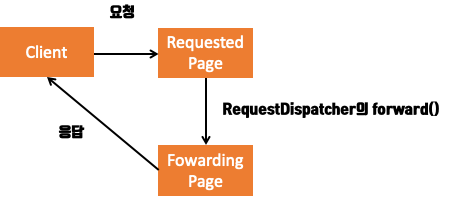

```toc
```

+ STEP 1. 포워딩(Forwading)이란?
    + STEP 1.1 HttpServletRequest 클래스
        + STEP 1.1.1 HttpServletResponse 클래스 
            + STEP 1.1.1.1 HttpServletResponse 예제 소스
	    + STEP 1.1.2 RequestDispatcher 클래스
            + STEP 1.1.2.1 RequestDispatcher 예제 소스


# 개요
이번에는 서블릿 WebApplication에서 사용하는 포워딩 기법을 알아보기 위해서, 정리하려고 글을 남겨본다.
잡설이지만, 원래는 포스팅을 올릴 때 한땀 한땀 쓰려고 노력하고 있는데 요즘에 너무 몰아쓰면서 전반적인 글의 퀄리티가 떨어지는 것을 좀 느끼고 있다. 

(사실 이것도 스터디때문에...)

앞으로는 미리미리 공부해서 마스터해놓고 좀 더 퀄리티있는 글을 쓰도록 노력해봐야겠다.

일단, 들어가기전에 간략하게 `RequestDispathcer`와 `HttpServletResponse`에 대해서 설명하고자 한다.
서블릿 또는 JSP에서 요청을 받은 후 다른 컴포넌트로 요청을 위임할 수가 있다. 
이러한 위임 방법에는 2가지가 있는데 그것이 바로 `RequestDispathcer`와 `HttpServletResponse`이다.

## STEP 1.1 RequestDispatcher 클래스

일단, 이 클래스를 아는 사람들이라면 의아할 부분이 있을 것이다. 왜냐하면, `HttpServletRequest` 객체는 클라이언트로부터 실행 요청이 들어올 때마다 서블릿의 `service()` 메소드가 실행되기 전에 자동으로 생성되고, `service()` 메소드가 종료되면 자동으로 소멸하는 객체로 알고 있기 때문이다.

즉, `HttpServletRequest` 객체에 여러 페이지에서 공유할 정보를 저장한다 하더라도 `service()` 메소드가 종료되는 시점에 `HttpServletRequest` 객체도 소멸하는데 그 곳에 정보를 저장하는게 의미가 있을까?? 

`HttpServletRequest`는 하나의 서블릿 페이지가 실행되는 동안에만 메모리에 존재하는 객체이기 때문에 이를 통해 정보를 유지하는 것은 무의미하다고 생각할 것이다. 

그런데 클라이언트가 서블릿 실행 요청을 했을 때 하나의 페이지만 실행되는 것이 아니라 여러 페이지가 실행될 수 있는 상황이 발생할 수가 있다.

위의 그림처럼 클라이언트 요청 한 번으로 두 개의 페이지가 실행된다면, 어떻게 될까?

보다 쉽게 설명하기 위해 가정을 해보겠다. 클라이언트가 A 페이지를 요청하면, A 페이지가 실행되면서 B 페이지로 이동하여, B 페이지도 실행된다고 가정하자. 그러면 위의 말이 이해가 되지않겠는가??

> 즉, 한 번의 요청으로 여러 페이지가 실행된 것이다.

**`HttpServletRequest`를 통해 정보를 유지하는 예는 이처럼 한 번의 요청으로 실행된 페이지 간에 데이터를 공유하고자 할 때 사용하는 방법이다.**

한 번의 요청으로 여러 개의 페이지들이 실행되었을 때는 처음 요청된 페이지에서 생성된 `HttpServletRequest`가 이동되는 페이지에서도 그대로 전달하여 사용할 수 있도록 해야된다.

그래서 페이지를 이동하기 전에 `HttpServletRequest`에 정보를 등록한 후 이동하면, 이동된 페이지에서는 전달받은 `HttpServletRequest`에 저장된 정보를 추출하여 사용할 수 있다. 

이런 방식으로 **페이지 간의 정보 공유가 이루어지는 것이다.**

다시 이 그림을 보자!


클라이언트가 A 페이지를 요청하고, A 페이지에서 B 페이지로 이동했을 때는 A와 B 페이지가 동일한 `HttpServletRequest`과 `HttpServletResponse` 객체를 사용하지만, 클라이언트가 B 페이지를 직접 실행 요청했을 때는 새로운 객체가 생성되므로, **A 페이지와는 상관없는 객체를 사용하게 된다.**
그래서 **이때는 서로 다른 `HttpServletRequest`를 사용하기 떄문에 `HttpServletRequest` 객체를 통해 정보를 공유할 수 있다.**


`HttpServletRequest`를 통한 정보 공유는 동일한 요청에서 실행된 페이지끼리만 이루어지며, 이떄는 클라이언트가 요청한 페이지에서 다른 페이지로 이동하기 때문에, 클라이언트가 요청한 페이지가 실행되다가 다른 페이지로 이동하는 것을 **요청 재지정** 이라 한다.

**요청 재지정** 기능을 제공하는 객체는 다음 2가지가 존재한다.

1. **HttpServletResponse**
2. **RequestDispatcher**

### STEP 1.1.2 HttpServletResponse 클래스 
`HttpServletResponse`에서 제공하는 메소드를 사용하여, 요청을 재지정할 때는 요청을 재지정하는 자원이 현재 자원과 동일한 웹 어플리케이션에 속하지 않아도 상관없고, 동일한 서버에 존재하지 않아도 상관이 없다. 

즉, 다른 웹 어플리케이션의 파일로 요청 재지정이 가능하고, 다른 웹서버의 자원으로도 가능하다.

`HttpServletResponse`에서 제공하는 요청 재지정 메소드는 아래와 같다. 

| 접근자&반환형 | 메소드                        | 기능                                                           |
|---------------|-------------------------------|----------------------------------------------------------------|
| public void   | sendRedirect(String location) | location에 설정된 자원으로 요청을 재지정                       |
| public String | encodeRedirectURL(String url) | url에 설정된 URL 문자열에 세션 ID 정보를 추가하여, 요청 재지정 |

이제 예제 소스를 보면서 이해 해보자! 

####  STEP 1.1.1.1 HttpServletResponse 예제 소스

지금 내가 짜려고 하는 예제는 라디오 버튼을 통해서 검색 엔진을 선택한 후 제출을 하게되면, 해당 사이트로 이동하는 예제를 만들려고 한다. 

```html
<!DOCTYPE html>
<html>
    <head>
        <meta charset="utf-8">
        <title>포털 사이트</title>
    </head>
    <body>
        <form action="potalSite">
            <input type="radio" name="site" value="naver">네이버<br>
            <input type="radio" name="site" value="daum">다음<br>
            <input type="radio" name="site" value="bing">빙<br>
            <input type="radio" name="site" value="google">구글<br>
            <input type="submit" value="제출">
        </form>
    </body>
</html>
```

`form:method` 형식을 지정안했으니 기본적으로 GET 방식으로 통신을 할 것이다.
이 변수를 받아서 처리하는 서블릿을 작성해보겠다.

```java
@WebServlet("/portalSite")
public class SendRedirectTestServlet extends HttpServlet {
    @Override
    protected void doGet(HttpServletRequest req, HttpServletResponse resp) throws ServletException, IOException {

        String param = req.getParameter("site");
        if(param.equals("naver")){
            resp.sendRedirect("http://naver.com");
        } else if(param.equals("daum")) {
            resp.sendRedirect("http://daum.net");
        } else if(param.equals("bing")){
            resp.sendRedirect("http://bing.com");
        } else if(param.equals("google")){
            resp.sendRedirect("http://google.co.kr");
        }
    }
}
```

`param`은 라디오에서 전달받은 `value`의 값을 저장하고, `param`이 저장한 값에 따라 `HttpServlet`의 `sendRedirect()`호출 하여 기존에 서블릿이 동작했던 서버가 아닌 외부 url로 리다이렉션 처리를 하는 것을 확인할 수가 있다.

다음으로는 `RequestDispatcher`를 활용하여 요청 재지정을 하는 방법에 대해서 알아보겠다.

###  STEP 1.1.2 RequestDispatcher 클래스
`RequestDispatcher`에서 제공하는 메소드를 사용하여, 요청을 재지정할 때는 **요청을 재지정하는 자원이 반드시 현재 자원과 동일한 웹 어플리케이션에 있어야만 한다.** 

`RequestDispatcher`는 다음과 같은 메소드들을 제공한다. 

| 접근자&반환형 | 메소드                                            | 기능                                            |
|---------------|---------------------------------------------------|-------------------------------------------------|
| public void   | forward(ServletRequest req, ServletResponse resp) | 요청을 다른 자원으로 넘긴다.                    |
|  public void  | include(ServletRequest req, ServletResponse resp) | 다른 자원의 처리 결과를 현재 페이지에 표시한다. |

`RequestDispatcher` 객체를 생성할 때는 아래와 같은 팩토리 메소드를 사용한다.

1. ServletContext 객체에서 제공하는 메소드

    + `RequestDispatcher getNamedDispatcher(String name)`
    + `RequestDispatcher getRequestDispatcher(String path)`

2. ServletRequest 객체에서 제공하는 메소드

    + `RequestDispatcher getRequestDispatcher(String path)`

여기서 path 형식과 name 등 어떤 것으로 지정하는가만 다를 뿐 대상을 지정하면서 RequestDispatcher 객체를 추출하는 기능은 같다. 주의할 점은 `ServletRequest` 객체의 `getRequestDispatcher()`로 생성할 때는 **절대/상대경로 상관없이 생성**이 가능하나, `ServletContext` 객체의 `getRequestDispatcher()`는 **절대 경로만 가능**하다.

`RequestDispatcher` 객체의 `forward()`메소드는 클라이언트의 요청으로 생성되는 `HttpServletRequest`와 `HttpServletResponse` 객체를 다른 자원에 전달하고, 수행 제어를 넘겨서 다른 자원의 수행 결과를 클라이언트에 응답하도록 하는 기능의 메소드이다. 

이게 무슨소리인지 잘모르겠다면 아래의 그림을 보자.





그러면 `include()`메소드는 어떠한 역할을 할까?

`include()`는 클라이언트 요청으로 생성되는 `HttpServletRequest`와 `HttpServletResponse` 객체를 다른 자원에 전달하고 수행한 다음, 그 결과를 클라이언트에서 요청한 서블릿 내에 포함하여 클라이언트로 응답하는 기능의 메소드이다. 

이것 또한 도식으로 표현해봤다.


이제 소스를 한번 봐보자! 

#### STEP 1.1.2.1 RequestDispatcher 예제 소스

샘플 소스코드를 하나 생성했으며, 클라이언트에서 dispatcher1을 호출하면 처리 후에, dispatcher2로 전달하는 로직을 짰다.

```java
@WebServlet("/dispatcher1")
public class DispatcherTest1Servlet extends HttpServlet {
    @Override
    protected void doGet(HttpServletRequest req, HttpServletResponse resp) throws ServletException, IOException {
        
        resp.setContentType("text/html;charset=UTF-8");
        PrintWriter out = resp.getWriter();
        out.print("<h3> Dispatcher Test1의 수행결과 </h3>");
        
        ServletContext sc = this.getServletContext();
        RequestDispatcher rd = sc.getRequestDispatcher("/dispatcher2");
        rd.forward(req, resp);
        
        out.close();
    }
}
```

이제 dispatcher2의 응답을 수행할 서블릿을 작성할 차례이다.

```java
public class DispatcherTest2Servlet extends HttpServlet {
    @Override
    protected void doGet(HttpServletRequest req, HttpServletResponse resp) throws ServletException, IOException {
        
        resp.setContentType("text/html;charset=UTF-8");
        PrintWriter out = resp.getWriter();
        out.print("<h3> Dispatcher Test2의 수행결과 </h3>");
        out.close();
    }
}
```

돌려보면 결과를 알겠지만, Dispatcher Test2의 수행결과가 적힌 페이지가 출력되는 것을 알 수가 있다.

위의 dispatcher1 소스를 아래와 같이 바꾸면 어떻게 될까?

```java
...(중략)...
        ServletContext sc = this.getServletContext();
        RequestDispatcher rd = sc.getRequestDispatcher("/dispatcher2");
        rd.include(req, resp);
...(중략)...
```

그러면, Dispatcher Test1의 수행결과와 Dispatcher Test2의 수행결과가 동시에 표시되는 페이지가 나옴을 확인할 수가 있다.

