```toc
```
# 개요
나중에 포스팅해야지 하고 넘어갔던 부분인데 이번에 다른 분께서 질문을 올려주셨어서 포스팅을 해보고자 한다. 

제목과 같이 `MacOS` 환경에서 HTTPS를 적용하는 것이 주된 목표이고, 확인 절차는 간단하게 스프링 부트를 통해서 작업하였다. 

# MacOS에서 로컬호스트 개발환경에 HTTPS 적용하기

+ STEP 1. HTTPS란?
    + STEP 1.1 HTTPS Handshake
+ STEP 2. 로컬호스트 환경에 HTTPS 적용하기
    + STEP 2.1 minica를 이용한 로컬호스트 CA 인증서 발급 
    + STEP 2.2 openssl 및 keytool을 이용한 p12, jks인증서 발급
    + STEP 2.3 로컬호스트 환경 스프링부트에 HTTPS 적용 확인
+ STEP 3. REFERENCE

## STEP 1. HTTPS란?
먼저 적용하기 앞서 HTTPS에 대해서 짚고 넘어가는게 좋다고 생각한다. 
우리가 알고 있는 인터넷 프로토콜 스택(TCP/IP 4 Layer)는 다음과 같을 것이다.

+ TCP/IP 4 Layer 
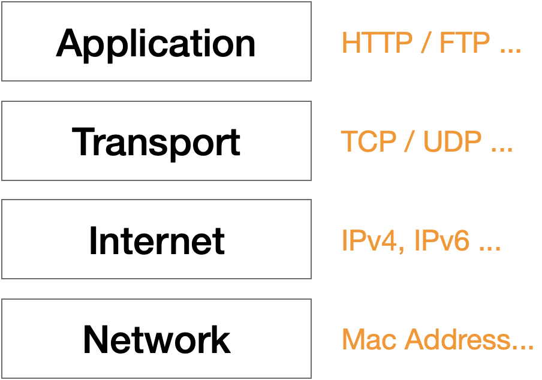

위의 구조와 `HTTPS` 와 무슨 상관이길래 갑자기 TCP/IP 4 Layer 얘기를 하였을까?HTTPS의 약어 부터 한번 확인해보자. 

> HyperText Transfer Protocol over Secure Socket Layer, HTTP over TLS, HTTP over SSL, HTTP Secure  

약어는 매우 다양하지만, 내가 TCP/IP 4 Layer를 예시를 든 이유와 적합한 약어는 **HTTP over TLS, HTTP over SSL** 의 약어라고 볼 수 있다.

즉, HTTP가 TLS 혹은 SSL 위에서 작동한다는 것이다.

위의 계층표를 보면 응용계층(Application Layer)에 `HTTP` 라고 명시한 것을 볼 수 있다. 따라서 그냥 간단하게 밑에 **TLS** 혹은 **SSL** 계층이 추가된 버전이라고 볼 수 있다.

+ HTTPS Layer
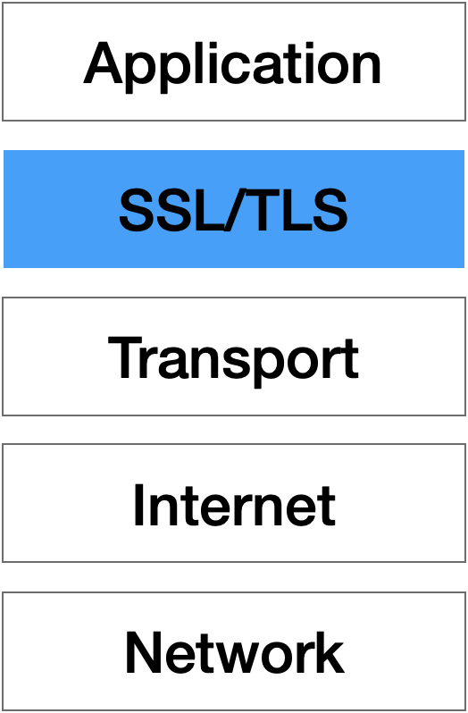

이런 구조가 HTTPS의 계층 구조라고 볼 수 있을 것이다.

그렇다면 SSL 혹은 TLS는 무엇일까?

TLS(Transport Layer Security)는 SSL(Secure Socket Layer)의 문제점을 고쳐서 보다 개선된 버전이라고 볼 수 있다. 

SSL은 `POODLE` [^1] 혹은 `DROWN` [^2] 등의 취약점이 발생해서 쓰진않고 **TLS** 가 표준이나 `openSSL` 과 같은 오픈소스 프로젝트를 보면 알 수 있듯이 **SSL** 라는 말이 계속 쓰이고 있는 상황이다.

즉, 오늘날의 HTTPS는 **모두 TLS로 동작**한다고 생각하면 된다. 그렇다면 이런 부분이 궁금해질 수 있다고 생각한다.

> **TLS** 는 **HTTP** 랑만 사용하나요?? 

아니다. 다른 프로토콜이랑도 병합해서 사용된다.

대표적으로 FTPS(File Transport protocol over SSL)과 같은게 있다. 
+ 참고 : SFTP는 ssh를 사용하므로 엄밀히 따졌을때 TLS를 사용하지는 않는다.

만약, FTPS와 SFTP의 차이가 궁금하다면 [ftp, ftps, sftp(ssh) 개념 정리](https://nhj12311.tistory.com/76)를 참고해보자. 

지금까지 HTTPS 스택에 대해서 알아봤다. 

그렇다면 네트워크에서 3way-handshake 나 4way-handshake가 있듯이 HTTPS에도 서버 <-> 클라이언트간의 연결수립 및 해제 방법이 존재할 것이다.

이것을 HTTPS Handshake라 부른다.

### STEP 1.1 HTTPS Handshake

+ HTTPS Handshake 
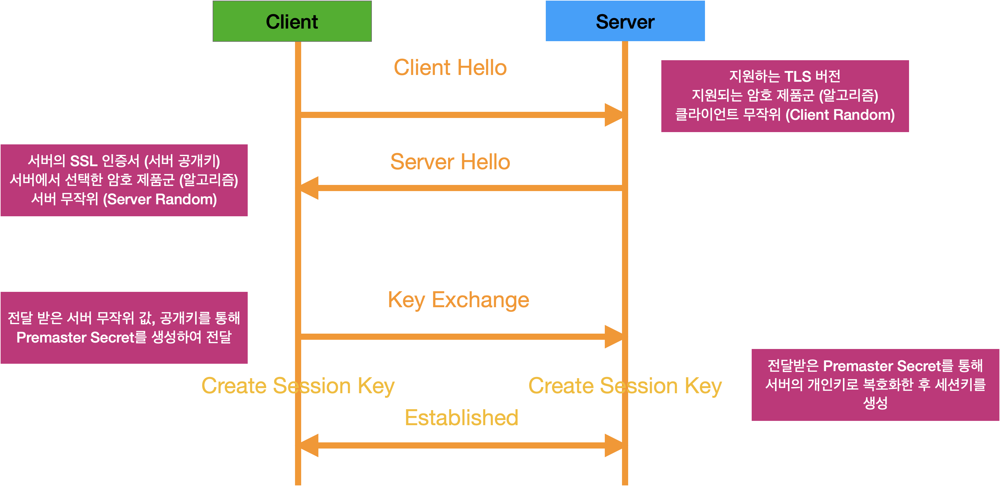


과정은 위의 그림과 같은데 이를 좀 더 풀어내면 다음과 같다.

1. **Client Hello** :  서버에게 지원되는 TLS버전(Client Version)과 암호 알고리즘(Cipher Suites) 그리고 클라이언트 무작위(Client Random) 값을 보낸다.

2. **Server Hello** : 서버는 지원하는 TLS버전(Server Version)과 암호 알고리즘(Cipher Suites) 그리고 서버 공개키(Server Certificate)를 보낸다.

3. **Key Exchange** : 클라이언트는 전달 받은 서버 무작위 값과, 공개키를 통해서 `Premaster Secret` 을 생성하여 서버에 전달한다. 이때, 서버가 전달받으면 서버의 개인키를 통해서 복호화 한 뒤에 서버 랜덤값과 클라이언트 랜덤값을 토대로 `Master Secret` 을 만든다. 

4. **Established** : **Key Exchange** 과정 속에서 Client는 `Premaster Secret` 을 생성할 때 세션 키를 만들어두고, Server는 `Master Secret` 을 만들면서 세션 키를 만들어 둔다. 이렇게 생성된 세션 키가 안전하게 공유되었으므로 이 세션 키를 이용해 서버와 클라이언트는 대칭키 방식으로 암호화 방식으로 데이터를 주고 받게 된다.

사실 위 내용은 아주 간단하게 HTTPS Handshake를 요약해둔 것이다.

 `Server Hello` 단계에서도 내부적으로 세분화 된 단계들이 존재하나 이 부분이 궁금하다면 [TLS Security 5: Establishing a TLS Connection | Acunetix](https://www.acunetix.com/blog/articles/establishing-tls-ssl-connection-part-5/) 여기를 참고하자.

HTTPS는 위와 같이 **연결 수립과정에서는 비대칭키를 활용**하여 세션 키를 만든 후에 연결 수립이 완료된 후에는 이 **세션 키를 대칭키 암호화 형식**으로 주고 받는 식으로 보안성을 높였다.

대략적으로 HTTPS에 알게되었으니 이제 진짜로 우리 로컬 서버에 HTTPS를 적용해보도록 하자.

---

## STEP 2. 로컬호스트 환경에 HTTPS 적용하기
일단 개요에서 말한 것과 같이 `MacOS` 환경에서 진행되는 것이기 때문에 `Windows` 나 `Linux` 는 아마 추가적인 작업이 필요할 것으로 보인다.

먼저, 우리가 사용할 인증서부터 발급해보자.

### STEP 2.1 minica를 이용한 로컬호스트 CA 인증서 발급 

사설 인증서를 제작하는 방식은 여러가지가 있었지만 [Let's Encrypt](https://letsencrypt.org/) 가 나오고서는 매우 쉬워졌다. 하지만, Let's Encrypt 또한 `localhost` 환경의 인증서를 만드는건 좀 까다로운 일이다. 

[Certificates for localhost -  Let's Encrypt](https://letsencrypt.org/docs/certificates-for-localhost/) 이 아티클을 통해서 만들 수 있으나 생각보다 귀찮은 작업이다.

그러던 와중에 [Minica로 Localhost를 위한 인증서 만들기](https://yongbin.kim/2019/12/02/https-for-localhost-with-minica.html) 이 블로그를 보고 `minica` 를 통해서 작업을 하는 것이 훨씬 수월하겠구나 느꼈고, 사용해보니까 정말 편했다. 

이제 설치부터 실제 인증서 방법까지 진행해보고자 한다.

1. minica 설치
    + `brew install minica` 명령어를 통해서 설치한다.
    + 윈도우나 리눅스 환경은 [GitHub - jsha/minica](https://github.com/jsha/minica) 여기서 문서를 확인해보자.


2. minica로 `localhost` 인증서 발급 
    + 명령어 : `minica -domains www.localhost,localhist -ip-addresses 127.0.0.1`

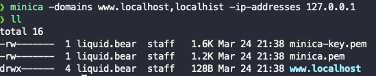

그러면 위와 같이 `.pem` 파일들이 생성된 것을 확인할 수 있다. 매우 간단하게 CA인증서[^3]를 만든 것이다. 

만약, 톰캣에 HTTPS를 적용하는 것이 아니라 웹 서버(Apache, Nginx...)에 적용하는 것이면 사실 여기서 끝내도 된다. 그러나, 이 `.pem` 파일을 스프링 부트 내장톰캣에 끼워서 띄워야하는데 톰캣은 `.jks(Java KeyStore)` 를 지원하기 때문에 변환 작업이 필요한 것이다.


+ nginx.conf 
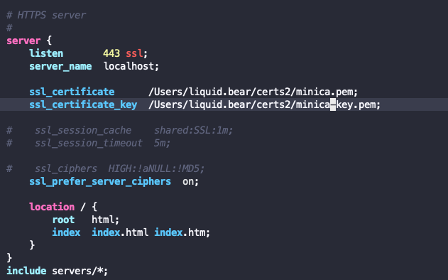

실제로 생성된 인증서를 통해서 nginx에 등록하면 아래의 화면을 볼 수 있다.


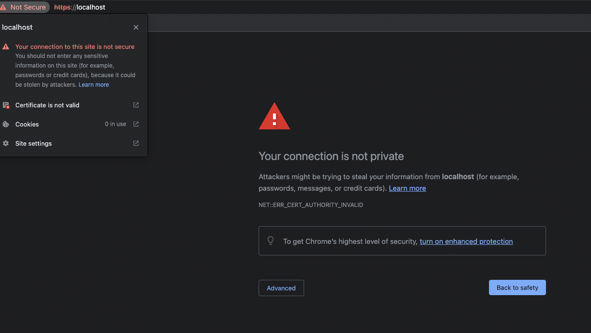

당연히 사설 인증서이므로, 발생하는 에러인데 이것도 예외를 추가함으로써 자물쇠를 띄울 수 있는데 이는 스프링에 적용한 후에 해보고자 한다.

결론은 `.pem` 으로도 충분하지만 우리가 내장 톰캣에 띄우기 위해서는 `.jks` 파일이 필요하므로 변환한다고 알아두면 될 것 같다.

### STEP 2.2 openssl 및 keytool을 이용한 p12, jks인증서 발급

먼저 `.pem` 파일을 `.p12` 파일로 변환하고자 한다.

1. `.pem` 파일을  `.p12` 파일로 변환
    + 아래의 명령어를 `minica.pem` 이 위치한 폴더에서 입력한다.

```sh
openssl pkcs12 -export -in www.localhost/cert.pem -inkey www.localhost/key.pem -out [저장할 .p12 파일명] -name localhost -CAfile minica.pem -caname minica
```

위의 명령어를 입력했으면 해당 키의 패스워드를 입력해줘야한다.

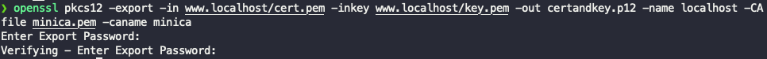

이를 마치면 `.p12` 파일이 생성됨을 확인할 수 있다.

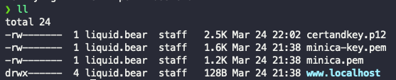

다음은 이제 `.p12` 파일을 `.jks` 로 변환하는 것이다.

2. `.p12` 파일을 `.jks` 파일로 변환
  + 아래의 명령어를 `minica.pem` 이 위치한 폴더에서 입력한다.
```
keytool -importkeystore -deststorepass [.jks 파일에 적용할 키 스토어 비밀번호] -destkeypass [.jks 파일에 적용할 키 비밀번호] -destkeystore minica.jks -srckeystore certandkey.p12 -srcstoretype PKCS12 -srcstorepass "[위의 .p12 파일을 만들때 입력했던 비밀번호]" -alias localhost
```

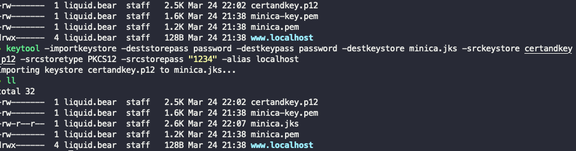

위의 처럼 `.jks` 파일이 생성됐으면 성공적으로 생성된 것이다.

변환 명령어 혹은 해당 명령어의 옵션들이 궁금하다면 아래를 참고해보자.

1. [SSL인증서, 재발급 없이 형식 바꾸기 PEM to JKS](https://www.psjco.com/32)
2. [java keytool 사용법 - Keystore 생성, 키쌍 생성, 인증서 등록 및 관리](https://www.lesstif.com/java/java-keytool-keystore-20775436.html)

---

### STEP 2.3 로컬호스트 환경 스프링부트에 HTTPS 적용 확인 
 
스프링 부트 초기 설치는 생략하고, 의존성은 `boot-starter-web` 만 있어도 된다. 설정을 확인하자.

+ application.yml
```yml
server:
  port: 8080 #Https port
  ssl:
    enabled: true
    key-store: /Users/liquid.bear/certs/minica.jks # 생성한 .jks 파일 위치
    key-store-password: "123456"  # .jks를 생성할 때 입력했던 keystore 비밀번호
    key-password: "123456" # .jks를 생성할 때 입력했던 key 비밀번호
    key-alias: "localhost" # .jks 별칭
``` 

이제 스프링 부트를 동작시켜보자.

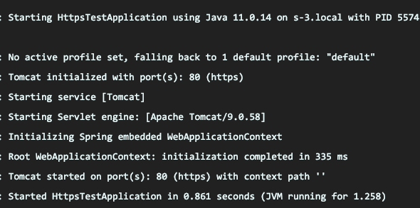

`http://localhost:8080` 로 접근하면 아래와 같은 메시지가 나올 것이다. 

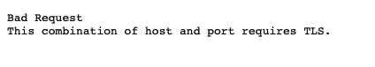

다시 `https://localhost:8080` 로 접근을 하면 아래와 같이 나올 것이다.

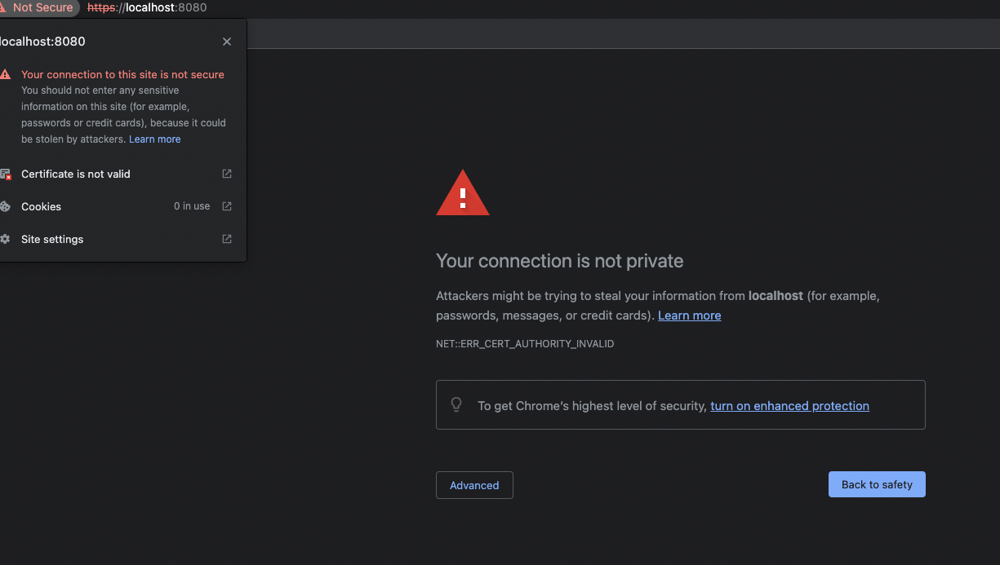

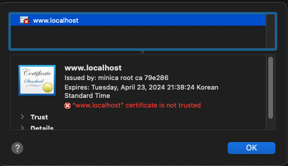

위의 경고들은 우리가 만든 인증서를 신뢰할 수 없어서 발생하는 경고로써 2가지 방법이 존재한다.

1. 파이어폭스에 인증서 예외 추가하기
	+ 장점 : 시스템적으로 신뢰하는 CA로 등록하는게 아니기 때문에 찜찜함이 덜할 수 있다.
	+ 단점 : 파이어폭스로만 Https를 확인해야한다.

2. `MacOS` KeyChain에 생성한 CA 인증서 등록 
	+ 장점 : 어떤 브라우저든 신뢰하는 인증서로 판단해준다.
	+ 단점 : 시스템 전역으로 이 CA를 신뢰한다고 판단해서 찜찜할 수 있다.

1번은 [반달가면 : 파이어폭스 브라우저에서 신뢰할 수 있는 웹서버 인증서 추가](http://bahndal.egloos.com/629897) 로 대체하고 2번을 해보고자 한다.
	
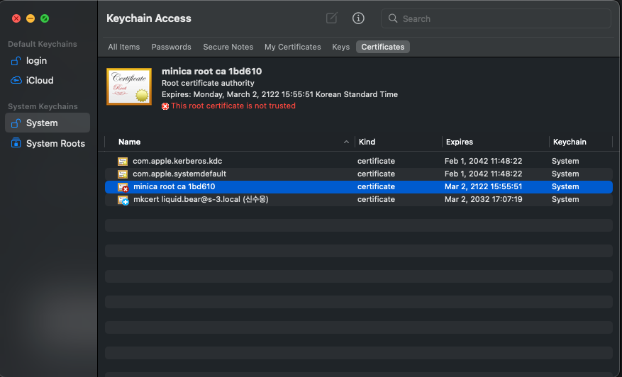

스포트 라이트에 `keychain` 이라 검색하여 위와 같은 인증서를 볼 수 있는 설정으로 들어간 후에

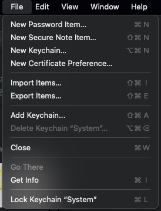

여기서 `import Items` 를 통해서 인증서를 추가하면 끝난다.

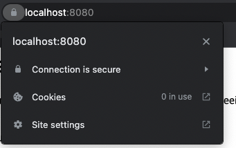

이런식으로 빨간 자물쇠가 없어진 것을 확인 할 수 있다.

이번 포스팅은 간단하게 HTTPS와 HTTPS 핸드셰이크에 대해서 다룬 후에 실제 CA인증서를 발급 후에 이것을 톰캣에 띄우기 위해서 `.jks` 파일로 변환하여 띄운 후에 인증서 예외처리를 통해서 빨간 자물쇠가 안뜨게끔 해보았다.


## STEP 3. REFERENCE
1. [What happens in a TLS handshake? | SSL handshake | Cloudflare](https://www.cloudflare.com/ko-kr/learning/ssl/what-happens-in-a-tls-handshake/)
2. [SSL(Secure Sockets Layer)이란 무엇입니까? | Cloudflare](https://www.cloudflare.com/ko-kr/learning/ssl/what-is-ssl/)
3. [HTTPS의 세부사항 | 필오의 개발일지](https://feel5ny.github.io/2019/12/08/HTTP_014_02/)
4. [TLS Security 5: Establishing a TLS Connection | Acunetix](https://www.acunetix.com/blog/articles/establishing-tls-ssl-connection-part-5/)
5. [HTTPS - 2. HTTPS의 Ciphersuite, Handshake, Key derivation](https://dokydoky.tistory.com/463)

[^1]:[SSL 3.0의 취약점 "POODLE"이란?](https://herrymorison.tistory.com/entry/SSL-30%EC%9D%98-%EC%B7%A8%EC%95%BD%EC%A0%90-POODLE%EC%9D%B4%EB%9E%80)
[^2]:[SSLv2 DROWN Attack(CVE-2016-0800) 취약점 분석 / 대응방안](https://www.hahwul.com/2016/04/07/hacking-sslv2-drown-attackcve-2016-0800/)
[^3]:[인증 기관](https://ko.wikipedia.org/wiki/%EC%9D%B8%EC%A6%9D_%EA%B8%B0%EA%B4%80)