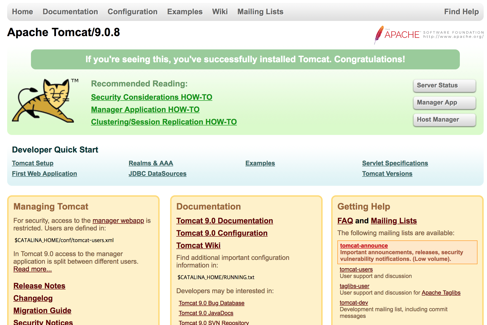

## 개요
이번 글은 Apache Tomcat 설치하고 Index.jsp 페이지인 고양이가 뛰어다니는 화면을 웹브라우저에 출력하는 것을 목표로 하겠다.

## Apache Tomcat 
이전 글을 따라서 진행하는 사람이라면, Latest Version인 JDK10을 설치했을텐데 마찬가지로 톰캣 또한, Latest Version인 9.0.10 버전으로 설치해 보도록 하겠다.
***
+ STEP 1 - Apache Tomcat 다운로드 및 설치
+ STEP 2 - Apache Tomcat 환경변수 등록 및 추가 설정 
  + STEP 2.1 - Apache Tomcat 환경변수 등록
  + STEP 2.2 - Apache Tomcat 전용 리눅스 계정 생성 후 그 계정으로 Tomcat 실행하기
  + STEP 2.3 - Apache Tomcat 서비스 등록 및 시작데몬 등록
+ STEP 3 - Apache Tomcat CentOS7 firewalld 톰캣 포트 인바운드 룰 적용 및 index.jsp 페이지 확인
  + STEP 3.1 - CentOS7 firewalld 톰캣 포트 인바운드 룰 적용
  + STEP 3.2 - Hello Tomcat!!

### STEP 1 - Apache Tomcat 다운로드 및 설치

이전 글과 마찬가지로 wget을 사용하여, Binary File을 다운로드 받고, 압축을 풀어서 설정을 해보도록 하겠다.

```console
[azureuser@AzureCentOS src]$ sudo wget http://apache.mirror.cdnetworks.com/tomcat/tomcat-9/v9.0.10/bin/apache-tomcat-9.0.10.tar.gz
[azureuser@AzureCentOS src]$ sudo tar -xvf apache-tomcat-9.0.10.tar.gz
[azureuser@AzureCentOS src]$ mv apache-tomcat-9.0.10 /usr/local/
[azureuser@AzureCentOS src]$ cd /usr/local/
[azureuser@AzureCentOS local]$ ln -s apache-tomcat-9.0.10 tomcat
```

이런식으로 압축을 푼 후에 심볼릭 링크를 생성하는 것으로 Tomcat의 설치는 어느정도 일단락된다.

### STEP 2 - Apache Tomcat 환경변수 등록 및 추가 설정 
***
#### STEP 2.1 - Apache Tomcat 환경변수 등록 및 방화벽 설정

역시나 JDK 설치때와 마찬가지로 환경변수를 등록해준다.
이전에 수정하였던 **/etc/profile** 파일을 수정을 할 것이며, 등록될 환경변수는 *CATALINA_HOME*와*CLASSPATH*가 있다.

```sh
[azureuser@AzureCentOS src]$ sudo vi /etc/profile

CATALINA_HOME=/usr/local/tomcat 
JAVA_HOME=/usr/local/java
PATH=$PATH:$JAVA_HOME/bin:/bin:/sbin
CLASSPATH=$JAVA_HOME/jre/lib:$JAVA_HOME/lib/tools.jar:$CATALINA_HOME/lib-jsp-api.jar:$CATALINA_HOME/lib/servlet-api.jar
export JAVA_HOME CLASSPATH PATH CATALINA_HOME
```

여기서*CATALINA_HOME=/usr/local/tomcat*와*CATALINA_HOME/lib-jsp-api.jar:$CATALINA_HOME/lib/servlet-api.jar*가 이전의 환경변수에서 추가되는 부분이다.

추가적인 작업을 하기 전에 톰캣이 동작하는지부터 확인해보자.


```sh
[azureuser@AzureCentOS src]$ cd /usr/local/tomcat/bin

(Tomcat 실행)
[azureuser@AzureCentOS bin]$ ./startup.sh
Using CATALINA_BASE:   /usr/local/tomcat
Using CATALINA_HOME:   /usr/local/tomcat
Using CATALINA_TMPDIR: /usr/local/tomcat/temp
Using JRE_HOME:        /usr/local/java
Using CLASSPATH:       /usr/local/tomcat/bin/bootstrap.jar:/usr/local/tomcat/bin/tomcat-juli.jar
Tomcat started.

(Tomcat 종료)
[azureuser@AzureCentOS bin]$ ./shutdown.sh
Using CATALINA_BASE:   /usr/local/tomcat
Using CATALINA_HOME:   /usr/local/tomcat
Using CATALINA_TMPDIR: /usr/local/tomcat/temp
Using JRE_HOME:        /usr/local/java
Using CLASSPATH:       /usr/local/tomcat/bin/bootstrap.jar:/usr/local/tomcat/bin/tomcat-juli.jar
NOTE: Picked up JDK_JAVA_OPTIONS:  --add-opens=java.base/java.lang=ALL-UNNAMED --add-opens=java.base/java.io=ALL-UNNAMED --add-opens=java.rmi/sun.rmi.transport=ALL-UNNAMED
```

이렇게 되면, 톰캣이 동작을 하게된다.
***
#### STEP 2.2 - Tomcat 전용 리눅스 계정 생성 후 그 계정으로 Tomcat 실행하기
지금까지 설치한 것으로는 Tomcat이 root 계정으로 돌아가게 된다.
만일 Tomcat을 root계정이 아니라 다른 계정으로 돌리기 위해서는 Tomcat을 돌리려는 계정의 홈 디렉토리에 설치되어 있거나, Tomcat이 설치된 디렉토리와 하위 디렉토리 전부를 톰캣을 실행하려는 계정 소유로 만들어야한다.

왜? Tomcat을 돌리는 계정이 따로 필요한가에 대해서는 밑에 가장 큰 세가지 문제점을 적어보겠다.
1. 업로드시 폴더에 퍼미션이 있어도, 영향을 받지 않고 프로그래밍만 되어 있으면 업로드가 된다. (접근권한이 root이기 때문)
2. 업로드 폴더 퍼미션에 실행권한을 빼도 파일업로드시 파일업로드 취약점 공격시 스크립트를 실행 할 수가 있다. (아주 간단히 예를 들면 끔찍하지만 rm -rf /가 있다.)
3. 로컬유저가 콘솔에서 jsp 파일 작성 후에 인터넷으로 접속하여 실행할 수가 있다.

이러한 치명적인 문제점때문에 대안책은 root가 아닌 다른 일반 사용자 계정으로 돌리는 것이다.

일단, 글쓴이는 Tomcat을 돌릴 계정으로 쉘 로그인 권한이 없는 계정인 Tomcat이라는 계정을 생성해보도록 하겠다.

```console
[azureuser@AzureCentOS ~]$ sudo useradd -s /bin/false tomcat (사용자 생성)
[azureuser@AzureCentOS ~]$ sudo grep tomcat /etc/passwd
tomcat:x:1001:1001::/opt/tomcat:/bin/false (계정생성 완료!)

[azureuser@AzureCentOS ~]$ sudo groupadd -r tomcat (사용자 그룹 생성)
[azureuser@AzureCentOS ~]$ sudo gpasswd -a tomcat tomcat (사용자 그룹에 사용자 등록)
[azureuser@AzureCentOS init.d]$ sudo grep tomcat /etc/gshadow (그룹 등록 완료!!)
tomcat:!::tomcat
```

참고로 리눅스에서 셀 로그인 권한이 없는 계정을 만드는 방법은 2가지가 있는데 하나는 nologin 옵션을 주는 것과 하나는 /bin/false를 주는 것이다.

두개의 차이점은 [nologin vs /bin/false][1]로 대체하겠다.

[1]: http://faq.hostway.co.kr/?mid=Linux_ETC&page=2&document_srl=1624

생성 후에 우리가 설치한 tomcat 디렉토리와 그 하위 디렉토리의 모든 권한을 tomcat으로 변경한다.
```console
[azureuser@AzureCentOS ~]$ cd /usr/local/
[azureuser@AzureCentOS local]$ chown -R tomcat:tomcat tomcat
```
***
#### STEP 2.3 - Apache Tomcat 서비스 등록 및 시작데몬 등록

역시 자바는 세팅이 반이다.
힘들지만 이제 거의 다 왔다!

먼저 아무 위치에서나 서비스 등록을 하기 위한 쉘을 만든다. 편의상 파일이름은 tomcat으로 하겠다.

```console
[azureuser@AzureCentOS ~]$ vi tomcat

(스크립트 내용)
#!/bin/bash
   #Startup script for Tomcat
   #
   # chkconfig: 345 50 50
   # description: apache tomcat 9.x
   # processname: tomcat
   # directory : CATALINA_HOME=/usr/local/tomcat
  
  JAVA_HOME=/usr/local/java
  CATALINA_HOME=/usr/local/tomcat
  CLASSPATH=$JAVA_HOME/jre/lib:$JAVA_HOME/lib/tools.jar:$CATALINA_HOME/lib-jsp    -api.jar:$CATALINA_HOME/lib/servlet-api.jar
  PATH=$PATH:$JAVA_HOME/bin:$CATALINA_HOME/bin:bin:/sbin
  export JAVA_HOME CLASSPATH PATH CATALINA_HOME
# See how we were called.
  case "$1" in
    start)
      echo -n "Starting tomcat: "
      $CATALINA_HOME/bin/startup.sh
      ;;
    stop)
      echo -n "Shutting down tomcat: "
       $CATALINA_HOME/bin/shutdown.sh
       ;;
    restart)
      echo "Restarting tomcat : "
      $CATALINA_HOME/bin/shutdown.sh;
      sleep 2
      $CATALINA_HOME/bin/startup.sh
      ;;
      *)
      echo "Usage: $0 {start|stop|restart}"
      exit 1
 esac
 exit 0

(저장 후)
[azureuser@AzureCentOS ~]$ sudo chown -R tomcat:tomcat tomcat (톰캣 계정으로 실행권한 부여)
[azureuser@AzureCentOS ~]$ sudo chmod 755 tomcat (쉘 스크립트 실행권한 부여)
[azureuser@AzureCentOS ~]$ sudo cp -a tomcat /etc/rc.d/init.d/tomcat (시작 서비스 등록을 위한 디렉토리 변경)

[azureuser@AzureCentOS ~]$ sudo chkconfig --add tomcat (runlevel 등록)
[azureuser@AzureCentOS src]$ systemctl | grep tomcat
  tomcat.service                                                                           
  loaded active running   Apache Tomcat 9
```

이렇게 하면 시작데몬까지 등록을 완료하게 된다.
### STEP 3 - Apache Tomcat CentOS7 firewalld 인바운드 룰 적용 및 index.jsp 페이지 확인 
***
#### STEP 3.1 - CentOS7 firewalld 톰캣 포트 인바운드 룰 적용
톰캣의 기본포트는 **8080**으로 만약에 접속이 안된다면, 인바운드 방화벽 설정이 되어있는지부터 확인해야된다.

원래 iptables옵션으로 설정이 가능하나 RHEL7 이후 배포판(우리가 사용하는 centOS7도 포함)은 firewalld를 이용하는 방식이 사용되기 때문에 firewalld를 이용하여 허용하는 방법을 알아보기로 하겠다.

만일, 우분투라면 UFW(Uncomplicated FireWall)를 사용하기 때문에 자신이 사용하는 운영체제의 방화벽 소프트웨어가 무엇인지부터 확인하는게 중요하다.


먼저, firewalld가 동작하고 있는지 부터 확인한다.

```console
[azureuser@AzureCentOS ~]$ sudo firewall-cmd --state
running
```

동작 중이라면, 방화벽을 잠시 끈 후에 8080 포트를 허용하기 위해서 설정 옵션을 작성한다.

```console
[azureuser@AzureCentOS ~]$ sudo systemctl stop firewalld
[azureuser@AzureCentOS ~]$ sudo firewall-cmd --permanent --zone=public --add-port=8080/tcp
[azureuser@AzureCentOS ~]$ firewall-cmd --reload
```

해당 설정은 /etc/firewalld/zones/public.xml 에서 확인할 수가 있다.

```console
[azureuser@AzureCentOS ~]$ vi /etc/firewalld/zones/public.xml

<zone>
  <short>Public</short>
  <description>For use in public areas. You do not trust the other computers on networks
               to not harm your computer. Only selected incoming connections are accepted.</description>
  <service name="dhcpv6-client"></service>
  <service name="ssh"></service>
  <port protocol="tcp" port="8080"></port>
</zone>
```

자세한 내용은 
[Linux Firewall][1]에서 확인하면 된다.

[1]: https://oracle-base.com/articles/linux/linux-firewall-firewalld "Linux Firewall"
***
#### STEP 3.2 - Hello Tomcat!!
지금까지의 과정을 마쳤으면, 이제 톰캣이 제대로 동작하는지 확인해야 될 차례이다.
CentOS7이 설치된 PC의 아이피를 입력하거나, 그 PC 내부에서 웹브라우저를 킨 뒤에 확인할 수가 있다.

전자의 경우에는 웹브라우저에 **server-ip:8080**을 입력하면 되고, 후자 같은 경우에는 **127.0.0.1:8080**을 입력하면 된다.


위와 같은 화면이 보인다면 성공적으로 톰캣이 설치가 된 것이다.

## 마치면서
다음 글은 Nginx와 Tomcat을 연동하는 것으로 마무리로 Linux상에서 Java 환경을 구축하는 시리즈를 마무리를 짓기로 하겠다.