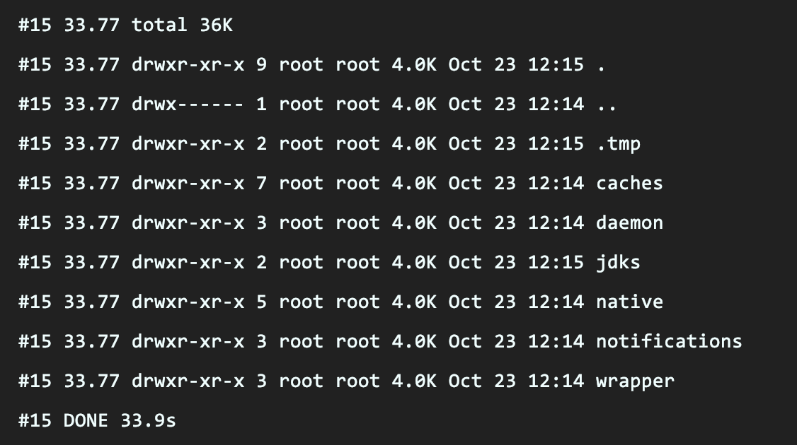

# 개요

이직을 한 후에 너무 바쁘다보니 블로그 포스팅을 신경을 쓰지 못하였다.
아직도 바쁘긴하지만, 그래도 여유가 조금씩 생기고 있어서 틈틈히 썼던 초안을 다듬어서 올려보려고 노력해보겠다.

이번 포스팅의 내용은 AWS Ligthsail와 Github를 통한 CI/CD 구축 예시이다.

# AWS Ligthsail과 Github를 이용한 CI/CD 파이프라인 구축 예시

+ STEP 1. AWS Ligthsail란?
+ STEP 2. AWS Ligthsail과 Github를 이용한 CI/CD 파이프라인 구축 예시
  + STEP 2.1. Spring Boot Application Dockerize 
    + STEP 2.1.1. Docker Buildkit 
  + STEP 2.2 Ligthsail 배포 전 사전 작업
    + STEP 2.2.1 IAM 계정 생성
    + STEP 2.2.2 Github Secret을 통한 보안 작업
  + STEP 2.3 Github Deploy.yml 파일 작성
+ STEP 3. 정리
+ STEP 4. REFERENCE

## STEP 1. AWS Ligthsail란?

<p align="center">
    
</p>
<p align="center">
   <em>그림 1. 라이트세일 웹 콘솔</em>
</p>

Ligthsail(이하, 라이트세일)은 AWS에서 2016년에 공표한 서버 호스팅 서비스입니다.

기존 AWS 서비스 중에 하나지만 SQS나 RDS 등과 달리 Ligthsail은 아예 독립적인 페이지를 갖고 있는 것을 볼 수가 있습니다.

이렇게 구성된 이유는 기존 AWS가 너무 복잡하기 때문입니다. 
실제로, 많이 사용하는 EC2 서비스의 경우에도 네트워크부터 스토리지까지 매우 다양한 옵션들이 존재하며, EC2를 실무에서 써본 분이라고 알겠지만 별도의 VPC와 같은 가상 네트워크가 필수가 되면서 점점 복잡도는 높아지고 있었습니다.

이러한 복잡도를 낮추고 저렴하게 사용할 수 있는 서비스가 바로 라이트세일이라 볼 수 있습니다.
저렴한 가격으로 큰 서버로 옮기게 될 경우에도 익숙한 환경에서 적응할 수 있는 엔트리 모델의 서비스라고 볼 수 있습니다.

실제로, 라이트세일은 나중에 EC2로 마이그레이션해주는 도구들과 고정 IP 및 저희가 뒤에 쓸 서비스 내용인 Ligthsail container 서비스도 제공해줍니다.

글 작성 시점 기준으로 Ligthsail은 아래의 기능을 제공해줍니다. 

1. 인스턴스 (기존 EC2와 비슷)
2. 컨테이너 (기존 ECS과 비슷) 
3. 데이터베이스 (기존 RDS와 비슷)
4. 네트워크 (고정 IP 할당 및 DNS 서비스 등)
5. 스토리지 (기존 S3와 비슷)

여기서 저희는 1번을 사용하는 것이 아닌 2번을 활용하여 Spring Boot Application을 Dockerize하여 배포파이프라인을 만들고 배포를 진행하는 식으로 진행해 볼 예정입니다.

사용을 해봤을 때 느낀점은 ECS 보다 매우 편리하고 관리하기도 매우 쉬웠습니다.
또한, Github Actions API와 궁합도 잘맞아서 앞으로 사이드 프로젝트를 진행할 때 라이트세일 컨테이너를 쓰지않을까 생각해봅니다.

좀 더 라이트세일에 대해서 궁금하시면 아래의 링크를 확인해주시면 좋을 것 같습니다.

1. [아마존 라이트세일(Amazon Lightsail)이란?](https://www.44bits.io/ko/keyword/amazon-lightsail)
2. [AWS Lightsail - 라이트세일을 소개합니다., 운클라우드](https://wooncloud.tistory.com/96)
3. [아마존 라이트세일 요금의 모든 것과 비용 관리 방법 (서버 및 리소스 가격 책정 방법) - 스위프트코딩](https://swiftcoding.org/all-about-amazon-lightsail-billing)

저희는 라이트 세일 가격정책이나 서비스 내용이 중심이 아니기에 이 부분은 생략을 하고 배포 파이프라인 구축 및 빌드 관련된 이야기를 나눠보고자 합니다.

## STEP 2. AWS Ligthsail과 Github를 이용한 CI/CD 파이프라인 구축 예시

위에서 잠깐 언급한 내용처럼 저희는 라이트세일 컨테이너 서비스와 Github Action을 활용하여 CI/CD 파이프라인을 구축하고자합니다.

대상이 될 어플리케이션은 간단한 스프링부트 어플리케이션을 활용할 예정입니다.

### STEP 2.1. Spring Boot Application Dockerize 

우선, 라이트세일 컨테이너 서비스에 배포를 하기 위해서는 기존 스프링 부트 어플리케이션을 도커라이징해야합니다. 

예제 샘플(Dockerfile)은 아래와 같습니다.

```sh
# syntax=docker/dockerfile:experimental
FROM openjdk:11-jdk AS build-stage
WORKDIR /workspace/app

COPY src /workspace/app/src
COPY gradle /workspace/app/gradle
COPY gradlew settings.gradle build.gradle /workspace/app/

RUN --mount=type=cache,target=/root/.gradle ./gradlew clean build -x test
RUN mkdir -p build/dependencies && (cd build/dependencies; jar -xf ../libs/ligthsail-example-1.0-SNAPSHOT.jar)

FROM openjdk:11-jre-slim
WORKDIR /tmp
ARG DEPENDENCY=/workspace/app/build/dependencies

COPY --from=build-stage ${DEPENDENCY}/BOOT-INF/lib ./app/lib
COPY --from=build-stage ${DEPENDENCY}/META-INF ./app/META-INF
COPY --from=build-stage ${DEPENDENCY}/BOOT-INF/classes ./app/

ENTRYPOINT ["java","-cp","app:app/lib/*","io.github.brewagebear.LigthsailApp"]
```

어려워 보일 수 있으나 한가지씩 뜯어보면 그렇게 어렵지 않습니다.

### STEP 2.1.1. Docker Buildkit 

우선 첫 줄에 아래와 같은 명령어가 적힌 것을 볼 수 있다.
`# syntax=docker/dockerfile:experimental` 

이 부분은 [moby/buildkit - syntax](https://github.com/moby/buildkit/blob/master/frontend/dockerfile/docs/reference.md#syntax)에서 내용을 확인할 수 있다.
즉, 위의 주석은 Buildkit을 활용하여 도커를 빌드할 때 실험적 기능을 키기 위한 옵션 주석이라고 볼 수 있다.

그렇다면, BuildKit은 무엇일까?
Docker 18.09버전부터 지원되기 시작한 백엔드 도구라고 한다.

백엔드 도구와 프론트 엔드에 대해서 이해를 하기 전에 BuildKit 프로젝트가 만들어진 계기를 간략하게 설명하면 아래와 같다.

<p align="center">
    
</p>
<p align="center">
    <em>그림 1. 싱글 빌드 형태의 Dockerfile</a></em>
</p>

초기에 도커 빌드를 할 때 위와 같은 Dockerfile을 생성하여 빌드를 하곤 하였다.
그런데 이런 구조의 문제점은 옆에 하드 디스크 같이 보이는 아이콘의 갯수를 보면 이해할 수 있는데 명령행이 시작되면서 갈수록 레이어가 무거워진다는 단점이 존재하였다.

실제로 이러한 빌드형태로 이미지를 생성하게 되면 상당히 많은 용량을 차지하는 것을 볼 수 있다.

그렇다면, 이러한 방식을 개선한 점이 없을까?

<p align="center">
    
</p>
<p align="center">
    <em>그림 2. 멀티 스테이징 빌드 형태의 Dockerfile</a></em>
</p>

위와 같은 방식으로 멀티 스테이징 빌드 방식으로 빌드를 할 경우에 좀 더 경량화된 이미지를 갖게된다.

멀티 스테이징 빌드 방식은 이미지를 만드는 동안 빌드 등에서는 필요한 의존성이 존재하지만, 최종 컨테이너 이미지에는 필요 없는 환경을 제거할 수 있도록 단계를 나누어 이미지를 만드는 기법이다. 

따라서, 위와 같이 경량화된 도커파일을 얻을 수 있다. 
이렇게 되면서 빌드타임에 이점을 가져갈 수 있다.

이 멀티스테이징 빌드는 많은 사람들에게 각광을 받았고 나온 후에 많은 사람들이 이용하는 빌드 방식이 되었다.

그러나, 오늘날 빌드파일은 점차 계속해서 복잡해지고 있다.
이를테면, 최종 이미지에 의존성이 A서비스의 의존성과 B 서비스의 의존성을 갖을 수 있는식으로 말이다.

최종 이미지에는 두가지 모두 필요하지만, 사용자 입장에서 빌드타임을 더 단축시키기위해 만약, 다른 스테이지지만 최종에 모두 필요한 의존성이라면 병렬로 빌드할 수 있을 것이다.

그래서 나온 것이 바로 BuildKit이다.

<p align="center">
    
</p>
<p align="center">
    <a href="https://blukat.me/2021/07/docker-buildkit-speedup/"><em>그림 3. Buildkit 병렬 빌드 - blukat29, 2021</em></a>
</p>

당연히 BuildKit이 이 역할만 하는 애는 아니다.
따라서, BuildKit이 해당 기능을 위해서만 나온건 아니고, 전반적인 빌드 속도나 기타 편의기능들을 추가한 도구라고 보면될 것 같다.

자세한 내용은 

[공식 레포지토리](https://github.com/moby/buildkit#quick-start)를 보면 아래와 같은 핵심 기능을 설명하고 있다.

Key features:
1. Automatic garbage collection
2. Extendable frontend formats
3. Concurrent dependency resolution
4. Efficient instruction caching
5. Build cache import/export
6. Nested build job invocations
7. Distributable workers
8. Multiple output formats
9. Pluggable architecture
10. Execution without root privileges

여기서, 우리가 사용하는 Key feature는 5번(**Build cache import/export**)에 해당한다고 보면된다.

사실 우리의 `Dockerfile`은 parallel multi staging build 기능이 필요없는 `Dockerfile`이기 때문이다.

명령어를 키고 위의 `Dockerfile`을 아래와 같이 바꿔주자.

```sh
... 중략 ...

# AS-IS
RUN --mount=type=cache,target=/root/.gradle ./gradlew clean build -x test

# TO-BE
RUN --mount=type=cache,target=/root/.gradle ls -alh /root/.gradle; ./gradlew clean build -x test; ls -alh /root/.gradle
... 중략 ...
```

그 후에 아래의 명령어를 활용하여 빌드를 수행해보자.
`DOCKER_BUILDKIT=1 docker build -t test/test:1.0.0 . --no-cache --progress=plain`

참고로, 여기서 `DOCKER_BUILDKIT=1` 은 Buildkit을 백엔드로 활성화한다는 의미이다.

명령어를 통해서 초기 빌드 시에 대략 내 노트북 기준 35초 정도 걸리는 것을 확인하였다.
참고로 TO-BE 부분은 아래의 내용을 확인하기 위해서 작성했다.

<p align="center">
    
</p>
<p align="center">
    <em>그림 4. 초기 ls -alh로 검색 시 아무런 캐시 데이터가 없는 것이 확인된다.</em></a>
</p>

<p align="center">
    
</p>
<p align="center">
    <em>그림 5. Gradle Task가 끝난 후 ls -alh 명령 시 아래와 같이 캐시가 적재된다.</em></a>
</p>

우리는 캐시가 적재되었음을 눈으로 확인하였다. 
그렇다면, 아래의 명령어를 통해서 빌드를 수행해보자. 

`DOCKER_BUILDKIT=1 docker build -t test/test:1.0.0 . --progress=plain`

총 시간이 대략 1.9초 걸린것을 확인할 수 있다.

<p align="center">
    
</p>
<p align="center">
    <em>그림 6. 캐시가 적용되었음을 확인할 수 있다.</em></a>
</p>

즉, BuildKit 캐시를 이용하면 Gradle에 등록된 의존성을 빌드할 때마다 새로 받는 것이 아니라 이미 캐시가 있으면 캐시를 활용하고, 변경된 부분만 사용한다고 볼 수 있다.

실제로 build.gradle에 lombok만 추가해서 다시 빌드한 결과는 아래와 같다.

<p align="center">
    
</p>
<p align="center">
    <em>그림 8. 의존성 추가 시 기존 값은 캐시를 쓰고, 새 의존성은 리빌드 </em></a>
</p>

즉, Buildkit을 활용하면 빌드타임이 빠르게 단축될 수 있다. 

BuildKit에 대해서는 더 할 말이 많은데, 포스팅의 길이가 길어질 것 같아서 우리가 사용하는 기능에 대해서만 다루고 다음으로 넘어가고자 한다.

## STEP 2.2 Ligthsail 배포 전 사전 작업

일단, 위에서 `Dockerfile`을 Buildkit의 캐시기능을 활용한 멀티스테이징 빌드기법으로 만들었다. 

저걸로 이제 우리는 Spring Application의 이미지를 말 수가 있는데, 이제 남은건 배포 스크립트 설정만 남아있다. 

그 전에 사전작업 몇 가지를 진행하고자한다.

1. LigthSail IAM 계정 설정

이 부분은 보안 상 이점을 가져가기 위해서 ROOT 계정이 아닌 서비스용 IAM 계정을 발급하는 내용이다.

이 부분은 기존의 AWS Web Console을 통해서 작업할 수 있다.


<p align="center">
    
</p>
<p align="center">
    <em>그림 9. AWS 웹콘솔 - IAM </em></a>
</p>

참고로, 위 두개에 초록색 활성화 버튼이 보이는데 저것은 권장사항보다는 필수사항이라고 생각이 든다. 생각보다 AWS 해킹사태가 빈번하게 발생해서 해커가 인스턴스를 채굴용으로 만들어서 몇 천만원 과금이 발생한 사례가 존재하기도 하였다.

1. [aws - 저에겐 2174만원이 없습니다.(해킹과금)](https://velog.io/@gmtmoney2357/aws-%EC%A0%80%EC%97%90%EA%B2%90-2174%EB%A7%8C%EC%9B%90%EC%9D%B4-%EC%97%86%EC%8A%B5%EB%8B%88%EB%8B%A4.-%ED%95%B4%ED%82%B9%EA%B3%BC%EA%B8%88)
2. [aws 해킹때메 2천만원 요금 청구 왔었네](https://m.ruliweb.com/best/board/300143/read/56010593?)

이거말고도 더 많은 사례를 보았고, 심지어 아마존에서는 요즘은 모든 피해사례를 무료로 해주기보다는 일정 금액 손해배상을 요청한다하니 다른건 몰라도 ROOT 계정의 MFA는 필수로 설정하자. 

IAM 계정을 설정하는 이유도 동일하다. 
만약, 해킹을 당하더라도 IAM 계정이 권한이 좁게 주어지면, 해커가 인스턴스 생성이나 그런 행위는 못할 것이기 때문이다. 

귀찮더라도 작업을 진행해보자.

순서는 아래와 같다. 

1. IAM 사용자 그룹 생성 (생략 가능)
2. IAM 사용자 생성
3. IAM 사용자 Accesskey & Private Key csv 다운로드

1번은 해도 되고, 안해도 되는 부분이니 2번 부터 수행하고자한다.
AWS Web Console IAM 대시보드 우측에 액세스 관리 > 사용자를 클릭하여 사용자 추가를 할 수 있다.

<p align="center">
    
</p>
<p align="center">
    <em>그림 10. AWS 웹콘솔 - IAM 사용자 추가 </em></a>
</p>

나는 'lightsail-container-service' 라는 계정을 생성하였다.
이후 정책을 추가하면 된다.
물론, 만들면서 정책을 추가해도 상관없다.


<p align="center">
    
</p>
<p align="center">
    <em>그림 11. AWS 웹콘솔 - IAM 사용자 정책 추가 </em></a>
</p>

읽기, 쓰기 모두 ContainerService에 해당하는 권한을 추가하였다.
단, 쓰기에서 CreateContainerService는 권한을 제거하였다. (루트 계정으로 생성하기 때문)

따라서, 쓰기에는 ECR과 같은 솔루션을 쓸지는 모르겠지만
1. CreateContainerServiceDeployment
2. CreateContainserServiceRegistryLogin 
3. RegisterContainerImage
4. UpdateContainerService

정도면 될 것 같다.

<p align="center">
    
</p>
<p align="center">
    <em>그림 12. AWS 웹콘솔 - IAM 사용자 정책 추가 (ARN 세팅) </em></a>
</p>

쓰기 기능은 ARN이 설정이 가능한데, 일단 명시적인 group-id를 얻으면 좋겠으나 현재는 그 값을 구하기 어려운 상황(컨테이너 생성 전)이라 id는 *로 와일드 카드를 추가해둔다. 

이 정도면 충분하지 않을까 생각을 해본다.

그 후 IAM 사용자의 AccessKey & SecretKey를 Github Action에 사용하기 위해서 csv를 등록한 뒤에 github에 실제로 추가를 해야한다.

<p align="center">
    
</p>
<p align="center">
    <em>그림 13. Github - github action 대상 프로젝트에 secret 등록 </em></a>
</p>

위와 같이 진행하면 사전작업은 끝이다. 
자 이제 배포 스크립트를 작성해보자.

```yml
name: Build and deploy Docker app to Lightsail

on:
  push:
    branches:
      - main # 배포 트리거 대상 브랜치 on.push.branch -> 해당 브랜치가 푸시될 때 트리깅

env:
  AWS_REGION: ap-northeast-2 
  AWS_LIGHTSAIL_SERVICE_NAME: amazon-lightsail-container-example # 실제 lightsail에 올라갈 이미지 명

jobs:
  deploy:
    name: Build and deploy
    runs-on: ubuntu-latest
    defaults:
      run:
        working-directory: ligthsail-example # github project내에 배포할 대상 프로젝트 디렉토리
    steps:
      - name: Checkout # 해당 working-directory checkout (트리깅 브랜치 최신버전)
        uses: actions/checkout@v2
        
      - name: Install Utilities # 필수 유틸리티 다운로드 
        run: |
          sudo apt-get update
          sudo apt-get install -y jq unzip

      - name: Install AWS Client # AWS SDK 다운로드 (LightSail 이미지 푸시 및 배포를 위함)
        run: |
          curl "https://awscli.amazonaws.com/awscli-exe-linux-x86_64.zip" -o "awscliv2.zip"
          unzip awscliv2.zip
          sudo ./aws/install || true
          aws --version
          curl "https://s3.us-west-2.amazonaws.com/lightsailctl/latest/linux-amd64/lightsailctl" -o "lightsailctl"
          sudo mv "lightsailctl" "/usr/local/bin/lightsailctl"
          sudo chmod +x /usr/local/bin/lightsailctl

      - name: Configure AWS credentials # 입력된 IAM 사용자 액세스키 & 시크릿키 검증
        uses: aws-actions/configure-aws-credentials@v1
        with:
          aws-region: ${{ env.AWS_REGION }}
          aws-access-key-id: ${{ secrets.AWS_ACCESS_KEY_ID }}
          aws-secret-access-key: ${{ secrets.AWS_SECRET_ACCESS_KEY }}

      - name: Build Docker Image # Docker Buildkit 빌드
        run: DOCKER_BUILDKIT=1 docker build -t ${{ env.AWS_LIGHTSAIL_SERVICE_NAME }}:release .

      - name: Push and Deploy # 이미지 푸시 및 배포
        run: |
          service_name=${{ env.AWS_LIGHTSAIL_SERVICE_NAME }}
          aws lightsail push-container-image \
            --region ${{ env.AWS_REGION }} \
            --service-name ${service_name} \
            --label ${service_name} \
            --image ${service_name}:release
          aws lightsail get-container-images --service-name ${service_name} | jq --raw-output ".containerImages[0].image" > image.txt
          jq --arg image $(cat image.txt) '.containers.app.image = $image' container.template.json > container.json
          aws lightsail create-container-service-deployment --service-name ${service_name} --cli-input-json file://$(pwd)/container.json
```

위에 각 스텝마다 간단히 주석을 달아놨다.
사실, AWS SDK를 직접 내려받아서 AWS CLI로 처리를 하는 것을 볼 수가 있다.

위의 코드를 github action을 사용할 프로젝트에 `.github/workflows` 디렉토리 밑에 두면 실제로 액션이 수행된다. 

한번 main 브랜치에 푸시를 하면 이런식으로 github action이 동작하는 것을 볼 수 있다.

<p align="center">
    
</p>
<p align="center">
    <em>그림 14. Github Action 수행 결과 </em></a>
</p>

하지만, 에러가 발생하는 것을 볼 수 있다. 
이 부분은 AWS CLI로 라이트세일 컨테이너 서비스 배포를 처리할 때 발생하는 템플릿 파일이 없어서 발생하는 에러이다.

```yml
...중략...
jq --arg image $(cat image.txt) '.containers.app.image = $image' container.template.json > container.json # container.tamplate.json이 없어서 에러 발생 
...중략...
```

이 파일을 추가하자.

```yml
{
  "containers": {
    "app": {
      "image": "",
      "environment": {
        "APP_ENV": "release"
      },
      "ports": {
        "80": "HTTP"
      }
    }
  },
  "publicEndpoint": {
    "containerName": "app",
    "containerPort": 80,
    "healthCheck": {
      "healthyThreshold": 2,
      "unhealthyThreshold": 2,
      "timeoutSeconds": 5,
      "intervalSeconds": 10,
      "path": "/",
      "successCodes": "200-499"
    }
  }
}
```

이 파일이 필요한 이유는 위 배포 스크립트에서 jq를 통해서 `container.template.json` 에 생성된 이미지 이름을 넣고, 아래의 명령을 수행하기 때문이다.

`aws lightsail create-container-service-deployment --service-name ${service_name} --cli-input-json file://$(pwd)/container.json`

따라서, aws cli로 배포를 진행할 때 해당 json으로 헬스 체크나 port등을 처리한다 볼 수 있다.

Spring boot Application 기준으로 디렉토리 트리를 보자면 아래와 같다.

```sh
.github
  └── workflows
       └── deploy.yml
ligthsail-example
├── Dockerfile
├── build.gradle
├── container.template.json
├── gradle
├── gradlew
├── gradlew.bat
├── settings.gradle
└── src
```
위와 같은 구조로 세팅을 하면 보면 된다. 
따라서, 이 글을 보면서 구축을 하려면 어플리케이션 디렉토리와 `.github/workflows` 디렉토리를 분리하고, 어플리케이션 디렉토리 최상단에 `Dockerfile` 과 `container.tamplate.json`을 위치시키면 된다고 보면된다.

<p align="center">
    
</p>
<p align="center">
    <em>그림 14. Github Action - 배포 성공 </em></a>
</p>

설정이 정상적이라면 위와 같이 배포 성공했음을 알 수가 있을 것이다.
그렇다면, 라이트세일 콘솔에서 제대로 반영됐는지 확인해보자.

<p align="center">
    
</p>
<p align="center">
    <em>그림 15. Lightsail 웹 콘솔 - 배포 성공 </em></a>
</p>

주어진 Public domain으로 요청을 보냈을 때 (`api/v1/greeting`) 안녕하세요가 나오는지 확인해보자. 

<p align="center">
    
</p>
<p align="center">
    <em>그림 16. API 호출 성공</em></a>
</p>

위와 같이 정상적으로 나옴을 확인할 수 있었다.

## STEP 3. 정리 

이번 기회에 EC2와 달리 간단하게 설치할 수 있는 VPS 서비스인 LightSail CI/CD를 만들어보았다.

물론, 라이트세일 인스턴스 서비스가 아닌 컨테이너 서비스를 활용하였다는 것을 잊으면 안된다.

우리는 이 컨테이너 서비스에 이미지를 적재하기 위해서 아래와 같은 것들을 배웠다.
1. 싱글 빌드
2. 멀티스테이징 빌드
3. Buildkit을 활용한 의존성 캐시 + 멀티스테이징 빌드

3을 통해서 좀 더 빠르게 빌드를 할 수 있었고, 이 만들어진 Dockerfile을 적재하기 위해서 
Github Action을 사용하고자 하였다.

그 전에 먼저 IAM 사용자를 추가하여 보안성을 확보하였고, 해당 액세스 키랑 시크릿 키도 Github Secret을 통해서 처리되게끔 설정하였다.

그 뒤에 Github Action의 배포 스크립트를 통해서 실제 배포를 진행하였다.
많은 과정을 겪었는데, 한번 익숙해지면 금방 할 수 있지 않을까 싶다.

위의 내용 중 상당 부분을 아래의 레포지토리를 참고하였습니다.

+ [arch-inc/amazon-lightsail-containers-test](https://github.com/arch-inc/amazon-lightsail-containers-test)

해당 레포지토리 작성자가 쓴 글도 보시면 매우 좋습니다.

+ [研究プロジェクトのWebアプリを気軽にデプロイする方法](https://zenn.dev/junkato/books/how-to-deploy-research-web-apps/viewer/introduction)

일어라 저는 파파고로 번역해서 읽었습니다.


모쪼록 긴 글이지만 읽어주셔서 감사합니다.


## STEP 4. REFERENCE 

1. [아마존 라이트세일(Amazon Lightsail)이란?, 44BITS, 2021](https://www.44bits.io/ko/keyword/amazon-lightsail)
2. [AWS Lightsail - 라이트세일을 소개합니다, 운클라우드, 2022](https://wooncloud.tistory.com/96)
3. [아마존 라이트세일 요금의 모든 것과 비용 관리 방법 (서버 및 리소스 가격 책정 방법), 스위프트코딩, 2020](https://swiftcoding.org/all-about-amazon-lightsail-billing)
5. [moby/buildkit, github](https://github.com/moby/buildkit)
6. [Docker Buildkit으로 빌드 시간 단축하기, blukat29, 2021](https://blukat.me/2021/07/docker-buildkit-speedup/)
7. [Compiling Containers – Dockerfiles, LLVM and BuildKit, Adam Gordon Bell, 2021](https://earthly.dev/blog/compiling-containers-dockerfiles-llvm-and-buildkit/)
8. [How to Speed Up Your Dockerfile with BuildKit Cache Mounts, vsupalov, 2022](https://vsupalov.com/buildkit-cache-mount-dockerfile/)
9. [arch-inc/amazon-lightsail-containers-test](https://github.com/arch-inc/amazon-lightsail-containers-test)
10. [研究プロジェクトのWebアプリを気軽にデプロイする方法, Jun Kato, 2021](https://zenn.dev/junkato/books/how-to-deploy-research-web-apps/viewer/introduction)
