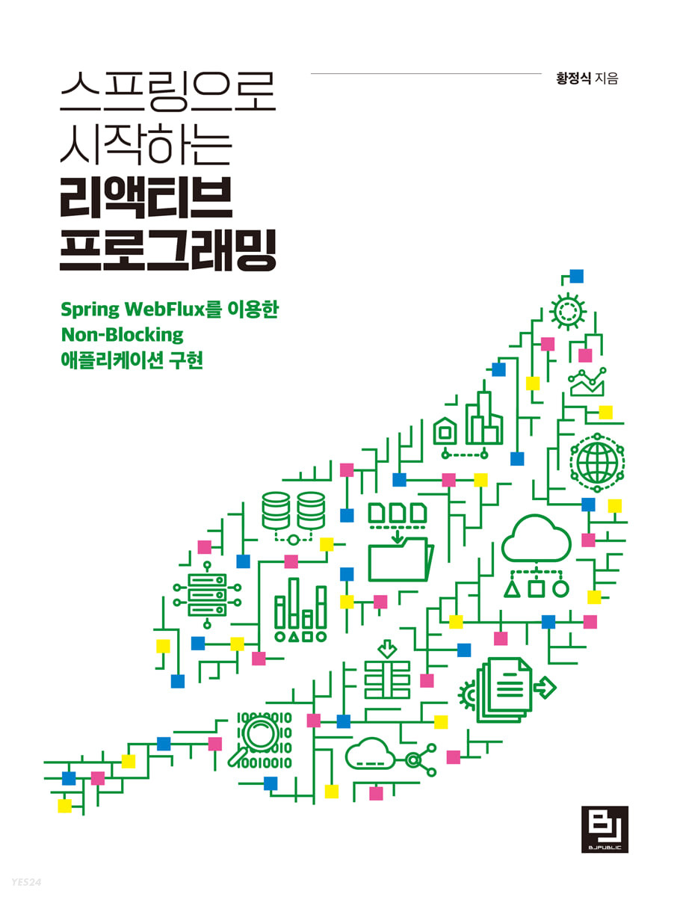

```toc
```

# 개요

사실 예전부터 리액티브 시스템과 스트림즈에 대한 글은 준비를 하고 있었다.
초안까지 어느정도 만들어 둔 상태였는데 다 갈아엎고 다시 쓰게되었다.

그 이유는 바로 아래의 책 때문이다.

<p align="center">
    
</p>
<p align="center">
    <em><a href="https://www.yes24.com/Product/Goods/118202569">그림 1. 스프링으로 시작하는 리액티브 프로그래밍, 황정식 저, 2023</a></em>
</p>

사실 국내 번역서 중에서 리액티브 프로그래밍을 좀 잘 다룬 책은 찾기가 힘들었었다.
그래서, 원래 초안은 아래의 책을 참고하고, 공식문서들을 참고해서 작성하고 있었다.

+ [Hands-On Reactive Programming in Spring 5, Igor Lozynskyi, 2018](https://www.amazon.com/Hands-Reactive-Programming-Spring-cloud-ready-ebook/dp/B076QCBXZ2)

이 책도 매우 잘쓰여진 책이라고 볼 수 있다. 하지만 위 책과 비교하면 저 원서의 경우에는 거시적인 관점에서 작성되었다면, 황정식님께서 작성하신 책은 미시적인 관점의 책이라고 볼 수 있다. 

이 포스팅의 내용 대부분은 두 가지 책과 공식문서를 참고하였다.

예시 코드는 아래의 레포지토리들을 참고바란다.
1. [blog-exampl/reactive-examples](https://github.com/brewagebear/blog-example/tree/main/reactive-examples)
2. [Hands-On-Reactive-Programming-in-Spring-5](https://github.com/PacktPublishing/Hands-On-Reactive-Programming-in-Spring-5)
3. [String-Reactive](https://github.com/bjpublic/Spring-Reactive)


## STEP 2. 리액티브 시스템과 리액티브 프로그래밍 

### STEP 2.1 리액티브 시스템이란?

요즘날 프로그래밍 세계에서는 리액티브라는 말이 수도 없이 많이 거론되고 있다.
하지만, 정작 리액티브(Reactive)라는 단어 자체에 대한 모호함때문에 정확히 어떠한 시스템인지 감을 잡기가 힘들다.

실생활의 예에서 찾아보자. 예능이나 토크쇼 프로그램을 보면 MC들이 게스트들에게 리액션을 잘한다고 한다.
그렇다면 리액션은 어떤 것일까? 화자의 얘기를 청취하고 맞장구를 잘 쳐주는 행위를 리액션이라고 볼 수 있을 것이다.

리액티브 시스템도 그런 맥락에서 보면, **반응을 잘하는 시스템**이라고 볼 수 있을 것이다.
하지만, 아직까지도 모호하다. 반응을 잘한다는 뜻은 어떤 것일까? 

아마도 소프트웨어 엔지니어의 관점에서 본다면 클라이언트의 요청에 대해서 빠르게 응답해주는 시스템일 것이다.
이를 한 문장으로 정리하면 아래와 같다고 볼 수 있을 것이다.

> 클라이언트의 요청에 즉각적으로 응답함으로써 지연 시간을 최소화하는 시스템 
> - 스프링으로 시작하는 리액티브 프로그래밍, Kevin, p.28 -

그렇다면 리액티브 시스템은 기존 시스템과 어떠한 차이를 통해서 위에서 말한 목표를 이루고자하는 것일까?
이를 알기 위해서는 리액티브 선언문을 봐야한다.


<p align="center">
    
</p>
<p align="center">
    <em>그림 2. 리액티브 선언문</em>
</p>

위 도표를 설명하면 아래와 같다. 

+ MEANS(방법) : 리액티브 시스템에서 주요 통신 수단을 무엇을 사용할지를 표현한 것으로, 비동기 메시지 기반으로 동작한다.
+ FORM(형태) : 비동기 메시지 통신 기반하에 시스템의 변화하는 작업량에 탄력적으로 대응하고, 장애가 발생하더라도 응답성을 유지하는 것을 뜻한다.
	+ Elasticity(탄력성) : 유입되는 입력이 많든 적든 간에 시스템이 요구하는 응답성을 일정하게 유지
	+ Resilient(회복성) : 비동기 메시지 기반 통신을 이용하여 낮아진 결합도 덕분에 장애가 발생해도 전체 시스템은 응답 가능하며, 장애가 발생한 부분만 복구하면 된다.
+ VALUE(가치) : 위에서 나온 MEANS + FORM을 통해서 즉각적으로 응답 가능한 시스템을 구축할 수 있음을 의미

선언문의 내용을 정리하면, **비동기 메시지 기반 통신을 활용하여 탄력성과 회복성을 토대로 시스템이 요구하는 일정 수치의 응답성을 유지하는 견고한 시스템**이라고 볼 수 있을 것이다.

이 부분에 대해서 아직도 안 와닿는 독자분들이 계실꺼라 생각하여, 간단한 예시를 설명해보겠다.

필자는 미국에서 수입대행을 하는 작은 직구 스토어를 개업을 하였다.
시간이 갈수록 장사는 꽤 잘되었고, 시간당 약 1000명의 사용자가 방문하게 되었다.

그래서 필자는 클라우드 환경에 Tomcat 서버를 구축하였고, 쓰레드 풀은 500개 정도로 할당해두었다.
대다수의 사용자의 요청의 평균 응답 시간은 약 250밀리초였다.  

$$TPS(Transaction\ Per \ Second) = {500 \over 0.25} \approx 2,000$$

위와 같은 공식에 따라 초당 2,000명의 요청이 처리가 가능하였다. 
따라서, 해당 서버는 평균적인 부하에는 충분해보였다. 

그러나 이 시스템은 실패하였다. 그 원인은 바로 **블랙 프라이데이**였다. 블랙 프라이데이때 예상치 못한 고객들이 몰리기 시작하였으며, 서버는 평균부하보다 심한 부하를 겪게되었고, 이에 따라 점차적으로 쓰레드 풀이 고갈되어 매우 큰 장애가 발생하였다.

이 예시는 필자가 뇌피셜로 작성한 글이 아니라 실제로 아마존과 월마트도 겪었던 문제였다.
1. [Amazon.com hit with outages - CNET](https://www.cnet.com/tech/tech-industry/amazon-com-hit-with-outages/)
2. [Amazon.com Goes Down, Loses $66,240 Per Minute - Forbes](https://www.forbes.com/sites/kellyclay/2013/08/19/amazon-com-goes-down-loses-66240-per-minute/?sh=2b7f445b495c)
3. [Walmart's Black Friday Disaster : Website Crippled, Violence In Stores - TechCrunch](https://techcrunch.com/2011/11/25/walmart-black-friday/?guccounter=1)

이제 우리는 **어떻게 응답해야할 것인가?** 를 고민하게 되었다. 위의 예시와 같이 오늘날 어플리케이션은 사용자의 요청에 대한 응답에 영향을 줄 수 있는 어떠한 변화에도 반응을 해야하는 것이다.

이것이 바로 리액티브 시스템이 지향하고자하는 가치이다.
그렇다면 탄력성은 무엇인가? 위 예시에서 만약, 사용자가 많아졌을 때 어플리케이션의 수용능력이 증가가 되었으면 어땠을까? 버틸 수도 있지 않았을까? 

이것이 바로 **탄력성(Elastcity)** 이다. 수요가 증가했을 때 시스템을 확장하고, 수요가 감소되었을 때 시스템을 축소하는 등 탄력적으로 운영하는 것이다. 그렇다면 **회복성(Resilience)** 는 어떤식으로 이뤄질 수 있을까? 바로 시스템의 기능적 구성 요소(Component) 사이에 격리를 적용하여 달성할 수 있다.

스토어 예시를 들었는데 스토어에는 다양한 기능이 존재한다. 상품 상세 페이지를 보여주는 기능, 리뷰를 보여주는 기능 등 말이다. 
만약, 리뷰를 보여주는 기능이 장애가 발생하더라도 상품 상세 페이지를 보여주는 기능이나 결제 기능은 멀쩡하다면 고객은 충분히 계속해서 주문을 수행할 수 있을 것이다. 

리액티브 시스템이 지향하는 가치를 추구하고자하면 이 두가지 특성이 필요충분조건이라 볼 수 있다. 이러한 특성을 얻기 위해서 메시지-주도(Message-Driven) 통신을 사용하는 것이다.  왜 메시지-주도 방식이 이와 연관이 되어있는지 궁금하다면 아래의 글을 참고해보자.

+ [스트리밍 시스템 톺아보기](https://brewagebear.github.io/overview-streaming-system/)

이런 리액티브 시스템의 가치는 다양한 곳에서 사용되고 있다. 위에서 얘기한 스트리밍 시스템의 예시를 보자.

<p align="center">
    
</p>
<p align="center">
    <em><a href="https://www.amazon.com/Hands-Reactive-Programming-Spring-cloud-ready-ebook/dp/B076QCBXZ2"> 그림 3. 스트리밍 시스템 아키텍처(Hands-On Reactive Programming in Spring 5, Igor Lozynskyi, 2018, p.71)</a></em>
</p>

스트리밍 아이켁처는 데이터 처리와 변환의 흐름을 중점적으로 바라보는 아키텍처로 준 실시간에 해당하는 응답을 내려줘야하기 때문에, 낮은 지연시간과 높은 처리량을 지니는 특성을 가진다. 이러한 효과적인 작업량을 처리하기 위해서 배압(Backpressure)라는 기능을 통해서 해당 아키텍처가 해결하고자하는 문제를 해결할 수 있으며, 메시지는 신뢰할 수 있는 브로커(e.g 카프카)와 같은 것을 토대로 메시지 기반 통신을 통해서 해당 가치를 달성할 수 있다.

이 뿐만 아니라 위에서 얘기한 스토어 예시에 적용하자면 아래와 같은 그림처럼 볼 수 있을 것이다.

<p align="center">
    
</p>
<p align="center">
    <em><a href="https://www.amazon.com/Hands-Reactive-Programming-Spring-cloud-ready-ebook/dp/B076QCBXZ2"> 그림 4. 마이크로 서비스 아키텍처(Hands-On Reactive Programming in Spring 5, Igor Lozynskyi, 2018, p.69)</a></em>
</p>


위에서 언급한 탄력성과 회복성을 극대화하기 위해서 마이크로서비스 패턴을 적용하였고, Kafka같은 브로커를 이용하여 외부 시스템(PG, 펌뱅킹)의 영향도를 최소화신키는 아키텍처로 구성하여, 다시 재시도하는 처리작업까지 해두었다. 이 뿐만 아니라 데이터베이스도 마스터-슬레이브 구조[^1] 를 채택하였다. 

이런식으로 리액티브 시스템의 가치는 단순하게 리액터(Reactor)[^2] , 스프링 클라우드 스트림(Spring Cloud Streams)[^3] 나 스프링 웹플럭스(Spring Webflux)[^4] 같은 기술에 국한된 개념이 아닌 것이다.

### STEP 2.2 리액티브 프로그래밍이란?

위에서는 리액티브 시스템에서 알아보았다. 그런데 이러한 시스템을 어떻게 프로그래밍적으로 구현할 수 있을까? 
그거에 대한 해결책이 바로 리액티브 프로그래밍이다.

> 리액티브 시스템을 구축하는 데 필요한 프로그래밍 모델이 리액티브 프로그래밍이다. 
> - 스프링으로 시작하는 리액티브 프로그래밍, 황정식 저, p.30 -

리액티브 프로그래밍의 특징을 설명하기 앞서 코드의 변화과정을 살펴볼 필요가 있다.
스프링 프레임워크와 자바 진영의 변화점에 대해서 중점적으로 살펴볼 것이다.

### STEP 2.2.1 Blocking I/O에서 Non-Blocking I/O로 

아래와 같은 코드가 있다고 가정해보자.

#### STEP 2.2.1.1 블록킹 시나리오

```java
public interface ShoppingCardService {  
	Output calculate(Input value);  
}

public class BlockingShoppingCardService implements ShoppingCardService {  
	@Override  
	public Output calculate(Input value) {  
		try {  
			Thread.sleep(1000);  
		} catch (InterruptedException e) {  
			e.printStackTrace();  
		}  
		return new Output();  
	}  
}

public class OrdersService {  
	private final ShoppingCardService shoppingCardService;  
  
	public OrdersService(ShoppingCardService shoppingCardService) {  
		this.shoppingCardService = shoppingCardService;  
	}  
  
	void process() {  
		Input input = new Input();  
		Output output = shoppingCardService.calculate(input);  
  
		System.out.println(shoppingCardService.getClass().getSimpleName() + " execution completed");  
	}
}

public static void main(String[] args) {  
	long start = System.currentTimeMillis();  
  
	new OrdersService(new BlockingShoppingCardService()).process();  
	new OrdersService(new BlockingShoppingCardService()).process();  
  
	System.out.println("Total elapsed time in millis is : " + (System.currentTimeMillis() - start));  
}
```

아주 단순하게 구현된 코드로 `OrderService`에서 `ShoppingCardService`를 호출한다고 생각해서 짠 코드이다.
`BlockingShoppingCardService`는 I/O 작업같이 장 시간 소요되는 작업이 있다 가정해보자. 

결과를 보면 2번의 `Thread.sleep(1000)` 이 호출될 것이며, 대략 2초정도 걸릴 것이다.
`calculate()` 메서드를 처리하기 위해 전달된 쓰레드는 당연히 블록킹이 될 것이고, 이 쓰레드는 1초동안 아무것도 하지 못하게 된다.

따라서, `OrderService`에서 `ShoppingCardService`에 요청 이후에 다른 작업을 하고 싶으면 추가적인 쓰레드 할당이 필요한 상황이다.
이 문제를 어떻게 해결할 수 있을까?

바로, 콜백을 통해서 해결할 수 있다.

#### STEP 2.2.1.2 콜백 시나리오

```java
public interface ShoppingCardService {  
	void calculate(Input value, Consumer<Output> consumer);  
}

// 비동기 서비스
public class AsyncShoppingCardService implements ShoppingCardService {  
	@Override  
	public void calculate(Input value, Consumer<Output> consumer) {  
		new Thread(() -> {  
			try {  
				Thread.sleep(1000);  
			} catch (InterruptedException e) {  
				e.printStackTrace();  
			}  
			consumer.accept(new Output());  
		}).start();  
	}  
}

// 동기 서비스 
public class SyncShoppingCardService implements ShoppingCardService {  
	@Override  
	public void calculate(Input value, Consumer<Output> consumer) {  
		consumer.accept(new Output());  
	}  
}

public class OrdersService {  
	private final ShoppingCardService shoppingCardService;  
  
	public OrdersService(ShoppingCardService shoppingCardService) {  
		this.shoppingCardService = shoppingCardService;  
	}  
  
	void process() {  
		Input input = new Input();  
		shoppingCardService.calculate(input, output -> {  
			System.out.println(shoppingCardService.getClass().getSimpleName() + " execution completed");  
		});  
	}
}

public static void main(String[] args) throws InterruptedException {  
	long start = System.currentTimeMillis();  
  
	OrdersService ordersServiceAsync = new OrdersService(new AsyncShoppingCardService());  
	OrdersService ordersServiceSync = new OrdersService(new SyncShoppingCardService());  
  
	ordersServiceAsync.process();  
	ordersServiceAsync.process();  
	ordersServiceSync.process();  
  
	System.out.println("Total elapsed time in millis is : " + (System.currentTimeMillis() - start));  
  
	Thread.sleep(1000);  
}
```

`Consumer<T>` 타입으로 콜백을 생성하여, 비동기 서비스와 동기 서비스를 작업하였다. 
`SyncShoppingCardService()`는 블록킹 작업이 없다 가정하고, 바로 콜백에 리턴되게끔 설계되었다. 
`ASyncShoppingCardService()`는 블록킹 작업이 존재해도, 새로운 쓰레드로 감싸서 `OrderService`에서 콜백을 기다리는 동안 다른 작업을 수행할 수 있게끔 해준다. 

기존 2초에서 필자의 노트북 기준으로 6밀리초로 성능이 대폭 좋아지긴했지만, 위 방식도 치명적인 단점이 존재한다.

첫번째로는 멀티쓰레딩 환경에서의 공유 변수관련한 높은 이해도를 개발자에게 요구한다.
두번째로는 바로 콜백 지옥(Callback Hell)로 빠질 수 있는 문제가 존재한다.

+ [참고 : Callback hell](http://callbackhell.com/)

그렇다면, 비동기의 장점을 누리면서 위의 단점을 해결할 수는 없을까? 이 부분은 자바의 `Future`를 통해서 어느정도 해결할 수 있다.

#### STEP 2.2.1.3 Future 시나리오

```java
public interface ShoppingCardService {  
	Future<Output> calculate(Input value);  
}

// FutureShoppingCardService.java
... (중략) ...
@Override  
public Future<Output> calculate(Input value) {  
	FutureTask<Output> future = new FutureTask<>(() -> {  
		Thread.sleep(1000);  
		return new Output();  
	}); 
	 
	new Thread(future).start();  
	return future;  
}
... (중략) ...

// OrderService.java
... (중략) ...
void process() {  
	Input input = new Input();  
	Future<Output> result = shoppingCardService.calculate(input);  
  
	System.out.println(shoppingCardService.getClass().getSimpleName() + " execution completed");  
  
	try {  
		result.get();  
	} catch (InterruptedException | ExecutionException e) {  
		e.printStackTrace();  
	}  
}
... (중략) ...

public static void main(String[] args) {  
	long start = System.currentTimeMillis();  
  
	OrdersService ordersService = new OrdersService(new FutureShoppingCardService());  
  
	ordersService.process();  
	ordersService.process();  
  
	System.out.println("Total elapsed time in millis is : " + (System.currentTimeMillis() - start));  
}
```

`Future`는 리턴 값이 사용 가능한지 또는 그 리턴 값을 가져오기 위해 블록킹을 해야하는 지 등을 파악할 수 있게 하는 클래스이다.
위 코드에서는 생략했지만, `return future;` 문이 끝나고 `OrdersService`에서는 `.get()` 메서드를 통해서 실제 값을 가져오게끔한다. 
실제 동작하면 대략 2초가 걸리는 것을 확인할 수 있는데 이는 `.get()` 메서드가 결과값을 받을때까지 대기하는 블록킹 메서드이기 때문이다.
`.isDone()` 메서드같은 것을 활용하면 즉시 반환할 수도 있다.

`Future`를 통해서 콜백 지옥이라는 문제점과 멀티 쓰레딩의 복잡성을 개발자가 몰라도 되게끔 처리된 것처럼 보인다.
그러나, 결과를 얻기 위해서 현재 쓰레드를 블록(`.get()`) 하고 동기화해야되는 불편함이 존재하여 확장성이 감소된다.

이러한 문제때문에 Java 8부터는 `CompletableFuture`와 같은 `CompletionStage`[^5]를 제공하기 시작했다.

#### STEP 2.2.1.4 CompletableFuture 시나리오

```java
public interface ShoppingCardService {  
	CompletableFuture<Output> calculate(Input input);  
}

... (중략) ...
@Override  
public CompletableFuture<Output> calculate(Input input) {  
	return CompletableFuture.supplyAsync(() -> {  
		try {  
			Thread.sleep(1000);  
		} catch (InterruptedException e) {  
			e.printStackTrace();  
		}  
		return new Output();  
	});  
}
... (중략) ...

... (중략) ...
void process() {  
	Input input = new Input();  
  
	shoppingCardService.calculate(input)  
			.thenAccept(v -> System.out.println(shoppingCardService.getClass().getSimpleName() + " execution completed"));  
  
	System.out.println(shoppingCardService.getClass().getSimpleName() + " calculate called");  
}
... (중략) ...

public static void main(String[] args) throws InterruptedException {  
	long start = System.currentTimeMillis();  
  
	OrdersService ordersService = new OrdersService(new CompletableFutureShoppingCardService());  
  
	ordersService.process();  
	ordersService.process();  
  
	System.out.println("Total elapsed time in millis is : " + (System.currentTimeMillis() - start));  
  
	Thread.sleep(1000);  
}
```

`CompletableFuture`의 장점은 수행 후 `thenAccept()` 나 `thenCombine()` 메서드와 같은 메서드들과 체이닝을 이룰 수 있고, 자바8 이후에 나온 람다표현식과도 찰떡궁합처럼 쓰일 수 있다. 또한, `Future`와 다르게 결과를 기다리지 않고 결과가 실제 사용가능할 때 처리할 수 있는 기능도 제공한다.  하지만, 스프링 진영에서는 하위호환성을 위해서 `CompletionStage` 를 지원하지 않고, `ListenableFuture`[^6]를 제공하였다.

그에 대표적인 녀석이 `AsyncRestTemplate`[^6] 이다.  이 클래스는 비동기 호출을 처리하기 위해 다시 콜백을 사용하였고, 내부적으로 별도 쓰레드에서 블록킹하는 작업 등이 존재하였다. 또한, Spring MVC는 Servlet API에 의존적으로 동작하여 모든 구현에 쓰레드 당 요청(Request per Thread)[^7] 을 의무화하였다. 

이러한 문제는 SpringFramework 5의 `WebClient`[^8] 의 도입으로 해소가 되는 듯하였다. 이를 통해서 논블록킹 통신을 충분히 가능케 하였고, Servlet 또한, 3에서는 비동기 클라이언트-서버 커뮤니케이션[^9]을 지원하고 3.1에서는 논블록킹 쓰기 작업[^9]을 지원하였다.
이로써, 서블릿을 사용하는 애플리케이션의 모든 과정에서 논블록킹한 작업이 가능해졌다.

하지만 3.1에서 지원하는 API는 Spring MVC와 궁합이 맞지 않았는데, 동기식(`Filter`, `Servlet`) 나 블록킹( `getParameter, getPart`) 작업 등이 존재하였기 때문에 논블록킹 I/O를 지원하려면 나머지 API들이 문제가 생겼다.

이러한 문제를 해결하기 위해서는 많은 부분을 수정해야됐었는데 하나같이 전부 어려운 문제들이었다. 또한, JVM의 쓰레드 당 일반적인 크기는 1,024KB인데 64,000개의 동시 요청이 들어오는 상황이면 대략적으로 64GB의 메모리가 사용될 수 있다. 그러나 이러한 문제를 해결하기 위해 제한된 수로 쓰레드 풀로 설정할 경우에는 클라이언트 응답이 지연이 되는 문제가 있었다.

더군다나 리액티브 선언문에서 논블록킹 연산을 권장하고 있는데 이는 스프링 생태계에서는 어찌보면 누락이 되었다. 추가로 이때까지만 해도 스프링은 반응형 서버인 Netty같은 것과 통합이 잘 되어있지가 않았다.

이러한 문제를 해결하기 위해 스프링 진영에서는 **반응형 프로그래밍**을 꺼내들었고, 반응형 서버와 통합을 시도하였다. 
그것이 바로 `Spring WebFlux`이다. 

하지만, 이 포스팅의 중점은 `Spring WebFlux`가 구현한 리액티브 스트림즈(Reactive Streams)에 초점이 맞춰져있어서 그 부분에 대해서 좀 더 다루고자한다.

위에 내용은 자바 개발자가 친숙한 스프링 웹플럭스의 출범 이유에 대해서 다뤘다고 보면될 것 같다.
결국, `Spring WebFlux`도 리액티브 스트림즈 구현체기 때문에 리액티브 프로그래밍과 리액티브 스트림즈에 대해 이해를 하면 좀 더 접근이 쉬울 것이다. 

자 이제, 왜 리액티브 프로그래밍이 대두가 되게 되었는지 알게되었다. 이제 본격적으로 리액티브 프로그래밍의 특징을 알아보자.

### STEP 2.2.2 리액티브 프로그래밍의 특징 

위에서는 리액티브 프로그래밍의 정의에 대해서 아래와 같이 설명했었다.

> 리액티브 시스템을 구축하는 데 필요한 프로그래밍 모델이 리액티브 프로그래밍이다. 
> - 스프링으로 시작하는 리액티브 프로그래밍, 황정식 저, p.30 -

자세한 정의는 [위키피디아](https://en.wikipedia.org/wiki/Reactive_programming)에 아래와 같이 정의되어있었다.

> In [computing](https://en.wikipedia.org/wiki/Computing "Computing"), **reactive programming** is a [declarative](https://en.wikipedia.org/wiki/Declarative_programming "Declarative programming") [programming paradigm](https://en.wikipedia.org/wiki/Programming_paradigm "Programming paradigm") concerned with [data streams](https://en.wikipedia.org/wiki/Stream_(computing) "Stream (computing)") and the propagation of change.

여기서 2가지를 볼 수 있는데 
1. 데이터 스트림즈와 변화의 전파(Data Streams and the propagation of change)
2. 선언형 프로그래밍 패러다임(Declarative Programming Paradigm)

1번에 대해서 설명하자면 데이터 스트림(Data Stream)은 데이터가 지속적으로 발생하는 흐름을 뜻한다.
변화의 전파(Propagation of Change)는 지속적으로 데이터가 발생할 때마다 이것을 변화하는 이벤트로 보고, 이벤트를 발생시키면서 데이터를 계속적으로 전달하는 것을 의미한다.

이 부분은 이전에 다뤘던 [스트리밍 시스템 톺아보기](https://brewagebear.github.io/overview-streaming-system/)에 이벤트 주도 아키텍처를 설명하기 위해 작성된 부분을 보면 이해할 수 있을 것이다.

그렇다면, 선언형 프로그래밍 패러다임은 무엇일까? 이는 코드로 보여주고자 한다.

#### STEP 2.2.2.1 명령형 프로그래밍 패러다임 vs 선언형 프로그래밍 패러다임 

명령형 프로그래밍 패러다임은 기존 우리가 사용하던 코드라 보면 될 것이다.  
1부터 100까지 숫자 중에서 짝수 합을 구하는 프로그램을 짜본다하면 아래와 같이 짤 수 있을 것이다.

```java
public static void main(String[] args) {
	int sum = 0;
	
	for(int i = 1; i <= 100; i++) {
		if(i % 2 == 0) {
			sum += i;
		}
	}
	
	System.out.println(sum); // 2550
}
```

이러한 방식이 명령형 프로그래밍이다. 그렇다면 선언형 프로그래밍은 어떤식으로 작성하는 것일까? 

```java
public static void main(String[] args) {

	int sum = IntStream.rangeClosed(1, 100)  
						.filter(number -> number % 2 == 0)
						.reduce(0, Integer::sum);
	
	System.out.println(sum); // 2550
}
```

리액티브 프로그래밍은 아니지만, 우리가 자주 사용하는 자바 스트림 또한 선언형 프로그래밍이다. 

가장 큰 차이를 보이는 부분은 `for`문과  `if`문의  존재유무일 것이다. 

명령형 프로그래밍은 `for`와 `if`를 통해서 "1 ~ 100 짝수 합"이라는 결론을 도출하기 위해서 컴퓨터가 처리할 수 있는 명령을 설명하는 식으로 작성되어왔다. 
그러나, 선언형 프로그래밍은 `rangeClosed()`, `filter()`, `reduce()` 메서드를 통해서 원하는 결과를 지정한다는 차이가 존재한다는 점이다. 

이를 보완하면 `rangeClosed()`에는 내가 원하는 숫자의 바운더리를 지정하고, `filter()` 메서드를 통해서 `number % 2 ==0`인 결과를 필터링하고, `reduce()` 메서드를 통해 실제로 값을 더한다.
이것이 명령형 프로그래밍과 선언형 프로그래밍의 차이이다. 

잘 이해가 안간다면 아래의 글을 참고하자.
+ [Imperative vs Declarative Programming in JavaScript](https://www.linkedin.com/pulse/imperative-vs-declarative-programming-javascript-yehuda-margolis/)

추가적으로 메서드 체이닝(`rangeClosed(..).filter(..).reduce(..)`) 과 같이 **코드가 간결해지고 가독성도 높아진다는 장점**도 있다.

>  💡 이 부분은 다소 오해의 소지를 불러올 수 있는데, 코드 자체를 **쉽게 이해하는 것**은 `for`문이 더 나을 수 있다.
>  그리고 메서드 체이닝의 길이가 길어질수록 오히려 가독성이 떨어지는 상황도 있으므로 대한 컨벤션을 적절하게 정한 후 사용하는 것이 올바르다 생각한다.
>  
>  예를 들어, 복잡한 도메인 로직인 경우에는 선언형 프로그래밍을 사용하여 작성할 경우 오히려 동료가 이해를 못할 수 있으니 모두가 이해할 수 있는 명령형 프로그래밍으로 작성을 하고,  단순 로직인데 명령형 프로그래밍을 쓰면 지저분해지는데 선언형 프로그래밍을 사용하면 3줄 이내로 끝나는 케이스는 후자가 나을 수도 있다. 모든 것은 트레이드-오프이다.

또한, `filter(number -> number % 2 == 0)` 와 같이 람다와 같은 함수형 프로그래밍으로 구성된다는 특징이 있다. 

정리를 하면 아래와 같다.

1. 선언형 프로그래밍은 원하는 결과를 지정하는데 중점을 주는 패러다임이다.
2. 메서드 체이닝을 통해서 코드가 간결해지고 가독성이 높아진다. 
3. 람다와 같은 함수형 프로그래밍을 통해서 장점을 극대화 시킨다.


### STEP 2.2.3 리액티브 프로그래밍의 구성 

리액티브 프로그래밍의 구성 요소는 크게 아래의 4가지와 같다.

| 구성요소    | 설명                                                                                              | 
| ----------- | ------------------------------------------------------------------------------------------------- |
| Publisher   | 입력으로 들어오는 데이터를 제공하는 역할                                                          |    
| Subscriber  | Publisher가 제공한 데이터를 전달받아서 사용하는 주체                                              |     
| Data Source | Publisher의 입력으로 들어오는 원천 데이터(엄밀히 따지면 다르긴한데 Data Stream이라 표기하기도 함) |     
| Operator    | 요구사항에 맞게 Publisher <-> Subscriber 사이에서 가공처리를 하는 역할                            |     

그렇게 어려운 내용은 아니니 위의 표로 설명이 가능하다고 생각한다.

그러나 이러한 구성 요소가 필요한다 정도만 있었고 이를 구현한 라이브러리나 생태계는 부족했던 상황이었다. 
2007년에 MS에서는 Rx 라이브러리[^10]를 세상에 내놓았고, 이 라이브러리는 인기를 얻기 시작하였다. 

이러한 인기 덕에 MS에서는 Rx.NET을 오픈소스로 공개하였고, Rx가 가진 아이디어는 MS뿐만 아니라 전세계로 퍼지게 되었다.
넷플릭스는 이러한 Rx.NET을 RxJava[^11]로 포팅을 하였고 2013년에 오픈소스로 공개를 하였다.

이러한 영향을 받아서 리액티브 프로그래밍의 수요가 증가하면서 다양한 라이브러리들이 나오게 되었다. 
반응형 서버인 Vert.x[^12]는 초기에 콜백 기반 통신만 지원했지만, 이후에는 자체 솔루션을 만들어서 RxJava의 아이디어를 차용하였다.
+ 참고 : https://vertx.io/docs/vertx-reactive-streams/java/

이렇게 리액티브 프로그래밍 생태계가 풍성해지고 있었지만 자바 진영에서는 몇 가지 문제점이 존재하였다. 다양한 리액티브 라이브러리를 함께 사용하고자 하면 충돌이 발생하거나 예기치 않는 동작이 발생하는 등 문제가 발생하였다. (데이터 스트림은 유기적으로 흘러야하는데 서로 구현한 방식이 다르다보니 문제가 발생)

이에 표준 라이브러리의 필요성에 대해서 이야기가 되기 시작하였고, Netlix와 Pivotal, Lightbend의 엔지니어들이 리액티브 스트림즈라는 표준 라이브러리를 개발하였다.

2015년 4월에 리액티브 스트림즈가 공식 릴리즈 되었고, 2017년 9월에 이 표준의 사용 원칙을 그대로 포팅한 것이 바로 [Flow API](https://docs.oracle.com/javase/9/docs/api/java/util/concurrent/Flow.html)이다.
이로써 리액티브 스트림즈가 자바의 공식 기능이 되었다.

## STEP 2.3 리액티브 스트림즈 

위에서는 리액티브 프로그래밍과 리액티브 스트림즈가 왜 대두 되었는지에 대해서 설명하였다. 
한마디로 정의하면 아래와 같을 것이다.

> 데이터 스트림을 Non-Blocking이면서 비동기적인 방식으로 처리하기 위한 리액티브 라이브러리의 표준사양
> - 스프링으로 시작하는 리액티브 프로그래밍, 황정식 저, p.39 -

지금부터는 리액티브 스트림즈의 구성요소에 대해서 설명하고자 한다.


### STEP 2.3.1 리액티브 스트림즈 구성요소 

구성요소는 거의 리액티브 프로그래밍의 구성요소에서 봤던 내용과 흡사하다.

| 구성요소    | 설명                                                                                              | 
| ----------- | ------------------------------------------------------------------------------------------------- |
| Publisher   | 데이터를 생성 후 방출(Emit)하는 역할                                                          |    
| Subscriber  | 구독한 Publisher로 부터 방출된 데이터를 전달받아 처리하는 역할                                              |     
| Subscription | Publisher에 요청할 데이터의 개수를 지정하고, 구독을 취소하는 역할 |     
| Processor    | Publisher와 Subscriber의 기능을 모두 갖고 있는 구성요소                           |     

구성요소간 흐름을 알기 위해서 간단한 코드를 가져왔다.

```java
public static void main(String[] args) throws InterruptedException {  
	Flux<String> flux = Flux.just("Hello", "World")  
							.log();  
  
	flux.subscribe(log::info,  
					error -> log.error(error.getMessage()),  
					() -> log.info("complete"));  
  
	Thread.sleep(1000L);  
}
```

여기서 `Flux`가 무엇이고, `subscribe()` 메서드가 무엇인지는 중요하지 않다. 
해당 코드를 동작한 후 로그를 보면 아래와 같이 나온다.

```sh
14:13:08.483 [main] INFO reactor.Flux.Array.1 -- | onSubscribe([Synchronous Fuseable] FluxArray.ArraySubscription)
14:13:08.485 [main] INFO reactor.Flux.Array.1 -- | request(unbounded)
14:13:08.485 [main] INFO reactor.Flux.Array.1 -- | onNext(Hello)
14:13:08.485 [main] INFO reactive.Example1 -- Hello
14:13:08.485 [main] INFO reactor.Flux.Array.1 -- | onNext(World)
14:13:08.485 [main] INFO reactive.Example1 -- World
14:13:08.486 [main] INFO reactor.Flux.Array.1 -- | onComplete()
14:13:08.486 [main] INFO reactive.Example1 -- complete
```

어떤식으로 동작하는 것일까? `Processor`를 제외한 3가지 구성요소의 인터페이스 메서드를 확인해보자.

```java
public interface Publisher<T> {
   public void subscribe(Subscriber<? super T> s);
}
 
public interface Subscriber<T> {
   public void onSubscribe(Subscription s);
   public void onNext(T t);
   public void onError(Throwable t);
   public void onComplete();
}
 
public interface Subscription {
   public void request(long n);
   public void cancel();
}
```

위 코드와 함께 로그의 흐름을 같이 보면 아래와 같은 흐름으로 플로우가 흘러간다.

1. `Publisher.subscribe()` 메서드를 사용하여 `Subscriber`를 등록한다.
2. `Subscriber.onSubscribe()` 메서드를 통해 `Subscription`을 `Publisher`에 전달하며, 이 과정에서 `request()` 메서드를 사용하여 가져올 데이터의 개수를 결정한다.
3. `Publisher`는 `request()` 메서드에서 지정한 개수만큼 데이터를 `Subscriber`에게 방출한다. 이때, 데이터 방출에는 `onNext()` 메서드가 사용된다.
4. 데이터 방출이 정상적으로 완료되면 `onComplete()` 메서드가 호출되며, 에러가 발생한 경우 `onError()` 메서드가 실행된다.

그림으로 보면 아래와 같다.

<p align="center">
    
</p>
<p align="center">
    <em><a href="https://engineering.linecorp.com/ko/blog/reactive-streams-with-armeria-1"> 그림 5. 리액티브 스트림즈 구성요소간 연관관계( Armeria로 Reactive Streams와 놀자!-1, lkhun Um, 2020)</a></em>
</p>

이제 다시 로그와 코드를 보기바란다. 

코드에서 `Flux`는 `Publisher`로 간주될 수 있다.  그리고 `Subscriber`는 로그를 출력하는 부분으로 볼 수 있다. 
`request()` 메서드에 대한 별도의 처리가 없었기 때문에 "unbounded" 요청이 발생했다. 이것은 무한 스트림을 의미한다. 

따라서 `Flux`에 포함된 "Hello"와 "World"라는 두 개의 데이터가 순차적으로 방출될 것이다. 
각 데이터가 방출될 때마다 자동으로 `OnNext()` 메서드가 호출된다. 그리고 에러 없이 모든 데이터가 방출되면 여기서 세 번째 파라미터로 전달된 "complete"가 출력된다.

```java
flux.subscribe(log::info,  
               error -> log.error(error.getMessage()), // error
               () -> log.info("complete"));  // complete
```

## STEP 3. Project Reactor 

위에서는 리액티브 스트림즈의 구성요소에 대해서 알아보았다. 이제 이 리액티브 스트림즈의 구현체 중에 하나인 Project Reactor[^2]에 대해서 알아보고자 한다. Reactor는 스프링 프레임워크 팀 주도하에 개발된 구현체이다. 실제 WebFlux의 코어는 이 Reactor가 담당한다.

아래의 코드를 다시봐보자.

```java
public static void main(String[] args) throws InterruptedException {  
	Flux<String> flux = Flux.just("Hello", "World")  
							.map(String::toUpperCase)  
							.log();  
  
	flux.subscribe(log::info,  
					error -> log.error(error.getMessage()),  
					() -> log.info("complete"));  
  
	Thread.sleep(1000L);
}
```

리액터에서는 `Publisher`를 크게 2가지를 제공한다.

1. `Flux` : 0개부터 N개의 데이터를 방출할 수 있는 `Publisher`
2. `Mono` : 0개부터 1개의 데이터를 방출할 수 있는 `Publisher`

위의 코드에서는 `Flux.just(..)` 메서드를 통해서 데이터를 제공하는 것을 볼 수 있다. 여기서 "Hello" 와 "World"가 **데이터 소스(Data Source)** 라 볼 수 있다.  `Subscriber`는 `flux.subscribe(log::info)` 이 부분의 `log::info`라 보면된다. 이를 람다로 바꾸면 `data -> log.info("{}", data)`
와 같은 코드라 볼 수 있을 것이다. 이 람다 표현식은 `Consumer` 함수형 인터페이스로 `LambdaSubscriber`[^12]라는 클래스에 전달되서 데이터를 처리한다.

그리고 `just()` 나 `map()` 과 같은 메서드들을 `Operator`라고 부르며 원본 데이터를 가공하는 역할을 해주는 메서드들이다.

### STEP 3.1 Cold Sequence & Hot Sequence

위에서는 간단한 리액터 예시를 토대로 설명을 진행했었다.
이제 리액터에서 중요한 개념들을 다루고, 글을 마무리 하고자한다. 

먼저, 첫번째로는 Cold Sequence와 Hot Sequence다. 
이는 구독에 대한 중요한 개념이다.  표로 정리하면 아래와 같다.

| 종류          | 특징                                                                                                 |
| ------------- | ---------------------------------------------------------------------------------------------------- |
| Cold Sequence | 구독할 때마다 데이터 흐름이 처음부터 시작되는 Sequence                                               |
| Hot Sequence  | 구독이 발생한 시점 이전에 방출된 데이터는 받지 못하고 시점 이후에 방출된 데이터를 전달 받는 Sequence |

### STEP 3.1.1 Cold Sequence

이제 Cold Sequence에 대해서 좀 더 알아보고자 한다. 이는 마블다이어그램을 보면 한눈에 확인할 수 있다. 

<p align="center">
    
</p>
<p align="center">
    <em><a href="https://velog.io/@korea3611/%EB%A6%AC%EC%95%A1%ED%8B%B0%EB%B8%8C-%EC%8A%A4%ED%8A%B8%EB%A6%BC%EC%A6%88Reactive-Streams%EB%9E%80"> 그림 6. Cold Sequence(리액티브 스트림즈란?, korea3611, 2022) </a></em>
</p>

위 그림을 참고하면 구독이 언제 발생하든 방출되는 데이터는 동일하게 받는다는 것을 알 수가 있다. 이것을 코드로 구현하면 아래와 같다.

```java
public static void main(String[] args) throws InterruptedException {  
	Flux<String> coldSequence = Flux.just("a", "b", "c", "d", "e", "f", "g")  
									.map(String::toUpperCase);  
  
	Mono<String> coldSequence2 = Mono.just("HI!!")  
									.map(String::toUpperCase);  
  
	coldSequence.subscribe(log::info);  
	coldSequence2.subscribe(log::info);  
  
	Thread.sleep(1000L);  
  
	coldSequence.subscribe(log::info);  
	coldSequence2.subscribe(log::info);  
  
	Thread.sleep(100L);
}
```

`Flux` 와 `Mono`는 대표적인 Cold Sequence이다.  위 코드에 대한 결과는 아래와 같다.

```sh
16:50:54.421 [main] INFO reactive.ColdSequnece -- A
16:50:54.422 [main] INFO reactive.ColdSequnece -- B
16:50:54.422 [main] INFO reactive.ColdSequnece -- C
16:50:54.422 [main] INFO reactive.ColdSequnece -- D
16:50:54.422 [main] INFO reactive.ColdSequnece -- E
16:50:54.422 [main] INFO reactive.ColdSequnece -- F
16:50:54.422 [main] INFO reactive.ColdSequnece -- G
16:50:54.423 [main] INFO reactive.ColdSequnece -- HI!!
16:50:55.429 [main] INFO reactive.ColdSequnece -- A
16:50:55.429 [main] INFO reactive.ColdSequnece -- B
16:50:55.429 [main] INFO reactive.ColdSequnece -- C
16:50:55.429 [main] INFO reactive.ColdSequnece -- D
16:50:55.429 [main] INFO reactive.ColdSequnece -- E
16:50:55.429 [main] INFO reactive.ColdSequnece -- F
16:50:55.429 [main] INFO reactive.ColdSequnece -- G
16:50:55.430 [main] INFO reactive.ColdSequnece -- HI!!
```

`Thread.sleep(1000L)`을 걸어서 1초 뒤에 다시 구독하게끔 수행했지만 동일한 데이터가 방출되었음을 확인할 수 있다.

### STEP 3.1.1 Hot Sequence

<p align="center">
    
</p>
<p align="center">
    <em><a href="https://velog.io/@korea3611/%EB%A6%AC%EC%95%A1%ED%8B%B0%EB%B8%8C-%EC%8A%A4%ED%8A%B8%EB%A6%BC%EC%A6%88Reactive-Streams%EB%9E%80"> 그림 7. Hot Sequence(리액티브 스트림즈란?, korea3611, 2022) </a></em>
</p>

Hot Sequence는 위 그림과 같이 구독 시점마다 데이터가 달라진다. 
실제로 그러한지 한번 코드로 확인해보자.

```java
public static void main(String[] args) throws InterruptedException {  
	Flux<String> hotSequence = Flux.just("a", "b", "c", "d", "e")  
		.map(String::toUpperCase)  
		.delayElements(Duration.ofSeconds(1))  
		.publish()  
		.refCount(1);  
  
	hotSequence.subscribe(data -> log.info("# Subscribe-1 : {}", data));  
  
	Thread.sleep(2100L);  
  
	hotSequence.subscribe(data -> log.info("# Subscribe-2 : {}", data));  
  
	Thread.sleep(2100L);  
  
	hotSequence.subscribe(data -> log.info("# Subscribe-3 : {}", data));  
  
	Thread.sleep(1000L);  
}
```

리액터에서는 Cold Sequence를 Hot Sequence를 변경해주는 다양한 메서드들을 제공해준다. 

위에서 예시는 `Flux`를 사용하였는데 `publish()` 메서드는 `ConnectableFlux<T>` 를 리턴하는 메서드로 이를 통해서 Cold Sequence인 `Flux`를 Hot Sequence로 변환할 수 있다. `refCount`는 최소 `Subscriber`의 개수로 1로 설정했다. 

위 코드를 동작하면 아래와 같은 결과를 얻을 수 있다.

```sh
17:00:57.252 [parallel-1] INFO reactive.HotSequence -- # Subscribe-1 : A
17:00:58.263 [parallel-2] INFO reactive.HotSequence -- # Subscribe-1 : B
17:00:59.266 [parallel-3] INFO reactive.HotSequence -- # Subscribe-1 : C
17:00:59.267 [parallel-3] INFO reactive.HotSequence -- # Subscribe-2 : C
17:01:00.273 [parallel-4] INFO reactive.HotSequence -- # Subscribe-1 : D
17:01:00.274 [parallel-4] INFO reactive.HotSequence -- # Subscribe-2 : D
17:01:01.279 [parallel-5] INFO reactive.HotSequence -- # Subscribe-1 : E
17:01:01.280 [parallel-5] INFO reactive.HotSequence -- # Subscribe-2 : E
17:01:01.280 [parallel-5] INFO reactive.HotSequence -- # Subscribe-3 : E
```

각 구독 시점에 따라서 값이 달라지는 점을 확인할 수 있다. 위에서는 `Flux`를 Hot Sequence로 변환했는데 뒤에서 살펴볼 `Sinks`는 `Flux` 나 `Mono`와 다르게 Hot Sequence가 기본인 녀석이다.

### STEP 3.2 Sinks

리액티브 스트림즈의 구성요소 중에서 `Processor`라는 놈이 존재하여, `Subscriber`와 `Publisher`의 역할을 모두 할 수 있다했는데 위에서는 그 내용에서는 다루진 않았다. 물론, 리액터에서도 `Processor`를 제공했지만, 해당 기능을 개선한 `Sinks`가 나왔으니 이로 대체하여 설명하고자 한다.

우선 어떤 일을 하는 녀석일까? 

> Sinks는 리액티브 스트림즈의 Signal을 프로그래밍 방식으로 푸시할 수 있는 구조이며 Flux 또는 Mono의 의미 체계를 가진다.
>  - 스프링으로 시작하는 리액티브 프로그래밍, Kevin, p.188 -

무슨 얘기인지 감이 안잡히는데 이 부분은 위에서 본 로그를 보면 바로 이해할 수 있다.

```sh
14:13:08.483 [main] INFO reactor.Flux.Array.1 -- | onSubscribe([Synchronous Fuseable] FluxArray.ArraySubscription)
14:13:08.485 [main] INFO reactor.Flux.Array.1 -- | request(unbounded)
14:13:08.485 [main] INFO reactor.Flux.Array.1 -- | onNext(Hello)
14:13:08.485 [main] INFO reactive.Example1 -- Hello
14:13:08.485 [main] INFO reactor.Flux.Array.1 -- | onNext(World)
14:13:08.485 [main] INFO reactive.Example1 -- World
14:13:08.486 [main] INFO reactor.Flux.Array.1 -- | onComplete()
14:13:08.486 [main] INFO reactive.Example1 -- complete
```

이 로그를 보면, 어떤 코드였는지 기억이 날 것이다. 그러나 생각해보면 우리는 `onSubscribe()` 나 `onNext()` 메서드를 코드에서 짠 적은 없었다.
내부적으로 `Flux`나 `Mono`가 해당 시그널을 전송했기 때문이다. 

그러나, `Sinks`를 사용하면 이를 프로그래밍 코드를 통해 명시적으로 처리할 수 있는 것이다.  그러면 기존 방식과 어떠한 차이가 있었을까?

```java
public static void main(String[] args) throws InterruptedException {  
	int tasks = 6;  
  
	Flux.create((FluxSink<String> sink) -> {  
					IntStream.range(1, tasks)  
							.forEach(n -> sink.next(doTasks(n)));  
				})  
				.subscribeOn(Schedulers.parallel())  
					.doOnNext(taskNumber -> log.info("# create() : {}", taskNumber))  
				.publishOn(Schedulers.boundedElastic())  
					.map(result -> result + " success!!")  
					.doOnNext(taskNumber -> log.info("# map(): {}", taskNumber))  
				.publishOn(Schedulers.parallel())  
				.subscribe(result -> log.info("# onNext(): {}", result));  
  
	Thread.sleep(1000L);  
}  
  
private static String doTasks(int taskNumber) {  
	return "task" + taskNumber + " result";  
}
```

코드가 복잡해보일 수 있지만 우리가 확인할 내용은 `subscribeOn()` , `publishOn()` , `doOnNext()` 와 같은 시그널을 프로그래밍 적으로 제어할 수 있다는 점이다. `create()` 메서드는 그러한 작업을 위한 대표적인 메서드이다. 

로그를 보면 아래와 같다.

```sh
17:35:12.687 [parallel-2] INFO reactive.signal.OldSchool -- # create() : task1 result
17:35:12.689 [parallel-2] INFO reactive.signal.OldSchool -- # create() : task2 result
17:35:12.689 [parallel-2] INFO reactive.signal.OldSchool -- # create() : task3 result
17:35:12.689 [parallel-2] INFO reactive.signal.OldSchool -- # create() : task4 result
17:35:12.689 [parallel-2] INFO reactive.signal.OldSchool -- # create() : task5 result
17:35:12.689 [boundedElastic-1] INFO reactive.signal.OldSchool -- # map(): task1 result success!!
17:35:12.689 [boundedElastic-1] INFO reactive.signal.OldSchool -- # map(): task2 result success!!
17:35:12.689 [boundedElastic-1] INFO reactive.signal.OldSchool -- # map(): task3 result success!!
17:35:12.689 [boundedElastic-1] INFO reactive.signal.OldSchool -- # map(): task4 result success!!
17:35:12.689 [boundedElastic-1] INFO reactive.signal.OldSchool -- # map(): task5 result success!!
17:35:12.689 [parallel-1] INFO reactive.signal.OldSchool -- # onNext(): task1 result success!!
17:35:12.689 [parallel-1] INFO reactive.signal.OldSchool -- # onNext(): task2 result success!!
17:35:12.689 [parallel-1] INFO reactive.signal.OldSchool -- # onNext(): task3 result success!!
17:35:12.689 [parallel-1] INFO reactive.signal.OldSchool -- # onNext(): task4 result success!!
17:35:12.689 [parallel-1] INFO reactive.signal.OldSchool -- # onNext(): task5 result success!!
```

보면, 쓰레드 명이 다 다른점을 볼 수가 있다. 이 부분은 다음 스텝에서 다룰 예정이다. (`Schedulers.parallel()`과 같은것)
다행히도 `doTasks()` 메서드는 초기 실행했던 쓰레드 내에서 동작을 해서 문제가 없었다. 

그러면 만약, 이 `doTasks()` 메서드가 멀티쓰레드로 동작하게 되면 어떤일이 벌어질까?

```java
public static void main(String[] args) throws InterruptedException {  
	Flux<String> flux = Flux.create(sink -> {  

		new Thread(() -> {  
			for (int i = 0; i < 100; i++) {  
				sink.next("Thread 1 - " + i);  
			}  
		}).start();  
  
		
		new Thread(() -> {  
			for (int i = 0; i < 100; i++) {  
				sink.next("Thread 2 - " + i);  
			}  
		}).start();  
	});  
  
	flux.subscribe(System.out::println);  
  
	Thread.sleep(3000);  
}
```

위의 예시처럼 각각 별개의 쓰레드에서 데이터를 방출하는 예제가 있다고 가정해보자. 이러한 케이스에 두 쓰레드에서 방출되는 데이터로 다시 가공처리를 하려고 한다고 보면 누락이 되거나 잘못 방출된 데이터 등이 존재할 수 있다. 즉, `Flux.create()` 로 전달되는 `FluxSink`는 **쓰레드 안정성을 보장해주지 않는다.** 

`Sinks`는 이러한 문제를 해결해주었다고 보면된다.

```java
public static void main(String[] args) throws InterruptedException {  
	int tasks = 6;  
  
	Sinks.Many<String> unicastSinks = Sinks.many()  
											.unicast()  
											.onBackpressureBuffer();  
  
	Flux<String> flux = unicastSinks.asFlux();  
  
	IntStream.range(1, tasks)  
			.forEach(n -> {  
				try {  
					new Thread(() -> {  
						unicastSinks.emitNext(doTasks(n), Sinks.EmitFailureHandler.FAIL_FAST); // 멀티쓰레드 작업
						log.info("# emitted: {}", n);  
					}).start();  
  
				Thread.sleep(100L);  
  
				} catch (InterruptedException e) {  
					log.error(e.getMessage());  
				}  
			});  
  
	flux.publishOn(Schedulers.parallel())  
			.map(result -> result + " success!!")  
			.doOnNext(n -> log.info("# map(): {}", n))  
		.publishOn(Schedulers.parallel())  
		.subscribe(data -> log.info("# onNext() : {}", data));  
  
	Thread.sleep(200L);  
}
```

이 코드의 결과를 보면 아래와 같다.

```sh
17:56:52.598 [Thread-0] INFO reactive.signal.SinksExample -- # emitted: 1
17:56:52.696 [Thread-1] INFO reactive.signal.SinksExample -- # emitted: 2
17:56:52.801 [Thread-2] INFO reactive.signal.SinksExample -- # emitted: 3
17:56:52.905 [Thread-3] INFO reactive.signal.SinksExample -- # emitted: 4
17:56:53.011 [Thread-4] INFO reactive.signal.SinksExample -- # emitted: 5
17:56:53.140 [parallel-2] INFO reactive.signal.SinksExample -- # map(): task1 result success!!
17:56:53.141 [parallel-2] INFO reactive.signal.SinksExample -- # map(): task2 result success!!
17:56:53.141 [parallel-1] INFO reactive.signal.SinksExample -- # onNext() : task1 result success!!
17:56:53.141 [parallel-2] INFO reactive.signal.SinksExample -- # map(): task3 result success!!
17:56:53.141 [parallel-1] INFO reactive.signal.SinksExample -- # onNext() : task2 result success!!
17:56:53.141 [parallel-1] INFO reactive.signal.SinksExample -- # onNext() : task3 result success!!
17:56:53.141 [parallel-2] INFO reactive.signal.SinksExample -- # map(): task4 result success!!
17:56:53.141 [parallel-2] INFO reactive.signal.SinksExample -- # map(): task5 result success!!
17:56:53.141 [parallel-1] INFO reactive.signal.SinksExample -- # onNext() : task4 result success!!
17:56:53.141 [parallel-1] INFO reactive.signal.SinksExample -- # onNext() : task5 result success!!
```

새로운 쓰레드를 통해서 `emitNext()` 메서드를 통해서 1부터 6까지 데이터가 생성되는 상황이지만 문제없이 작동하는 것을 볼 수 있다.
이런식으로 `Sinks`는 멀티쓰레드의 안정성을 가져갔다고 볼 수 있다.

이 뿐만 아니라 여러가지 특성이 더 있는데 이는 다음 스텝에서 알아보고자 한다.

### STEP 3.2 Sinks 특징 

잠깐 위의 코드에서 `Sinks` 를 선언하는 부분 코드를 가져와보겠다.

```java
...
Sinks.Many<String> unicastSinks = Sinks.many()  
										.unicast()  
										.onBackpressureBuffer();  
...
```

`Many`라는 값을 보면 알 수 있듯이 이 값은 0 ~ N개의 데이터가 방출가능한 `Flux`와 비슷한 개념이라고 볼 수 있다.
그렇다면, `Mono`는 없는가? `Sinks.One()` 가 바로 `Mono`와 대치된다고 보면된다.

코드로 보면 아래와 같이 `Mono` 나 `Flux`로 변환을 할 수 있다.

```java
Sinks.One<Object> sinksOne = Sinks.one();  
Mono<Object> mono = sinksOne.asMono();  
  
Sinks.Many<String> manySinks = Sinks.many().unicast().onBackpressureBuffer();  
Flux<String> flux = manySinks.asFlux();
```

그렇다면, 데이터 방출은 어떻게 할 수 있을까?

```java
Sinks.One<Object> sinksOne = Sinks.one();  
Mono<Object> mono = sinksOne.asMono();  
  
sinksOne.emitValue("Hello", Sinks.EmitFailureHandler.FAIL_FAST);  
  
mono.subscribe(data -> log.info("{}", data));
```

위와 같이 처리할 수 있다. 근데 `emitValue()`의 두번째 파라미터인 `Sinks.EmitFailureHandler.FAIL_FAST` 은 무엇일까?
이는 멀티쓰레드 예시 코드에서도 봤던 내용이다. `Publisher` 쪽에서 데이터 방출이 실패했을 때 처리되는 핸들러로 `FAIL_FAST` 전략을 취하면 재시도 하지 않고 즉시 실패처리하는 전략이다.
`Sinks`는 이러한 에러 핸들러를 통해서 쓰레드 간의 경합 등으로 발생하는 교착 상태등을 미연에 방지하게끔 설계되었다.

`Sinks.many()`인 경우에는 여러가지 스펙들이 존재한다.

```java
public interface ManySpec {  
	UnicastSpec unicast();  
	MulticastSpec multicast();  
	MulticastReplaySpec replay();  
}
```

각 스펙별 특징을 정리하면 아래와 같다.

| 스펙 종류           | 특징                                                                                                   | 선언 방법           |
| ------------------- | ------------------------------------------------------------------------------------------------------ | ------------------- |
| UnicastSpec         | 1개의 `Subscriber`만 구독 가능한 `Publisher` 스펙이다                                                  | `Sinks.unicast().onBackpressureBuffer()`   |
| MulticastSpec      | N개의 `Subscriber`가 구독 가능한 `Publisher` 스펙이다                                                  | `Sinks.multicast().onBackpressureBuffer()` |
| MulticastReplaySpec | N개의 `Subscriber`가 구독 가능한 `Publisher` 스펙이며, 방출된 데이터를 다시 방출하는 기능을 갖고 있다. | `Sinks.replay().onBackpressureBuffer()`    |

JPA랑 비교하자면, `UnicastSpec`은 `@OneToOne` 이라고 볼 수 있고 `MulticastSpec`은 `@OneToMany`와 비슷하다고 볼 수 있다.
또한, `MulticastSpec`은 위에서 얘기한 Hot Sequence의 특징을 지니고 있기에 다시 기존 데이터를 방출을 해야할 경우에 `MulticastReplaySpec`을 사용한다.
뒤에 `onBackPressureBuffer()` 메서드는 배압을 설명하면서 같이 설명하도록 하겠다.

그 전에 실제 사용방법을 코드로 확인해보자

+ `UnicastSpec` 구현 코드

```java
public static void main(String[] args) {  
  
	Sinks.Many<String> unicastSinks = Sinks.many().unicast().onBackpressureBuffer();  
  
	unicastSinks.emitNext("Hello", Sinks.EmitFailureHandler.FAIL_FAST);  
	unicastSinks.emitNext("World", Sinks.EmitFailureHandler.FAIL_FAST);  
  
	Flux<String> flux = unicastSinks.asFlux();  
  
	flux.subscribe(data -> log.info("{}", data));
	// flux.subscribe(data -> log.info("{}", data)); 주석을 풀면 IllegalStateException : Sinks.many().unicast() sinks only allow a single Subscriber 라는 에러가 뜨는데 구독을 1개만 등록할 수 있기 때문이다.
}
```

+ `MulticastSpec` 구현 코드

```java
...

Sinks.Many<String> multicastSinks = Sinks.many().multicast().onBackpressureBuffer();  
Flux<String> flux2 = multicastSinks.asFlux();  
  
  
multicastSinks.emitNext("Hello", Sinks.EmitFailureHandler.FAIL_FAST);  
multicastSinks.emitNext("World", Sinks.EmitFailureHandler.FAIL_FAST);  
  
flux2.subscribe(data -> log.info("# Subscriber-1 {}", data));  
  
flux2.subscribe(data -> log.info("# Subscriber-2 {}", data));  
  
multicastSinks.emitNext("Reactor", Sinks.EmitFailureHandler.FAIL_FAST);

...
```

위에서 얘기한 것처럼 `MulticastSpec` 의 경우에는 Hot Sequence의 특징을 가지게 된다. 
그래서 로그를 찍어보면 아래와 같은 결과가 나온다.

+ 결과

```sh
21:02:06.163 [main] INFO reactive.sinks.SinkManyExample -- # Subscriber-1 Hello
21:02:06.163 [main] INFO reactive.sinks.SinkManyExample -- # Subscriber-1 World
21:02:06.163 [main] INFO reactive.sinks.SinkManyExample -- # Subscriber-1 Reactor
21:02:06.163 [main] INFO reactive.sinks.SinkManyExample -- # Subscriber-2 Reactor
```

따라서 2번째 `Subscriber`는 구독 이전 시점에 방출된 데이터는 받을 수가 없고, `Reactor`만 받는 것을 확인할 수 있다.
만약, 이때 이전 방출 데이터를 받고자 하면 어떻게 해야될까? 

그럴 때 사용하는 것이 바로 `MulticastReplaySpec`이다.

+ `MulticastReplaySpec` 구현

```java
...

Sinks.Many<String> multicastReplaySinks = Sinks.many().replay().all();  
Flux<String> flux3 = multicastReplaySinks.asFlux();  
  
multicastReplaySinks.emitNext("Hello", Sinks.EmitFailureHandler.FAIL_FAST);  
multicastReplaySinks.emitNext("World", Sinks.EmitFailureHandler.FAIL_FAST);  
  
flux3.subscribe(data -> log.info("# Replay Subscriber-1 {}", data));  
  
flux3.subscribe(data -> log.info("# Replay Subscriber-2 {}", data));  
  
multicastReplaySinks.emitNext("Reactor", Sinks.EmitFailureHandler.FAIL_FAST);
...
```

+ 결과

```sh
21:06:56.887 [main] INFO reactive.sinks.SinkManyExample -- # Replay Subscriber-1 Hello
21:06:56.887 [main] INFO reactive.sinks.SinkManyExample -- # Replay Subscriber-1 World
21:06:56.888 [main] INFO reactive.sinks.SinkManyExample -- # Replay Subscriber-2 Hello
21:06:56.888 [main] INFO reactive.sinks.SinkManyExample -- # Replay Subscriber-2 World
21:06:56.888 [main] INFO reactive.sinks.SinkManyExample -- # Replay Subscriber-1 Reactor
21:06:56.888 [main] INFO reactive.sinks.SinkManyExample -- # Replay Subscriber-2 Reactor
```

여기서 `replay().all()` 메서드는 다시 모든 데이터를 방출하는 메서드이다. `limit()` 과 같이 이전에 몇개까지만 되돌려서 방출할 수도 있다.

`Sinks.Many<String> multicastReplaySinks = Sinks.many().replay().limit(1); `

+ 결과

```sh
21:09:04.768 [main] INFO reactive.sinks.SinkManyExample -- # Replay Subscriber-1 World
21:09:04.768 [main] INFO reactive.sinks.SinkManyExample -- # Replay Subscriber-2 World
21:09:04.768 [main] INFO reactive.sinks.SinkManyExample -- # Replay Subscriber-1 Reactor
21:09:04.768 [main] INFO reactive.sinks.SinkManyExample -- # Replay Subscriber-2 Reactor
```

마지막 결과인 "Reactor" 직전 값인 "World"까지 찍히는 것을 볼 수 있다.

### STEP 3.3 배압(Backpressure)

위에서 `Sinks.multicast().onBackpressureBuffer()` 와 같이 선언하는 부분을 우리는 보았었다.
그렇다면 Backpressure는 번역서에 주로 배압으로 나온다. 그렇다면 `onBackpressureBuffer()` 는 무언가 배압처리를 위한 버퍼를 선언하는 것이라 볼 수 있다.

그러면 배압이란 무엇일까? 리액티브 선언문을 잘 기억하면 비동기 메시지 기반 통신 위에서 이뤄진다고 하였다.

> 그렇다면, 만약에 `Publisher`가 `Subscriber`가 처리하는 속도보다 빠르게 데이터를 방출하게 될 경우 어떻게 될까? 
> 반대로 `Subscriber`가 처리하는 속도가 빨라 `Publisher` 가 방출하는 데이터 속도가 느리면 어떻게 될까?

이 두 가지 내용을 바로 "Producer-consumer problem"[^13] 이라 부른다. 이 문제에 대해서 다루기에는 범위가 벗어나므로 독자분들께서 검색을 통해서 확인해보기 바란다.
결론적으로 이 흐름 제어 혹은 속도 제어를 적절하게 수행해야 리액티브 선언문에 작성된 탄력성을 보장할 수 있을 것이다.

그러한 역할을 하는 것이 배압이다.  위에서 리액터 프로그래밍을 설명할 때 `Subscription`의 `request()` 메서드에 갯수를 통해서 몇개씩만 요청을 보내는 식으로 처리할 수 있다고 하였다.
이 부분은 생략하고 배압 전략에서만 보고자 한다.

### STEP 3.3.1 배압 전략

| 종류     | 특징                                                                                                             | 선언 방법                 |
| -------- | ---------------------------------------------------------------------------------------------------------------- | ------------------------- |
| `IGNORE` | 배압을 적용하지 않는 전략                                                                                        | 생략                      |
| `ERROR`  | 다운스트림으로 전달할 데이터가 버퍼에 가득 찰 경우, `Exception` 발생시키는 전략                                  | `.onBackpressureError()`  |
| `DROP`   | 다운스트림으로 전달할 데이터가 버퍼에 가득 찰 경우, 버퍼 밖 방출된 데이터를 버리는 전략                          | `.onBackpressureDrop()`   |
| `LATEST` | 다운스트림으로 전달할 데이터가 버퍼에 가득 찰 경우, 버퍼 밖에서 가장 최근에 방출된 데이터부터 버퍼에 채우는 전략 | `.onBackpressureLatest()` |
| `BUFFER` | 다운스트림으로 전달할 데이터가 버퍼에 가득 찰 경우, 버퍼 안에 있는 데이터부터 버리는 전략                        | `.onBackpressureBuffer()`                          |

각 전략에 대해서 코드를 살펴보자.

+ `ERROR` 전략 

```java
public static void main(String[] args) throws InterruptedException {  
	Flux  
		.interval(Duration.ofMillis(1L))  
		.onBackpressureError()  
		.doOnNext(data -> log.info("# doOnNext: {}", data))  
		.publishOn(Schedulers.parallel())  
		.subscribe(data -> {  
			try {  
				Thread.sleep(5L);  
			} catch (InterruptedException e) {}  
				log.info("# onNext: {}", data);  
			},  
			error -> log.error("# onError", error)
		);  
  
	Thread.sleep(2000L);  
}
```

+ 결과 

```sh
...
21:30:24.254 [parallel-1] INFO backpressure.BackPressureStrategyEx1 -- # onNext: 254
21:30:24.259 [parallel-1] INFO backpressure.BackPressureStrategyEx1 -- # onNext: 255
21:30:24.260 [parallel-1] ERROR backpressure.BackPressureStrategyEx1 -- # onError
reactor.core.Exceptions$OverflowException: The receiver is overrun by more signals than expected (bounded queue...)
	at reactor.core.Exceptions.failWithOverflow(Exceptions.java:236)
...
```

+ 마블 다이어그램


배압 버퍼는 별도 설정이 없다면 기본 사이즈가 255개이다. 그러니 256개째 데이터가 인입되려고 하는 순간 익셉션이 발생하는 모습을 볼 수가 있다.

+ `DROP` 전략 

```java
public static void main(String[] args) throws InterruptedException {  
	Flux  
		.interval(Duration.ofMillis(1L))  
		.onBackpressureDrop(dropped -> log.info("# dropped: {}", dropped))  
		.publishOn(Schedulers.parallel())  
		.subscribe(data -> {  
			try {  
				Thread.sleep(5L);  
			} catch (InterruptedException e) {}  
				log.info("# onNext: {}", data);  
			},  
			error -> log.error("# onError", error)
		);  
  
	Thread.sleep(2000L);  
}
```

+ 결과

```sh
...
21:32:30.255 [parallel-1] INFO backpressure.BackPressureStrategyEx2 -- # onNext: 40
21:32:30.255 [parallel-2] INFO backpressure.BackPressureStrategyEx2 -- # dropped: 256
21:32:30.256 [parallel-2] INFO backpressure.BackPressureStrategyEx2 -- # dropped: 257
21:32:30.257 [parallel-2] INFO backpressure.BackPressureStrategyEx2 -- # dropped: 258
21:32:30.258 [parallel-2] INFO backpressure.BackPressureStrategyEx2 -- # dropped: 259
21:32:30.259 [parallel-2] INFO backpressure.BackPressureStrategyEx2 -- # dropped: 260
21:32:30.260 [parallel-2] INFO backpressure.BackPressureStrategyEx2 -- # dropped: 261
21:32:30.261 [parallel-2] INFO backpressure.BackPressureStrategyEx2 -- # dropped: 262
21:32:30.261 [parallel-1] INFO backpressure.BackPressureStrategyEx2 -- # onNext: 41
...
```

+ 마블 다이어그램


버퍼에 들어가있는 데이터가 처리되기 이전에 빠르게 `Publisher`가 데이터를 방출하고 있는 상황이며, 버퍼에 인입되지 않은 방출 데이터는 버리는 전략이다.

+ `LATEST` 전략

```java
public static void main(String[] args) throws InterruptedException {  
	Flux  
		.interval(Duration.ofMillis(1L))  
		.onBackpressureLatest()  
		.publishOn(Schedulers.parallel())  
		.subscribe(data -> {  
			try {  
				Thread.sleep(5L);  
			} catch (InterruptedException e) {}  
				log.info("# onNext: {}", data);  
			}
		);  
  
	Thread.sleep(2000L);  
}
```

+ 결과

```sh
...
21:35:02.193 [parallel-1] INFO backpressure.BackPressureStrategyEx3 -- # onNext: 254
21:35:02.199 [parallel-1] INFO backpressure.BackPressureStrategyEx3 -- # onNext: 255
21:35:02.206 [parallel-1] INFO backpressure.BackPressureStrategyEx3 -- # onNext: 1180
21:35:02.212 [parallel-1] INFO backpressure.BackPressureStrategyEx3 -- # onNext: 1181
...
```

+ 마블 다이어그램


이 전략은 버퍼가 가득차있을 경우에 가장 최근에 인입된 데이터부터 채워놓는데 그 전에 있는 데이터는 지워진다.
마블 다이어그램을 보면, 버퍼에 주황색이 있었지만 `request(2)` 를 수행했을 시점에 그 전에 인입된 주황색은 날라갔고, 최신값인 보라색을 얻게 된다.

+ `BUFFER` 전략

```java
public static void main(String[] args) throws InterruptedException {  
	Flux  
		.interval(Duration.ofMillis(300L))  
		.doOnNext(data -> log.info("# emitted by original Flux: {}", data))  
		.onBackpressureBuffer(2,  
			dropped -> log.info("** Overflow & Dropped: {} **", dropped),  
			BufferOverflowStrategy.DROP_LATEST
		)
		.doOnNext(data -> log.info("[ # emitted by Buffer: {}]", data))  
		.publishOn(Schedulers.parallel(), false, 1)  
		.subscribe(data -> {  
			try {  
				Thread.sleep(1000L);  
			} catch (InterruptedException e) {}  
				log.info("# onNext: {}", data);  
		}, error -> log.error("# onError", error));  
  
	Thread.sleep(3000L);  
}
```

+ 결과 

```sh
...
21:46:31.853 [parallel-2] INFO backpressure.BackPressureStrategyEx4 -- # emitted by original Flux: 0
21:46:31.855 [parallel-2] INFO backpressure.BackPressureStrategyEx4 -- [ # emitted by Buffer: 0]
21:46:32.151 [parallel-2] INFO backpressure.BackPressureStrategyEx4 -- # emitted by original Flux: 1
21:46:32.451 [parallel-2] INFO backpressure.BackPressureStrategyEx4 -- # emitted by original Flux: 2
21:46:32.749 [parallel-2] INFO backpressure.BackPressureStrategyEx4 -- # emitted by original Flux: 3
21:46:32.749 [parallel-2] INFO backpressure.BackPressureStrategyEx4 -- ** Overflow & Dropped: 3 **
...
```

+ 마블 다이어그램


이 전략은 버퍼의 최대 크기를 설정하여 처리할 수 있는 전략으로 버퍼에 추가로 `BufferOverflowStrategy` 를 적용할 수 있다.
마블 다이어그램에서는 `DROP_OLDEST` 라 되어있는데 이는 가장 오래된 데이터부터 버리는 전략이다.

즉, 노란색이 존재했고 주황색이 채워진 상황에서 보라색을 넣을 때 오버플로우가 발생했고 `OLDEST` 전략이므로 노란색이 지워진 것이다.
예시 코드는 `BufferOverflowStrategy.DROP_LATEST` 로 적용했기 때문에 오히려 보라색이 버퍼에 인입이 안될 것이다.


### STEP 3.4 스케줄러

마지막으로 살펴볼 리액터의 마지막 구성요소 중 하나는 스케줄러이다.  우리는 이미 이것을 예시코드로 보긴했다.
`.subscribeOn(Schedulers.parallel())` 와 같은 코드들에서 쓰이는 것이 바로 스케줄러이다.

이 스케줄러는 리액터에서 제공하는 것으로 **쓰레드를 관리해주는 관리자 역할을 수행**을 하는데 이를 설명하기 앞서 컴퓨팅에서 사용하는 쓰레드의 종류에 대해서 간략히 알고 갈 필요가 있다.

### STEP 3.4.1 쓰레드의 종류 

쓰레드는 2가지 종류가 존재한다.
1. **물리적 쓰레드(Physical Thread)** : 코어에 나눠진 실제 하드웨어와 연관된 쓰레드
2. **논리적 쓰레드(Logical Thread)** : 물리적 쓰레드를 논리적인 단위로 나눈 쓰레드 

필자는 현재 M1 Pro 맥북을 사용하고 있는데 `sysctl -a | grep cpu` 명령어를 통해서 물리적 쓰레드를 확인할 수 있다.


위 명령어에 의하면 M1 Pro는 8개의 코어로 이뤄진 CPU이고, 코어당 1개의 물리적 쓰레드를 가진다는 점을 확인할 수 있다.
논리적 쓰레드는 이 물리적 쓰레드를 소프트웨어적으로 나눠서 사용하는 것이며, 흔히 자바에서 얘기하는 쓰레드는 대부분 논리적 쓰레드이다.

이 두 가지 종류의 쓰레드에 대해서 알아야하는 이유는 이 두 가지 쓰레드가 각기 다른 특징을 갖고 있기 때문이다.

물리적 쓰레드는 **병렬성(Parallelism)** 과 연관이 되어있는데 실제로 동시에 수행할 수 있기 때문이다. (실제 나눠진 별도 코어에서 동시 수행)
논리적 쓰레드는 **동시성(Concurrency)** 와 연관이 되어있는데 이는 사람 눈에는 동시에 수행되는 것처럼 보이지만 인간의 눈으로 인지가 불가능한 매우 짧은 속도로 서로 쓰레드간 문맥교환이 이뤄지기 때문이다.

이 내용이 좀 더 궁금하면 아래의 참고자료를 확인해보자.
+ [Concurrency vs Parallelism - MANNING FREE CONTENT CENTER](https://freecontent.manning.com/concurrency-vs-parallelism/)

### STEP 3.4.2 스케줄러의 동작 원리 

스케줄러는 일단 전용 연산자(Operator)가 존재한다 그것이 `subscribeOn` 이나 `publishOn`과 같은 연산자이다. 
그러면 전달된 스케줄러에 의해서 다음 연산은 전달된 스케줄러의 종류에 따른 쓰레드에 해당 작업이 할당되게 되는 방식이다.

+ `subscribeOn` 예시코드

```java
public static void main(String[] args) throws InterruptedException {  
	Flux.fromArray(new Integer[]{1, 2, 3})  
		.subscribeOn(Schedulers.parallel())  
		.doOnNext(data -> log.info("{}", data))  
		.doOnSubscribe(subscription -> log.info("# doOnSubscribe"))  
		.subscribe(data -> log.info("{}", data));  
  
	Thread.sleep(100L);  
}
```

+ 결과 

```sh
22:24:27.487 [main] INFO reactive.schedule.SubscribeOnEx -- # doOnSubscribe
22:24:27.490 [boundedElastic-1] INFO reactive.schedule.SubscribeOnEx -- # doOnNext 1
22:24:27.491 [boundedElastic-1] INFO reactive.schedule.SubscribeOnEx -- # onNext 1
22:24:27.491 [boundedElastic-1] INFO reactive.schedule.SubscribeOnEx -- # doOnNext 2
22:24:27.491 [boundedElastic-1] INFO reactive.schedule.SubscribeOnEx -- # onNext 2
22:24:27.491 [boundedElastic-1] INFO reactive.schedule.SubscribeOnEx -- # doOnNext 3
22:24:27.491 [boundedElastic-1] INFO reactive.schedule.SubscribeOnEx -- # onNext 3
...
```

초기에는 `main` 쓰레드에서 구독이 수행되었고, 이후 `boundedElastic-1` 쓰레드에서 수행된 것을 확인할 수 있다.  `doOnNext` 이후 연산에서는 별도 `Scheduler` 를 적용하지 않아 `subscribe`의 결과 역시 `boundedElastic-1` 쓰레드에서 수행되었음을 확인할 수 있다.

+ `publishOn` 예시코드

```java
public static void main(String[] args) throws InterruptedException {  
	Flux.fromArray(new Integer[] {1, 2, 3})  
		.doOnNext(data -> log.info("# doOnNext() : {}", data))  
		.doOnSubscribe(subscription -> log.info("# doOnSubscribe"))  
		.publishOn(Schedulers.parallel())  
		.subscribe(data -> log.info("# onNext() : {}", data));  
  
	Thread.sleep(100L);  
}
```

+ 결과 

```sh
22:30:25.355 [main] INFO reactive.schedule.PublishOnEx -- # doOnSubscribe
22:30:25.360 [main] INFO reactive.schedule.PublishOnEx -- # doOnNext() : 1
22:30:25.361 [main] INFO reactive.schedule.PublishOnEx -- # doOnNext() : 2
22:30:25.361 [main] INFO reactive.schedule.PublishOnEx -- # doOnNext() : 3
22:30:25.361 [parallel-1] INFO reactive.schedule.PublishOnEx -- # onNext() : 1
22:30:25.361 [parallel-1] INFO reactive.schedule.PublishOnEx -- # onNext() : 2
22:30:25.361 [parallel-1] INFO reactive.schedule.PublishOnEx -- # onNext() : 3
```

`PublishOn()` 메서드는 이후 다운스트림(`subscribe()`)의 동작에 대한 쓰레드 제어를 할 수 있다.
그래서 로그를 보면 초기 구독 발생 시에는 메인 쓰레드로 동작하였으나 `publishOn(Schedulers.parallel())`  이후 처리는 `parallel-1` 쓰레드에서 동작함을 볼 수 있다.

위 결과를 그림으로 보면 아래와 같다.

<p align="center">
    
</p>
<p align="center">
    <em>그림 8. 아무 스케줄러가 적용안됐을 때 경우</em>
</p>

별도 스케줄러 설정이 없다면 위와 같이 모든 연산이 전부 메인쓰레드에서 동작할 것이다. 
그러면 위 예시에 본 것처럼 `publishOn()`이 추가되면 어떤식으로 변경될까?

<p align="center">
    
</p>
<p align="center">
    <em>그림 9. publishOn이 중간에 추가된 경우</em>
</p>

이런식으로 `publishOn` 에 전달된 스케줄러에 따른 쓰레드로 변경이 될 것이다.
그러면 또 `publishOn` 을 추가해도 쓰레드가 다시 변경이 될까?


<p align="center">
    
</p>
<p align="center">
    <em>그림 9. publishOn을 2번 적용한 경우</em>
</p>


실제로 중간 연산 사이에 `publishOn()` 을 다시 추가하면 쓰레드가 변경이 된다. 이를 코드로 표현해보면 아래와 같다.

```java
public static void main(String[] args) throws InterruptedException {  
	Flux.fromArray(new Integer[]{1, 3, 5, 7})  
		.doOnSubscribe(subscription -> log.info("# doOnSubscribe"))
		.publishOn(Schedulers.boundedElastic())  
			.doOnNext(data -> log.info("# doOnNext fromArray: {}", data))  
		.filter(data -> data > 3)  
			.doOnNext(data -> log.info("# doOnNext filter: {}", data))  
		.publishOn(Schedulers.parallel())  
			.map(data -> data * 10)  
			.doOnNext(data -> log.info("# doOnNext map: {}", data))  
		.subscribe(data -> log.info("# onNext: {}", data));  
  
	Thread.sleep(500L);  
}
```

+ 결과

```sh
22:41:23.504 [main] INFO reactive.schedule.MultiplePublishOnEx -- # doOnSubscribe
22:41:23.507 [boundedElastic-1] INFO reactive.schedule.MultiplePublishOnEx -- # doOnNext fromArray: 1
22:41:23.508 [boundedElastic-1] INFO reactive.schedule.MultiplePublishOnEx -- # doOnNext fromArray: 3
22:41:23.508 [boundedElastic-1] INFO reactive.schedule.MultiplePublishOnEx -- # doOnNext fromArray: 5
22:41:23.508 [boundedElastic-1] INFO reactive.schedule.MultiplePublishOnEx -- # doOnNext filter: 5
22:41:23.508 [boundedElastic-1] INFO reactive.schedule.MultiplePublishOnEx -- # doOnNext fromArray: 7
22:41:23.508 [boundedElastic-1] INFO reactive.schedule.MultiplePublishOnEx -- # doOnNext filter: 7
22:41:23.508 [parallel-1] INFO reactive.schedule.MultiplePublishOnEx -- # doOnNext map: 50
22:41:23.508 [parallel-1] INFO reactive.schedule.MultiplePublishOnEx -- # onNext: 50
22:41:23.508 [parallel-1] INFO reactive.schedule.MultiplePublishOnEx -- # doOnNext map: 70
22:41:23.508 [parallel-1] INFO reactive.schedule.MultiplePublishOnEx -- # onNext: 70
```

보면 실제 그림과 결과가 같음을 볼수가 있다. 메인 쓰레드에서 `boundedElastic-1` 그리고 `parallel-1` 쓰레드로 변경된 모습을 확인 할 수 있다.

이후 로그를 보면 `publishOn()` 과 `subscribeOn()`을 같이 썼을 때도 마찬가지의 결과를 보여준다.

<p align="center">
    
</p>
<p align="center">
    <em>그림 10. subscribeOn과 publishOn을 적용한 경우</em>
</p>


+ 예시 코드 

```java
public static void main(String[] args) throws InterruptedException {  
	Flux.fromArray(new Integer[]{1, 3, 5, 7})  
		.doOnSubscribe(subscription -> log.info("# doOnSubscribe"))  
		.subscribeOn(Schedulers.boundedElastic())  
			.doOnNext(data -> log.info("# doOnNext fromArray: {}", data))  
		.filter(data -> data > 3)  
			.doOnNext(data -> log.info("# doOnNext filter: {}", data))  
		.publishOn(Schedulers.parallel())  
			.map(data -> data * 10)  
			.doOnNext(data -> log.info("# doOnNext map: {}", data))  
		.subscribe(data -> log.info("# onNext: {}", data));  
  
	Thread.sleep(500L);  
}
```

+ 결과

```sh
22:44:09.965 [boundedElastic-1] INFO reactive.schedule.SubscribeOnAndPublishOnEx -- # doOnSubscribe
22:44:09.967 [boundedElastic-1] INFO reactive.schedule.SubscribeOnAndPublishOnEx -- # doOnNext fromArray: 1
22:44:09.967 [boundedElastic-1] INFO reactive.schedule.SubscribeOnAndPublishOnEx -- # doOnNext fromArray: 3
22:44:09.967 [boundedElastic-1] INFO reactive.schedule.SubscribeOnAndPublishOnEx -- # doOnNext fromArray: 5
22:44:09.967 [boundedElastic-1] INFO reactive.schedule.SubscribeOnAndPublishOnEx -- # doOnNext filter: 5
22:44:09.967 [boundedElastic-1] INFO reactive.schedule.SubscribeOnAndPublishOnEx -- # doOnNext fromArray: 7
22:44:09.967 [boundedElastic-1] INFO reactive.schedule.SubscribeOnAndPublishOnEx -- # doOnNext filter: 7
22:44:09.967 [parallel-1] INFO reactive.schedule.SubscribeOnAndPublishOnEx -- # doOnNext map: 50
22:44:09.968 [parallel-1] INFO reactive.schedule.SubscribeOnAndPublishOnEx -- # onNext: 50
22:44:09.968 [parallel-1] INFO reactive.schedule.SubscribeOnAndPublishOnEx -- # doOnNext map: 70
22:44:09.968 [parallel-1] INFO reactive.schedule.SubscribeOnAndPublishOnEx -- # onNext: 70
```

`subscibeOn()` 메서드는 구독이 발생한 직후에 쓰레드를 지정하는 연산자로 `doOnSubscribe` 자체가 `boundedElastic-1` 쓰레드에서 수행되고 `publishOn()` 메서드를 만나 다시 `parallel-1` 쓰레드로 변환하는 것을 볼 수가 있다.

이러한 방식을 토대로 서두에 얘기했던 콜백 방식과 다르게 `Schedulers` 에서 제공하는 쓰레드를 통해서 각 연산마다 원하는 쓰레드에 작업을 처리할 수 있고 이는 개발자의 멀티 쓰레딩 핸들링에 대한 번거로움을 많이 줄여주었다.

이제 마지막으로 스케줄러가 제공하는 쓰레드의 종류에 대해서 설명하고 포스팅을 마무리를 짓겠다.

### STEP 3.4.2 스케줄러의 종류

종류에 대해서 간단한 특징과 선언 방법에서 표로 간단하게 알아보고 설명을 하고자 한다.
여기서 선언 방법 예시는 `publishOn()` 으로 통일하였는데 다른 연산자로도 선언할 수 있으나 편의를 위해서 통일하였다.

| 종류                               | 특징                                                                                                                               | 선언 방법 예시                           |
| ---------------------------------- | ---------------------------------------------------------------------------------------------------------------------------------- | ---------------------------------------- |
| `Schedulers.immediate()`           | 별도의 쓰레드를 생성하지 않고 현재 쓰레드에서 작업을 처리하는 스케줄러                                                             | `.publishOn(Schedulers.immediate())`     |
| `Schedulers.single()`              | 쓰레드를 1개만 생성하여 스케줄러가 제거되기 전까지 재사용하는 방식                                                                 | `.publishOn(Schedulers.single())`        |
| `Schedulers.newSingle()`           | `Schedulers.single()` 은 1개의 쓰레드를 재사용하지만 `Schedulers.newSingle()` 는 호출할 때마다 새로운 쓰레드를 1개씩 생성하는 방식 | `.publishOn(Schedulers.newSingle(String name, boolean daemon))`     |
| `Schedulers.boundedElastic()`      | `ExecutorService` 기반의 쓰레드 풀을 생성한 후 해당 풀의 쓰레드를 사용하여 처리하고 재사용하는 방식                                | `.publishOn(Schedulers.boundedElastic()` |
| `Schedulers.parallel()`            | CPU 코어 수만큼의 쓰레드를 생성하는 방식                                                                                           | `.publishOn(Schedulers.parallel()`       |
| `Schedulers.fromExecutorService()` | 기존에 사용하고 있던 `ExecutorService`가 있다면 이것을 사용하는 방식(리액터에서는 `ExecutorService` 직접 생성은 권장하지 않음)     | `.publishOn(Schedulers.fromExecutorService()`                                         |


이 스케줄러에 따른 동작 예시 코드는 많은데서 얻을 수 있으니 위에 나온 스케줄러 중에 부연설명이 필요한 스케줄러에 대한 내용만 추가하고 마무리를 짓고자 한다.

1. `Schedulers.immediate()` : 이 스케줄러를 주로 사용할 때는 `publishOn()` 메서드로 다른 쓰레드에서 작업하던 내용을 원래 실행되던 쓰레드에서 수행하고자할 때 쓰일 수 있다.
2. `Schedulers.newSingle(String name, boolean daemon)` :  `newSingle()` 스케줄러는 추가되는 쓰레드를 데몬 쓰레드로 동작할지 안할지 여부를 받을 수 있다. 데몬 쓰레드는 주 쓰레드가 종료되면 자동 종료되는 특성이 있다. 
3. `Schedulers.boundedElastic()` : 쓰레드 풀을 생성하여 해당 쓰레드 풀에서 쓰레드를 사용하고 종료 이후에 재사용하는 방식이기 때문에 블록킹 I/O 작업에 유용한데 별도 쓰레드 풀에 격리가 되기 떄문에 다른 논블록킹 작업에 영향을 줄일 수 있다.
4. `Schedulers.parallel()` : CPU 코어 수만큼 쓰레드가 생성되기 때문에 이는 논블록킹 작업에 특화되어있다고 볼 수 있다. 

# 결론

원래라면 `Context`도 다루고자했는데 이는 나중에 `WebFlux`와 `Netty`를 다룰 때 설명을 해보고자 한다.
이번 포스팅에 대해서 간단하게 정리해보자.

먼저, 리액티브 시스템이 어떤 것인지와 왜 대두가 되었는지 그리고 리액티브 프로그래밍에 대해서 역사와 함께 설명을 하였다.
그 이후에 리액티브 스트림즈라는 표준 라이브러리에 대해서도 왜 탄생했는지 알게되었다.

우리는 그 리액티브 스트림즈 구현체 중에 프로젝트 리액터를 기준으로 각 구성요소와 특성들을 알아보았다.

요즘 리액티브는 어떻게 보면 위기라고 볼 수 있을 것이다. 
웹 플럭스에서도 많은 개발자들은 리액티브 프로그래밍에 대해 익숙하지 않다보니 코루틴[^14]을 활용하여 해당 작업들을 처리를 하고 있고, Java21부터는 가상 쓰레드[^15]가 도입될 것이라 리액티브는 어떻게 보면 사장될 수 있다는 의견들이 많다.

하지만, 그럼에도 리액티브 프로그래밍은 데이터 스트림을 처리, 변환등의 작업을 하는 시나리오에는 강력할 것으로 생각한다.
오히려 코루틴이나 가상쓰레드를 통해서 기존 명령형 프로그래밍의 장점과 리액티브 프로그래밍의 장점이 결합되서 본래의 러닝커브가 줄어들 수 있지않을까? 생각해보면서 글을 마친다.


# 레퍼런스

1. [Thread per request VS EventLoop Model in Spring - velog](https://velog.io/@jihoson94/EventLoopModelInSpring)
2. [Servlet and Reactive Stacks in Spring Framework 5 - infoq](https://www.infoq.com/articles/Servlet-and-Reactive-Stacks-Spring-Framework-5/)
3. [Spring MVC Async vs Spring WebFlux - baeldug](https://www.baeldung.com/spring-mvc-async-vs-webflux)
4. [Servlet 3.0, 3.1 그리고 스프링 MVC - 하뎁의 기록](https://hadev.tistory.com/29)
5. [Imperative vs Declarative Programming in JavaScript - linkdin](https://www.linkedin.com/pulse/imperative-vs-declarative-programming-javascript-yehuda-margolis/)
6. [Armeria로 Reactive Streams와 놀자! - 1 - LINE Engineering](https://engineering.linecorp.com/ko/blog/reactive-streams-with-armeria-1)
7. [Java Virtual Threads 훑어보기 - 오늘도 끄적끄적](https://perfectacle.github.io/2022/12/29/look-over-java-virtual-threads/)
8. [Going Reactive with Spring, Coroutines and Kotlin Flow - spring.io](https://spring.io/blog/2019/04/12/going-reactive-with-spring-coroutines-and-kotlin-flow)

[^1]: [Master/slave (technology)](https://en.wikipedia.org/wiki/Master/slave_(technology))
[^2]: [Project Reactor](https://projectreactor.io/)
[^3]: [Spring Cloud Stream](https://spring.io/projects/spring-cloud-stream)
[^4]: [Spring WebFlux](https://docs.spring.io/spring-framework/reference/web/webflux.html)
[^5]: [CompletionStage - oracle docs](https://docs.oracle.com/javase/8/docs/api/java/util/concurrent/CompletionStage.html)
[^6]: [AsyncRestTempalte - spring docs](https://docs.spring.io/spring-framework/docs/4.2.4.RELEASE_to_4.2.5.RELEASE/Spring%20Framework%204.2.5.RELEASE/org/springframework/web/client/AsyncRestTemplate.html)
[^7]: [Thread per request VS EventLoop Model in Spring - velog](https://velog.io/@jihoson94/EventLoopModelInSpring)
[^8]: [Webclient - spring docs](https://docs.spring.io/spring-framework/docs/5.0.0.M2/javadoc-api/org/springframework/web/client/reactive/WebClient.html)
[^9]: [Servlet 3.0, 3.1 그리고 스프링 MVC - 하뎁의 기록](https://hadev.tistory.com/29)
[^10]: [ReactiveX](https://reactivex.io/)
[^11]: [RxJava](https://github.com/ReactiveX/RxJava)
[^12]: [LambdaSubscriber - github](https://github.com/reactor/reactor-core/blob/main/reactor-core/src/main/java/reactor/core/publisher/LambdaSubscriber.java)
[^13]: [Producer–consumer problem - wikipedia](https://en.wikipedia.org/wiki/Producer%E2%80%93consumer_problem)
[^14]: [coroutine - kotlin docs](https://kotlinlang.org/docs/coroutines-overview.html )
[^15]: [Virtual Thread - openJDK](https://openjdk.org/jeps/425)
