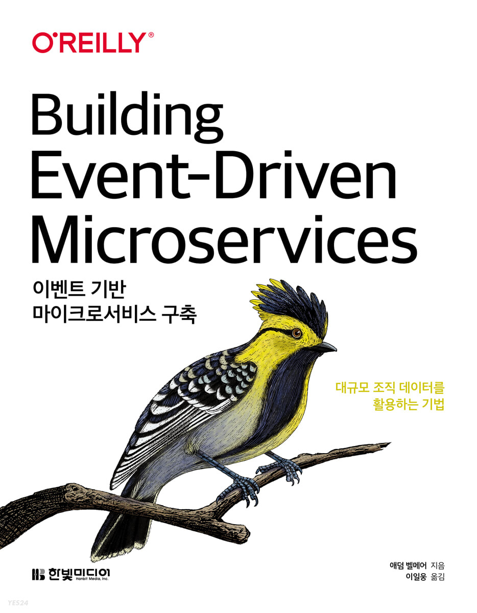

```toc
```

# 개요

<p align="center">
    
</p>

벌써, 1년 6개월 정도 진행 중인 스터디가 있다. 각자 읽고 싶은 책을 투표하여 완독을 목표로 하는 스터디로 간단하게 삼색볼펜법[^1]을 통해서 진행되고 있다.

읽은 책의 목록은 아래와 같다.
1. [오브젝트](http://www.yes24.com/Product/Goods/74219491)
2. [클린아키텍처](http://www.yes24.com/Product/Goods/77283734)
3. [대규모 서비스를 지탱하는 기술](http://www.yes24.com/Product/Goods/4667932)
4. [소프트웨어 아키텍처 101](http://www.yes24.com/Product/Goods/104491433)
5. [데이터 중심 어플리케이션 설계](http://www.yes24.com/Product/Goods/59566585)
6. [클린코드](http://www.yes24.com/Product/Goods/11681152)
7. [이펙티브 자바](http://www.yes24.com/Product/Goods/65551284)

다른 도메인의 현직 개발자분들과 같은 책을 읽으면서 서로 궁금한 부분이나 토론을 통해서 진행하면서 많은 인사이트를 얻게된 스터디라고 생각이 든다.

현재 우리가 읽고 있는 책은 [이벤트 기반 마이크로서비스 구축](http://www.yes24.com/Product/Goods/99423020)이라는 책이다.
이직 한 후에 재직 중인 회사의 서비스가 매우 비슷한 아키텍처로 되어있고, 흥미롭게 볼 수 있었다.

그런데 읽다보니 스트리밍 시스템 [^2] 이라는 내용이 자주나오는 것을 확인하였다.
이 부분에 대해서 다른 스터디원 한분이 아래와 같은 질문을 하였다.

> 배치 프로세싱과 스트리밍 프로세싱은 정확히 어떤 부분이 다른걸까요?

사실 이 부분은 어렴풋한 차이만 말을 할 수 있었고, 이 부분에 대해서 정확하게 나 또한 말을 할 수 없었다.
더 나아가 스트리밍 시스템과 기존 어플리케이션, 백엔드 서비스와의 차이도 알고 싶었고 이벤트 주도 아키텍처(Event-Driven Architecture) [^3] 와 스트리밍 시스템도 차이를 가지는가에 대해서 궁금하였다.

이번 포스팅은 위에 대한 궁금증을 해소하고, 간단한 스트리밍 시스템의 예시를 들어보고자 한다. 

# 스트리밍 시스템 톺아보기

+ STEP 1. 분산 시스템(Distribution System)의 대두
	+ STEP 1.1 이벤트 주도 아키텍처(Event-Driven Architecture)란?
		+ STEP 1.1.1 메시지와 이벤트
		+ STEP 1.1.2 정리
+ STEP 2. 스트리밍 시스템(Streaming System)이란? 
	+ STEP 2.1 Bounded Data vs Unbounded Data
	+ STEP 2.2 Stream Processing
	+ STEP 2.3 스트리밍 시스템 vs 전통적인 아키텍처
		+ STEP 2.3.1 어플리케이션(Application)
		+ STEP 2.3.2 백엔드 서비스(Back-End Service)
		+ STEP 2.3.3 배치 프로세싱(Batch Processing)
	+ STEP 2.4 정리
+ STEP 3. 간단한 스트리밍 시스템 
+ STEP 4. REFERENCE

## STEP 1. 분산 시스템(Distribution System)의 대두

먼저, 이벤트 주도 아키텍처가 탄생한 배경에 대해서 아는 것이 중요하다고 생각한다. 
이 내용은 **내 개인적인 생각이기때문에 당연히 틀릴 수 있는 부분이라고 생각하니**, 다양한 책들을 통해서 왜 이러한 아키텍처가 대두되어왔는가에 대해서 생각하는 것이 중요하다고 본다. 

먼저, 이전에 작성했던 [개발한입 - 동시성 문제 해결 전략 - 스프링으로 구현한 TCC 패턴](https://brewagebear.github.io/concurrency-distributed-transaction-with-tcc/) 글을 보면, 우리는 분산 트랜잭션의 핸들링의 어려움을 겪고 있고 이에 대해서 SAGA[^4] 패턴이나 TCC패턴, Two-Phase Commit[^5] 등이 나오게 되었다.

위 포스팅에서 작성하지 않는 부분이 있는데 바로 **왜 분산 시스템으로 가게되었는가?** 이다.

이 내용은 [Naver D2- 확장성 있는 웹 아키텍처와 분산 시스템](https://d2.naver.com/helloworld/206816) 에 매우 잘나와있다. 자세한 내용은 해당 본문을 참고하도록 하고, 여기서는 중요한 부분들만 짚어보도록 하자. 

> 일단, 분산 시스템이 대두된 원인은 단순했던 웹서비스가 **서비스의 사용자 증가 혹은 복잡도가 증대**되면서 신뢰성(Reliability)이나 확장성(Scalability), 가용성(Availability)등을 확보하기위함이라고 볼 수 있다.

즉, 기존의 아키텍처로는 해결이 안되기 때문에 **분산 시스템을 사용하자**라는 개념이 대두된 것이다. 
네이버 D2 글에서는 이미지 호스팅 서비스를 예시를 들어서 이 서비스가 어떻게 진화해나가는 지 잘 서술되어있다.

우리가 초점으로 볼 부분은 쓰기에 대한 부하를 감당하기 위해서 위 본문에서는 큐를 도입했는데 이 내용을 주로 보고자 한다. 

<p align="center">
    
</p>
<p align="center">
<em>그림 1. 전통적인 클라이언트-서버의 요청 구조 (동기식 처리)</em>
</p>

위는 전통적인 클라이언트-서버 구조의 요청, 응답 구조이며, 아래와 같다.
1. 클라이언트는 서버에게 요청을 보낸다.
2. 서버는 해당 요청을 읽은 후 알맞은 응답을 보낸다.
3. 이는 **동기적(Synchronous)** 으로 처리된다. 

동기적 요청에 대해 이해가 안간다면 [개발한입 - 자바 NIO의 동작원리 및 IO 모델(STEP 4.1 I/O 모델) ](https://brewagebear.github.io/fundamental-nio-and-io-models/#step-41-io-%EB%AA%A8%EB%8D%B8)을 참고해보자.

이러한 구조로 가게 되었을 경우에 당연히 서버쪽에 많은 요청이 들어오게 될 경우 병목현상(Bottlenack)[^6] 이 발생할 수 있으며, 병목현상이 발생할 경우 블록킹이 되기에 응답지연과 같은 문제가 발생하여 클라이언트의 경험이 상당히 저하가될 수 있다. 

이를 해결하기 위해서 비동기적 처리를 할 수 있지만 이는 구현하기 까다롭다는 문제가 있다. 이때 우리는 메시지 브로커(Message-Broker)[^7] 를 활용하여 처리할 수 있다.


<p align="center">
    
</p>
<p align="center">
<em>그림 2. 메시지 브로커를 통한 비동기식 처리</em>
</p>

위와 같이 처리함으로써 서버 요청을 부하를 메시지 브로커를 통해서 줄일 수 있으며, 비동기식(Ansychronous) 처리가 가능하므로  클라이언트는 작업요청을 보낸 후 기다리지 않고 다른 작업을 진행하다가 응답을 통해서 처리가 가능하다는 장점이 있다. 

핵심적인 차이는 **동기적 처리가 아닌 비동기적인 처리**를 할 수 있으며, 메시지브로커를 통해서 클라이언트-서버간의 **결합도(Coupling)을 줄일 수 있다는 점**이다.

갑자기 메시지 브로커 이야기를 하게되었는데 이벤트 주도 아키텍처를 알기 위해서는 위의 핵심 내용이 필요하기 때문이다. 

이제, 이벤트 주도 아키텍처에 대해서 알아보자. 

### STEP 1.1 이벤트 주도 아키텍처(Event-Driven Architecture)란?

위에서 간단하게 쓰기 부하에 대해서 동기식 처리에 대한 단점이 존재하여, 메시지 브로커를 통해서 비동기식 처리로 변경하는 부분에 대해서 설명하였다. 

이벤트 주도 아키텍처를 설명하기 전에 아래와 같이 가정을 해보자.

> 우리 서비스는 이제 메시지 브로커 도입을 통해서 비동기식 방식으로 처리가 잘 이루어지고 있었다. 
> 
> 하지만 서비스가 성장함에 따라 서버 내에 어떤 서비스(Bear Service)에 대한 처리가 느려지는 문제가 대두 되었다. 
>
> 이에 reply 메시지 브로커에 인입되는 메시지처리 속도가 느려졌고, 이에 사용자 경험은 또다시 떨어지게 되었다. 수많은 토론 끝에 내린 결론은 메시지 처리가 느린 서비스를 독립적인 모듈화를 시켜서 스케일 아웃을 진행하는 것이었다.
>
> 이 구조로 갈 경우 주요한 이슈는 독립된 모듈 서비스에서 처리한 내용을 다시 원래 서비스에서 받아서 처리를 해서 다시 클라이언트에 가야하는 구조이라는 점이다.
   
<p align="center">
 
</p>
<p align="center">
<em>그림 3. 복잡해진 아키텍처와 응답 처리 문제</em>
</p>

위의 경우에도 서버가 만약 동기식 요청을 해당 서비스에서 던지게 될 경우에는 또 다시 블록킹이 발생할 수 있다.
아주 단순하게 생각하면 저 부분에도 메시지 브로커를 도입하면 된다. 

<p align="center">
	
</p>
<p align="center">
<em>그림 4. 메시지 브로커를 통한 복잡한 아키텍처의 문제 해결</em>
</p>

이렇게 하면서 얻는 이점은 서버와 분리된 서비스간의 결합도가 낮아지고, 비동기식 처리가 가능하다는 점이다.
여기까지 봤을 때 눈치를 채었는가? 

> 이벤트 주도 아키텍처는 위와 같이 각 모듈간의 결합도를 낮추고, 비동기 처리를 통해서 해당 요청들을 알맞은 책임에게 던질 수 있는 아키텍처를 말한다.


### STEP 1.1.1 메시지(Message)와 이벤트(Event)

그렇다면? 이벤트 주도 아키텍처의 이벤트(Event)는 무엇을 뜻하는 것일까?
이벤트는 수 많은 내용을 포함하고 있다. 마우스를 움직이는 것이나 버튼을 클릭하는 것 혹은 요청을 보내는 것 등등.. 

컴퓨팅 영역에서는 어떤 input 자체를 이벤트라고 뜻할 수 있다고 본다. 

여기서 또 궁금한 점이 생겼다. 그렇다면 메시지와 이벤트는 무엇이 다른것일까?
구글링을 하면서 Akka[^8] 프레임워크의 개발사인 Lightbend[^9]의 공식 문서에서 이를 다루는 것을 확인하였다.

> A Message is some data sent to a specific address. In Message Driven systems, each component has a unique address other components can send messages to. Each of these components, or recipients, awaits messages and reacts to them.
> 
> An Event is some data emitted from a component for anyone listening to consume.

위의 내용을 요약하면 메시지는 택배기사가 택배를 정해진 위치에 배송하는 것과 유사하며, 이벤트는 해당 이벤트에 대한 내용을 구독하고 있는 모든 사용자를 위해 방출되는 데이터라고 볼 수 있다.

하지만, 대부분의 이벤트 주도 아키텍처를 보면 메시지 브로커든 메시지 큐 등을 사용한 내용을 볼 수 있다.

사실, 엄밀히 따져서 메시지는 송신 주체와 수신 주체가 명확한 것이고 이벤트는 그것이 명확하지 않은 것이다.
즉, 이벤트가 더 추상화된 상위개념이고 메시지는 이 이벤트를 담아서 송신과 수신을 처리해주는 녀석이라고 볼 수 있다. 

이해가 안될 수 있으니 아래와 같이 볼 수 있다고 생각한다.

<p align="center">
    
</p>
<p align="center">
<em>그림 4. 메시지와 이벤트</em>
</p>
따라서, 목적지와 수신지를 처리하기 위해서는 메시지가 필요하고, 메시지안에 이벤트가 담기는 형식이라고 생각한다. 

자세한 내용은 
[LightBend-Events ars messages](https://developer.lightbend.com/docs/akka-guide/concepts/message-driven-event-driven.html#_events_are_messages) 내용을 읽어보도록 하자. 

여기서도 메시지 주도 아키텍처는 보다 시스템 구성 요소적인 측면이 강하고, 이벤트 주도 아키텍처가 보다 추상화된 내용이라고 말한다. 

> 즉, 메시지 주도 아키텍처로도 이벤트 주도 아키텍처를 구현할 수 있다.
> So, using Message Driven tools we can build an Event Driven system.

좀 더 상세한 차이를 이해하고 싶다면 아래의 아티클을 추천한다.
+ [Medium - Using Commands, Events, and Queries in Microservices Communication](https://medium.com/event-driven-utopia/using-commands-events-and-queries-in-microservices-communication-3573f1fcfafe)

### STEP 1.1.2 이벤트 주도 아키텍처 정리

결국 핵심은 발전해가고 복잡해지는 소프트웨어 아키텍처에서 개선점들이 생겨나면서 이러한 아키텍처가 생긴 것이라고 볼 수 있다. 

파티셔닝과 샤딩, 프록시, 캐시등을 제외하고 해당 글에서 다룬 내용을 토대로 시스템 발전 과정의 히스토리를 봐보자. 

+ **분산 아키텍처는 왜 대두되었는가?** 
	+ 이유 : 기존 모놀리틱 시스템의 문제점들이 점점 발생 (복잡도 증대 및 유지보수의 어려움)
	+ 결론 : 각각의 서비스를 독립적으로 분리시키자 (SOA, MSA 등이 대두)
+ **하지만 동기적인 API 요청의 단점이 존재하였다.** 
	+ 이유 : 요청을 서버에서 처리하는 동안 클라이언트는 블록킹이 발생한다.
	+ 결론 : 비동기적인 처리를 하자 -> 구현의 복잡도를 낮추고 결합도를 낮추기 위해 메시지 브로커 등을 도입

따라서 핵심은 이벤트 브로커나 메시지 브로커등에 이벤트를 발생해서 비동기적으로 처리하여 각 서비스간의 결합도를 낮추고, 블록킹을 줄인 시스템이 이벤트 주도 아키텍처라 볼 수 있다. 

위의 내용은 많은 내용이 생략이 되었고, 본문에서 다룬 내용을 다시 재정리한 내용이다.
따라서 꼭 아래의 글을 읽기를 추천한다.
1. [Naver D2- 확장성 있는 웹 아키텍처와 분산 시스템](https://d2.naver.com/helloworld/206816)
2. [Medium - Event Driven Architecture란?](https://medium.com/dtevangelist/event-driven-microservice-%EB%9E%80-54b4eaf7cc4a)

## STEP 2. 스트리밍 시스템 

먼저, 스트리밍 시스템을 이해하기 위해서는 유한 데이터(Bounded Data)와 무한 데이터(Unbounded Data)를 알아야한다.

개인적으로 이 번역은 매우 잘못되어있다고 생각이 드는데 실제 번역서 중에서 Unbounded Data를 무한 데이터로 해놓은 책이 매우 많아서 이해하기가 매우 힘들었다. 

무한 데이터란 무엇인가? 사실 원어인 Unbounded Data를 보았을 때는 무엇인가 Bound가 결정되지 않은 즉, 언제 시작되고 언제 끝날지 모르는 그리고 실시간성 로그 데이터들이라고 볼 수 있다. 하지만, 번역서 중에는 이 내용을 원어가 없이 표기한 책이 많았고 이 때문에 어려움을 많이 겪었다.

그래서 이 포스팅에서는 유한, 무한데이터보다는 원어 표기인 Bounded Data, Unbouned Data의 표기를 따르도록 하겠다. 

그렇다면? Bounded Data와 Unbounded Data는 무슨 차이일까?

### STEP 2.1 Bounded Data vs Unbounded Data

이 내용은 [멧돼지책(데이터 중심 어플리케이션 설계)](http://www.yes24.com/Product/Goods/59566585)에도 나오는 내용이다.

> In reality, a lot of data is unbounded because it arrives gradually over time: your users produced data yesterday and today, and they will continue to produce more data tomorrow. Unless you go out of business, this process never ends, and so the dataset is never “complete” in any meaningful way.
>
> — Martin Kleppmann, Designing Data-Intensive Applications

**즉, Unbounded Data는 데이터의 수가 정해져(unbounded)있지않고, 계속 변경될 수 있는 데이터**를 말한다.
+ 이는 증권 거래 체결 내역이나 인스타그램의 피드 그리고 실시간 데이터 로그등이 속한다고 볼 수 있다.
그렇다면 **Bounded Data는 무엇일까? 데이터의 수가 정해진 데이터**를 뜻한다. 
+ 주간 정산 데이터, 월간 사용자 수 통계 등

내가 제일 헷갈린 것이 **Bounded** 개념이였는데 시간을 일정 바운드로 둔다면, 실시간 로그들도 일정 바운드에 갇히게 되는 것 아닌가? 라고 생각하였다. 그렇게 생각하다보니 이해가 어려웠는데 핵심은 **데이터의 수**라고 보면될 것 같다. 

즉, **데이터 수나 변경에 열려있는 것이 Unbounded data 데이터, 닫혀있는 것이 Bounded data라 보면 될 것 같다**.

그렇다면 위에서 다뤘던 이벤트는 Bounded Data일까? Unbounded Data일까?
이벤트는 언제 발생할지 모르고 동일한 이벤트여도 이전 이벤트와 동일한 데이터 수를 가진다고 기대할 수 없으므로 **Unbounded Data**에 가깝다고 볼 수 있다.

자 이제 Unbounded Data와 Bounded Data를 차이를 알았다.
그렇다면 이제 다시 스트리밍 시스템에 대해 알기 위해서 스트리밍 프로세싱에 대해 알아보자.

### STEP 2.2 Stream Proccesing

<p align="center">
    
</p>
<p align="center">
<em>그림 5. Grokking Streaming Systems : Real-time event Processing</em>
</p>

이 부분부터는 [이벤트 기반 마이크로 서비스 구축](http://www.yes24.com/Product/Goods/99423020)보다는 [Grokking Streaming Systems: Real-time event processing](https://a.co/d/9zb7Tml) 책을 많이 참고하였다.

이 책에서는 스트리밍 프로세스를 아래와 같이 정의한다. 

> Stream Proccssing has been one of the most popular technologies in the recent years in the big data domain. Streaming systems are the computer systems that process continuous event streams.
>
> — Josh Fischer, Grokking Streaming Systtems : Real-time event Processing p.31

즉, 지속적으로 발생하는 이벤트 스트림을 처리하는 작업이 바로 스트리밍 시스템이다. 
그림으로 보면 아래와 같다고 볼 수 있다.
<p align="center">
    
</p>
<p align="center">
<em>그림 6. 스트리밍 시스템 예시, Grokking Streaming Systems : Real-time event Processing, p.36</em>
</p>

이벤트 주도 아키텍처는 이벤트를 통해서 처리되는 아키텍처라고 위에서 설명을 하였다. 그렇다면, 이벤트 주도 아키텍처와 스트리밍 시스템의 차이는 무엇인가? 

틀린 생각일 수도 있지만 개인적으로 **스트리밍 시스템 ⊂ 이벤트 주도 아키텍처**와 같은 부분집합이라고 보면 될 것 같다. 즉, 이벤트 주도 아키텍처 내부에 지속적으로 발생하는 이벤트 스트림을 처리하는 스트리밍 시스템이 속하는 것이라 생각한다. 

이제 얼추 어떤 느낌인지 감이 올 것이라고 판단된다.
그렇다면 이 포스팅의 목적이였던 **스트리밍 시스템과 기존 시스템의 차이**를 알 시간이 왔다고 생각한다.

이에, 전통적인 시스템들과 스트리밍 시스템을 비교해보고자 한다. 


### STEP 2.3 스트리밍 시스템 vs 전통적인 아키텍처
#### STEP 2.3.1 어플리케이션(Application)

여기서 말하고자하는 어플리케이션의 정의는 아래와 같다.
> An application is a computer program that users intract with directly
>
> — Josh Fischer, Grokking Streaming Systtems : Real-time event Processing p.38

즉, 게임이 될수도 있고 어떤 GUI 환경의 프로그램도 될 수 있다. 
이 책에서는 어플리케이션의 특징을 아래와 같이 꼽는다. 
+ 어플리케이션은 시작점(Starting point)을 갖는다. (어플리케이션 시작 시)
+ 어플리케이션은 종료점(Ending point)를 갖는다.(어플리케이션 종료 시)
+ 그리고 메인 루프(Main loop)을 갖는데 메인 루프는 아래의 세가지 단계로 나눠진다.
	1. 사용자의 입력을 받는다. 
	2. 로직을 수행한다.
	3. 결과를 보여준다.

그림으로 보면 아래와 같다. 


<p align="center">
    
</p>
<p align="center">
<em>그림 7. 어플리케이션 구조 예시, Grokking Streaming Systems : Real-time event Processing, p.39</em>
</p>

#### STEP 2.3.2 백엔드 서비스(Backend Services)

다음으로 볼 아키텍처는 백엔드 서비스이다. 백엔드 서비스에 대해서는 이 책에서는 아래와 같이 정의를 내린다.

> A backend service is a computer program that runs behind the scenes.
> — Josh Fischer, Grokking Streaming Systtems : Real-time event Processing p.40

즉, 뒷단에서 작업을 하는 컴퓨터 프로그램이라고 정의를 내리고 있다.
어플리케이션과 다른 부분은 사용자와 직접적으로 상호작용(interaction)이 이뤄지지 않는다는 점이다.
대신, 요청에 따라 특정 작업을 수행한다.

백엔드 서비스는 대부분의 시간을 **요청을 받는 것과 요청을 처리하는 것**에 보낸다.
이 책에서는 백엔드 서비스의 특징을 아래와 같이 꼽는다.
+ 백엔드 서비스는 요청을 받는다.
+ 백엔드 서비스는 요청을 파싱한다.
+ 파싱된 요청에 따라서 적절한 작업을 수행한다.
+ 최종적으로 응답의 결과를 보낸다.


<p align="center">
    
</p>
<p align="center">
<em>그림 8. 전통적인 백엔드 서비스 구조 예시, Grokking Streaming Systems : Real-time event Processing, p.40</em>
</p>

위와 같이 서비스는 필요한 작업을 다른 서비스(위의 그림에는 Storage가 된다)에 요청을 보내고 종합하는 식으로도 처리하기도 한다.

어플리케이션과 동일하게 메인 루프(Main loop)가 존재하지만 요청에 따라 다른 작업을 처리할 필요성이 존재한다. (다양한 요청이 들어올 수 있기때문에) 어플리케이션은 주로 사용자가 단독으로 프로그램을 수행할 가능성이 많지만 백엔드 서비스의 경우에는 많은 사용자들이 요청을 보내고, 또한 요청 자체가 같은 시간에 도착할 수도 있는 동시성 문제가 존재한다.

이에 대부분의 백엔드 서비스는 멀티 쓰레딩기법을 활용하는 특징을 갖는다. 이를 통해 새로운 요청이 들어오면 쓰레드를 통해서 특정 작업을 통해 수행하도록하여 위와 같은 한계를 극복하였다.

이렇게 함으로써 메인 루프의 처리량을 쓰레드에 위임하여 보다 빠르게 요청을 응답하게 할 수 있는 것이다.
따라서, 요즘날의 백엔드 서비스는 아래와 같은 구조를 갖는다.

<p align="center">
    
</p>
<p align="center">
<em>그림 9. 현대의 백엔드 서비스 구조 예시, Grokking Streaming Systems : Real-time event Processing, p.42</em>
</p>

#### STEP 2.3.3 배치 프로세싱(Batch Processing)

앞에서 본 어플리케이션과 백엔드 서비스는 사용자의 응답 (혹은 요청)에 최대한 빠르게 응답할 수 있게 설계된 아키텍처라고 생각할 수 있다. 그러나, 배치 프로세싱은 어떤 요청을 처리하기 위해 고안된 아키텍처는 아니다.

배치 프로세스는 **어떤 작업을 스케줄 시간 혹은 리소스가 허용되었을 때 수행하는 아키텍처**이다.
주로 배치 프로세스는 대용량 데이터를 처리하기 위해서 사용하곤 한다.

전통적인 배치 프로세싱의 구조는 아래와 같다고 볼 수 있다.

<p align="center">
    
</p>
<p align="center">
<em>그림 10. 배치 프로세싱 구조 예시, Grokking Streaming Systems : Real-time event Processing, p.44</em>
</p>

위의 그림처럼 일정 스케줄이든 어떤 트리거를 통해서 배치 프로세싱이 수행된다면 나눠진 단계별로 배치 프로세싱이 수행된다. 그 과정속에서 데이터베이스나 스토리지 시스템을 통해서 각 단계별 내용을 바로 반영을 하고 다음 단계에서는 이전의 결과가 담겨있는 스토리지 데이터를 참고로 계속해서 작업을 수행한다.

배치 프로세싱은 모든 단계가 완료되면 끝난다. 
보면 알겠지만 이 배치 프로세싱의 최대의 단점은 **지연시간(latencty)** 이다.

이것을 풀어쓰자면 배치 프로세싱은 시작하기 전에 매시간 또는 매일과 같이 일정한 간격으로 데이터를 수집하고 배치로 저장해야하고, 특정 시간대에 수집된 모든 이벤트는 처리할 기간이 끝날 때까지 기다려야 한다는 점이다.

문제는 **이 단점을 수용할 수 없는 케이스들이 존재한다는 점**이다.

e.g) 서버 실시간 모니터링 시스템, 장애 알림 솔루션 등.. 

이러한 사용사례(use-case)들의 특징은 데이터가 받자마자 즉각적으로 처리되는 것을 요구사항으로 갖는다는 점이다. 즉, 실시간이든 준실시간이든 최대한 실시간으로 처리되길 희망하는 사용사례들이다.

위의 한계를 극복하기 위해서 탄생한 것이 바로 **스트리밍 시스템**이다.

### STEP 2.4 정리

배치 프로세싱과 스트리밍 시스템의 차이를 예시를 들면 아래와 같다.
+ 배치 프로세싱 : 우체국 
+ 스트리밍 시스템 : 공장의 조립 라인

배치 프로세싱은 **우체국과 같이 많은 우편들을 수집한 뒤에 분류 혹은 적절한 사업소에 배치 작업을 한 뒤에 최종 배달지에서는 정해진 배달 시간에 따라서 전송**을 한다.

스트리밍 시스템은 **공장의 조립 라인과 같이 여러 단계를 거쳐 단계 마다 새로운 부품을 조립하여 최종 제품을 생산**해낸다. 

전통적인 스트리밍 시스템의 구조는 아래의 그림과 같다.

<p align="center">
    
</p>
<p align="center">
<em>그림 11. 전통적인 스트리밍 시스템 구조 예시, Grokking Streaming Systems : Real-time event Processing, p.48</em>
</p>
거의 배치 프로세싱의 구조와 흡사한 것으로 볼 수 있다.
가장 큰 차이는 각 단계는 새로운 데이터가 들어오면 다음 단계로 처리하는 작업을 계속해서 수행하며, 각 이벤트들은 다음 단계로 처리가 되자마자 전달되어 모든 단계가 끝난 후에 최종 결과가 스토리지 시스템에 적재됨을 볼 수 있다.

비슷한 구조지만 가장 큰 차이점은 아래와 같다.
1. 배치 프로세싱 
	+ 각 단계가 독립적으로 수행되며, 같은 단계여도 서로 독립적으로 수행된다.
		+ 즉, 같은 시간에 모든 단계가 동작하지 않는다.(1번 단계 수행 후 스토리지 저장이 끝난 후 2번 단계가 수행된다. 이는 수행 윈도우를 증가하게 된다.)
	+ 장점으로는 각 단계가 독립적으로 수행되므로 페일오버처리하기가 쉽다.
2. 스트리밍 시스템
	+ 각 단계가 거의 같은 시간에 동작한다. (즉각적으로 전단계에서 발생한 일을 처리하므로)
		+ 따라서, 이벤트가 처리되면 준실시간으로 처리될 수 있다. 
	+ 단계는 Steaming처럼 Upstream에서 Downstream으로 흐르고, 독립적이지 않기에 페일오버 처리하기가 복잡하다. 따라서, 배치 프로세싱과 달리 실패 시에 별도의 처리가 없다면 핸들링이 어렵다.

위의 내용을 표로 정리하면 아래와 같다.

| 어플리케이션               | 백엔드서비스                       | 배치 프로세싱                           | 스트리밍 시스템              |
| -------------------------- | ---------------------------------- | --------------------------------------- | ---------------------------- |
| 사용자 인풋에 따라 처리    | 요청을 처리                        | 데이터를 처리                           | 데이터를 처리                |
| 사용자와 즉각적인 상호작용 | 사용자 혹은 다른 서비스와 상호작용 | 스케줄 시간 혹은 데이터에 따른 상호작용 | 데이터에 따른 상호작용       |
| 사용자에 의한 시작과 끝남  | 긴 동작을 하는 프로세스들의 집합   | 스케줄 시간에 따른 시작과 끝남          | 긴 동작을 하는 단계들의 집합 |
| 싱글 메인 루프             | 싱글 메인 루프와 쓰레드들          | 여러 단계의 프로세스들                  | 여러 단계의 프로세스들       | 

## STEP 3. 간단한 스트리밍 시스템 

이 책에서는 IoT 센서에 대한 예시를 다룬다. 
어떤 다리에 IoT 센서가 있고 트럭인지 버스인지 등을 파악하는 센서가 있다고 가정한다.

기존 시스템은 백엔드 서비스로 이루어져있었으나 휴일에 많은 트래픽이 몰려서 처리하기 어려운 상황이 놓였었다. 위에서도 설명했듯이 보통의 백엔드 서비스들은 동기적인 처리를 한다.

즉, 아래와 같이 처리가 된다. 이 경우에는 트래픽이 몰릴 경우 점점 사용자의 응답은 느려질 것이다.

<p align="center">
    
</p>
<p align="center">
<em>그림 12. 동기적 백엔드 서비스 모델, Grokking Streaming Systems : Real-time event Processing, p.66</em>
</p>

이 책에서도 동일하게 위에서 설명한 것과 같이 비동기적 처리를 위해서 큐를 도입해서 처리하고자 한다.

<p align="center">
    
</p>
<p align="center">
<em>그림 13. 큐를 통한 비동기 처리 도입, Grokking Streaming Systems : Real-time event Processing, p.69</em>
</p>

그렇다면, 실제 스트리밍 시스템 내부에는 어떤 원리로 동작을 시키는 지 확인 해보자.

<p align="center">
    
</p>
<p align="center">
<em>그림 14. 스트리밍 시스템 내부 도식화, Grokking Streaming Systems : Real-time event Processing, p.74</em>
</p>

위와 같이 큰 틀로 볼 수 있다.
+ Source executor : 이벤트가 발생되는 주체로 볼 수 있으며, 발생된 이벤트들은 큐를 통해서 발송된다.
+ Operator executor : 위에서 봤던 전통적인 스트리밍 시스템 구조의 단계에 해당한다고 볼 수 있으며, 이벤트를 알맞게 처리하는 작업을 수행한다.

이 내용을 좀 더 깊게 들어가면 아래와 같은 그림으로 볼 수 있다.

<p align="center">
    
</p>
<p align="center">
<em>그림 15. 스트리밍 엔진 내부 도식화, Grokking Streaming Systems : Real-time event Processing, p.77</em>
</p>

보다 복잡해진 그림을 볼 수 있다. 이를 다시 분해해서 설명하기 위해 아래와 같이 추상화를 해보자.

<p align="center">
    
</p>
<p align="center">
<em>그림 16. 스트리밍 엔진 내부 도식 추상화, Grokking Streaming Systems : Real-time event Processing, p.78</em>
</p>

아주 간단하게 `Source -> Stream -> Operator`의 구조로 추상화를 시킬 수가 있음을 확인할 수 있다.
여기서 이제 스트리밍 시스템의 5가지 주요 요소를 뽑을 수 있다.
1. Job : `Source -> Stream -> Operator` 을 한데 묶은 구조로 다른 말로는 **파이프라인(pipeline)**[^10]이라고도 한다. 스트리밍 시스템의 구현체라고 볼 수 있다.
2. Source : 외부세계의 데이터를 스트리밍 시스템으로 가져오는 역할을 한다. 이를 `entry point`라고 부르기도 한다.
3. Stream : Source에서 전달 받은 이벤트를 Operator에 전달하는 역할을 한다. 
4. Event : 스트림 내에 더이상 나눌 수 없는 최소 단위의 데이터들을 뜻하며 `tuple, element, message`등등으로도 부르기도 한다.
5. Operator : 스트림으로 부터 전달 받은 데이터를 변환하거나 어떠한 로직을 처리하는 역할을 수행한다.

그림으로 보면 아래와 같다.

<p align="center">
    
</p>
<p align="center">
<em>그림 17. 스트리밍 시스템 구성요소, Grokking Streaming Systems : Real-time event Processing, p.79</em>
</p>

위와 같은 간단한 스트리밍 시스템을 알아보았다. 
글이 길어진 관계로 실제 구현 내용은 아래의 링크로 대체하겠다.
+ [Github - nwangtw/GrokkingStreamingSystems](https://github.com/nwangtw/GrokkingStreamingSystems)
+ [Youtube - Hello Streaming 101](https://www.youtube.com/watch?v=A1YC_AC0qf8)

특히, 유튜브 영상은 현재 다뤘던 포스팅의 내용을 전부 다루고 있으니 참고해보길 바란다.
긴 글 읽어주셔서 감사합니다.


## STEP 4. 레퍼런스
1. [Naver D2- 확장성 있는 웹 아키텍처와 분산 시스템](https://d2.naver.com/helloworld/206816)
2. [Medium - Event Driven Architecture란?](https://medium.com/dtevangelist/event-driven-microservice-%EB%9E%80-54b4eaf7cc4a)
3. [Lightbend Document -Message Driven vs Event Driven](https://developer.lightbend.com/docs/akka-guide/concepts/message-driven-event-driven.html)
4. [StackOverflow - message driven vs event driven approaches to application integration](https://stackoverflow.com/questions/1659351/message-driven-vs-event-driven-approaches-to-application-integration)
5. [Medium - Using Commands, Events, and Queries in Microservices Communication](https://medium.com/event-driven-utopia/using-commands-events-and-queries-in-microservices-communication-3573f1fcfafe)
6. [조대협 - 실시간 빅데이타 처리를 위한 스트리밍 처리의 개념](https://bcho.tistory.com/1119)
7. [Medium -Making Sense of Unbounded Data](https://medium.com/event-driven-utopia/making-sense-of-unbounded-data-4abdfa0edad2)

[^1]: http://egloos.zum.com/agile/v/3684946
[^2]: https://en.wikipedia.org/wiki/Stream_processing
[^3]: https://en.wikipedia.org/wiki/Event-driven_architecture
[^4]: https://microservices.io/patterns/data/saga.html
[^5]: https://en.wikipedia.org/wiki/Two-phase_commit_protocol
[^6]: https://en.wikipedia.org/wiki/Bottleneck_(network)
[^7]: https://en.wikipedia.org/wiki/Message_broker
[^8]: https://akka.io/
[^9]: https://www.lightbend.com/
[^10]: https://en.wikipedia.org/wiki/Pipeline_(software)
