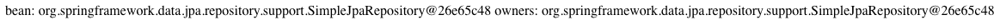

```toc
```

+ STEP 1. 제어 역전(IoC, Inversion of Control)
	+ STEP 1.1 제어 역전(IoC)이란?
    + STEP 1.2 Bean 등록 방법
	+ STEP 1.3 의존성 주입(DI)란?  
+ STEP 2. 관점 지향 프로그래밍(Aspect Oriented Programming)
	+ STEP 2.1 관점 지향 프로그래밍(AOP)란?
	+ STEP 2.2 프록시 패턴이란? 
    + STEP 2.3 AOP 적용 예제
+ STEP 3. 서비스 추상화(Portable Service Abstraction)
	+ STEP 3.1 서비스 추상화(PSA)란?
	+ STEP 3.2 스프링 트랙잭션

# 개요
요즘은 다시 스프링 공부를 하고 있다. 예전부터 [토비의 스프링 3.1](http://www.kyobobook.co.kr/product/detailViewKor.laf?ejkGb=KOR&mallGb=KOR&barcode=9788960773431&orderClick=LEA&Kc=))을 보면서 스프링 스터디를 하고자 했지만, 잘 안되는 찰나에 인프런에서 백기선 님의[스프링 프레임워크 제대로 마스터하는 법](https://blog.inflearn.com/%EC%9E%90%EB%B0%94-%EC%8A%A4%ED%94%84%EB%A7%81-%ED%94%84%EB%A0%88%EC%9E%84%EC%9B%8C%ED%81%AC-%EB%A1%9C%EB%93%9C%EB%A7%B5/)들을 볼 수가 있었고, 해당 내용을 다시 정리 차원에서 블로그 포스팅으로 남겨본다. 

책으로만 스터디할 때는 잘 이해 안됐던 내용들이 인터넷 강의를 보면서 체화가 되었으며, 좀 더 심도 깊게 이해할 수 있는 계기가 되었던 것 같다.

여기서 다룰 예제코드는 [GitHub - spring-projects/spring-petclinic: A sample Spring-based application](https://github.com/spring-projects/spring-petclinic)를 사용하므로, `git clone`하여 따라오던가 아니면, 
[인프런 - 예제로 배우는 스프링 입문 (개정판)](https://www.inflearn.com/course/spring_revised_edition/dashboard) 이 인터넷 강의를 따라오면 될 것 같다.

## STEP 1.1 제어 역전(Inversion of Control)이란?
자바에서 일반적인 경우에 자기가 사용할 의존성을 자기가 만들어 사용한다. 
이게 무슨 뜻인지 잘 모르겠다면, 아래의 코드를 보자! 
```java
class OwnerController {
	private OwnerRepository repo = new OwnerRepository();
}
```

위의 예시에서 자기란 (OwnerController)를 뜻한다.
여기서 OwnerController는 자기가 사용할 의존성을 직접 만들어서 사용한다.
`new OwnerRepository();`

하지만, 제어 역전에서는 컨트롤러가 의존성을 직접 관리하는 것이 아니라 아래와 같은 코드로 동작하게끔 하는 것이다. 

```java
class OwnerController {
	//오너 레포지스트리를 사용하긴 하지만 직접 만들지는 않는다.
	private OwnerRepository repo;
	//생성자를 통해서 받아온다 -> 즉, 오너 컨트롤러가 하는 일이 아님.
	public OwnerController(OwnerRepository repo){
		this.repo = repo;
	}
}

class OwnerControllerTest {
	@Test
	public void create() {
		OwnerRepository repo = new OwnerRepository();
		OwnerController controller = new OwnerController(repo);
	}
}
```

위 코드에 주석에도 설명되어 있듯이,  초기 코드에서는 OwnerController가 자신이 필요한 의존성인 OwnerRepository를 직접 생성 `new OwnerRepository();` 한 것을 볼 수 있는데 아래 코드를 보면, OwnerController가 직접 생성하는 것이 아닌 생성자의 인자로 OwnerRepository가 전달되며, **외부에서 주입**이 되는 것을 알 수가 있다.

```java
	public OwnerController(OwnerRepository repo){
		this.repo = repo;
	}
```

즉, 의존성이 외부에서 주입(DI, Dependency Injection)이 되는 상황이다. 
의존성 주입과 제어역전은 사실 별개 아니였다. 사실상 의존성 주입과 제어 역전은 같은 의미로 사용되며, **제어 역전은 의존성 주입을 통해 이루어짐을 확인 할 수가 있다.**

그런데 이런 제어 역전을 활용하면 어떤 장점이 있는 것일까? 

우리가  `new OwnerRepository();`  를 통해서 인스턴스를 생성했다고 가정해보자.
그런데 만약? 인스턴스의 생성 비용이 다소 크다던가, 굳이 일일히 이렇게 생성해야 되나?
라는 생각이 느껴질 수가 있다.

스프링 프레임워크는 IoC 컨테이너를 통해서, 이러한 인스턴스의 생성을 일괄적으로 진행하고, 라이프 사이클 관리까지 컨테이너에 맡긴다.

따라서 인스턴스의 생성 및 관리 주체가 OwnerController가 아닌 외부에서 OwnerRepository를 주입해주는 제 3자 혹은 컨테이너가 되기 때문에 제어 역전이라고 부르는 것이다. 

위에서 `git clone` 하라 했던 샘플 프로젝트로 확인해보자.

```java
public class SampleController {
	SampleRepository sampleRepository;
	public SampleController(SampleRepository sampleRepository) {
		this.sampleRepository = sampleRepository;
	}
	//sampleRepository에 기본 값 설정 X = Null pointer Exception이 발생할 수 있다고 생각할 수 있지만, 생성자가 1개 이므로, sampleRepository는 무조껀 생성되어야한다. 따라서, petClinic 프로젝트 또한 안전하다고 볼 수 있다.
	public void doSomething() {
		sampleRepository.save()
	}
}

public class SampleRepository {
	public void save(){
		
	}
}
```

그렇다면? 스프링에서 의존성 주입은 어떤 방식으로 이루어질까? 
스프링 프레임워크 의존성 주입은 일반적으로, 스프링 IoC 컨테이너에 등록된 빈(Bean)에 해준다. 

그렇다면? IoC 컨테이너에 등록된 빈들을 어떻게 확인할까?

```java
@Autowired
ApplicationContext applicationContext;

@Test
public void getBean(){
	//등록된 빈들의 이름을 가져온다.
	String s = applicationContext.getBeanDefinitionNames();
	//이름을 활용하여 빈의 정보를 볼 수가 있다.
	applicationContext.getBean(s)

	//두번째 방식으로는 등록된 빈의 타입으로 꺼내오는 방식이다.
	OwnerController bean = applicationContext.getBean(OwnerController.class);
	assertThat(bean).isNotNull();
}
```
 
위와 같은 방법으로 가져올 수가 있다.
잠시 추가 설명을 하자면, 스프링 IoC 컨테이너가 관리하는 객체를 빈(Bean)이라 부르는데, 여기서 위 소스에서 IoC 컨테이너 역할을 하는 것이 [ApplicationContext](https://docs.spring.io/spring/docs/current/javadoc-api/org/springframework/context/ApplicationContext.html)이다.

[ApplicationContext](https://docs.spring.io/spring/docs/current/javadoc-api/org/springframework/context/ApplicationContext.html)는 [BeanFactory](https://docs.spring.io/spring/docs/current/javadoc-api/org/springframework/beans/factory/BeanFactory.html)라는 컨테이너를 상속받아서 보다 빈팩토리보다 다양한 역할을 할 수 있는 클래스이다. 

보다 가시적으로 확인하는 방법은 아래와 같다.

```java
@Controller
class OwnerController {

    private static final String VIEWS_OWNER_CREATE_OR_UPDATE_FORM = "owners/createOrUpdateOwnerForm";
    private final OwnerRepository owners;
    private final ApplicationContext applicationContext;
    public OwnerController(OwnerRepository clinicService, ApplicationContext applicationContext) {
        this.owners = clinicService;
        this.applicationContext = applicationContext;
    }

    @GetMapping("/bean")
    @ResponseBody
    public String bean(){
        return "bean: " + applicationContext.getBean(OwnerController.class);
    }

... (중략) ... 
```

이 방식은  URL 요청으로 bean이 호출됐을 경우에 OwnerController 클래스의 해시 값을 보여준다.

이 방식을 좀 더 업데이트하여, 과연 스프링에서 자체적으로 주입된 객체 (OwnerRepositry)와 우리가 알고  있는 IoC 컨테이너에서 주입되는 객체가 동일한 것인지 파악해보자! 

```java
@Controller
class OwnerController {

    private static final String VIEWS_OWNER_CREATE_OR_UPDATE_FORM = "owners/createOrUpdateOwnerForm";
    private final OwnerRepository owners;
    private final ApplicationContext applicationContext;
    public OwnerController(OwnerRepository clinicService, ApplicationContext applicationContext) {
        this.owners = clinicService;
        this.applicationContext = applicationContext;
    }

    @GetMapping("/bean")
    @ResponseBody
    public String bean(){
        return "bean: " + applicationContext.getBean(OwnerRepository.class) + "\n" 
                + "owners: " + this.owners;
    }

... (중략) ...
```

결과 값을 확인해보자.



위와 같이 스프링 ApplicationContext를 사용하여, 직접 주입하는 경우와 IoC 컨테이너를 활용하여 주입하는 경우의 객체 값이 같음을 확인할 수가 있다.

### STEP 1.2 Bean 등록 방법

```java
	OwnerController ownerController = new OwnerController();
	OwnerController bean = applicationContext.getBean(OwnerController.class);
```

여기서 ownerController와 bean이라는 객체를 두 가지 생성한다.

위는 자바에서 생성되는 일반 객체이고, 아래는 빈인데 둘의 차이점은 무엇일까? 

바로, applicationContext가 알고 있는 객체 (applicationContext가 만들어서 담고 있는 객체)가 빈이다.
어떤 특정 인스턴스로 빈으로 만드는 방법은 2가지가 있다.

첫번째는 애노테이션을 활용한 컴포넌트 스캔을 이용하는 것과 두번째는 XML 혹은 자바설정 파일을 활용하여 직접 등록하는 방법이 있다.

1.  Component Scanning
	+  @Component
		+ @Repository
		+ @Service
		+ @Controller
		+ @Configuration

위와 같은 애노테이션을 활용하여 등록할 수가 있다.
해당 애노테이션을 보고, 우리가 빈으로 등록할 객체에 대해서 직접 등록하는 것이 아니라 SpringBootApplication에서 Component Scan을 통해서 해당 애노테이션을 확인하면, 자동으로 빈으로 등록해주게 된다. 

OwnerRepository와 같은 경우에는 스프링 데이터 JPA가 제공해주는 기능을 통하여, 빈으로 등록되게 된다. (특정 애노테이션X) 하지만, 특정 인터페이스를 상속받게되면, 인터페이스의 구현체를 만들어서 구현하게 된다.

```java
/*SampleController.java 파일*/
package org.springframework.samples.petclinic.sample;

import org.springframework.stereotype.Controller;

@Controller
public class SampleController {

}
/*SampleControllerTest.java 파일*/
package org.springframework.samples.petclinic.sample;

import org.assertj.core.api.AssertionsForClassTypes;
import org.junit.Test;
import org.junit.runner.RunWith;
import org.springframework.beans.factory.annotation.Autowired;
import org.springframework.boot.test.context.SpringBootTest;
import org.springframework.context.ApplicationContext;
import org.springframework.test.context.junit4.SpringRunner;

@RunWith(SpringRunner.class)
@SpringBootTest
public class sampleControllerTest {
    @Autowired
    ApplicationContext applicationContext;

    @Test
    public void testDI(){
        SampleController bean = applicationContext.getBean(SampleController.class);
        AssertionsForClassTypes.assertThat(bean).isNotNull();
    }
}

```

위와 같이 아주 간편하게 @Controller 애노테이션을 부여하여, 빈으로 등록을 할 수가 있다.

그렇다면? 빈으로 직접등록하는 방법은 어떻게 될까?

2. 직접등록

    XML 혹은 Java 설정파일을 만들어서 등록할 수가 있다.

```java
/*SampleConfig.java 파일*/
package org.springframework.samples.petclinic.sample;

import org.springframework.context.annotation.Bean;
import org.springframework.context.annotation.Configuration;

@Configuration //설정 관련 애노테이션
public class SampleConfig {
    @Bean // Bean으로 아래 객체 직접등록
    public SampleController sampleController(){
        return new SampleController();
    }
}

/*SampleController.java 파일*/
package org.springframework.samples.petclinic.sample;

import org.springframework.stereotype.Controller;

//@Controller 생략을 해도 빈으로 등록이 된다. (위에서 직접 등록해놨기 때문에)
public class SampleController {

}     
```
빈으로 등록 순서
1. @Configuration 

    @Configuration 또한, @Component 안에 속한 애노테이션이므로, 컴포넌트 스캔에 포함된다. 

2. @Bean

    컴포넌트 스캔을 하면서, Bean들이 IoC컨테이너 안에 등록이 된다. 

등록된 Bean에 대해서는 @Autowired 애노테이션을 통해서 꺼내올 수가 있다. (의존성 주입을 통해서)

### STEP 1.3 의존성 주입(DI)란? 
@Autowired / @Inject 

```java
@Autowired
public OwnerController(OwnerRepository clinicService) {
    this.owners = clinicService;
}
```
생성자에도 원래 @Autowired라는 애노테이션을 활용하여, 의존성 주입이 가능하나, 스프링 4.3부터는 어떠한 클래스의 생성자가 하나뿐이고, 생성자로 주입받는 매개변수가 Bean으로 등록되어있다면,Bean을 자동으로 주입하게끔 추가기능이 있으므로,`@AutoWired`라는 애노테이션을 생략할 수 있다.

그렇다면? 필드에 바로 주입받고 싶으면 어떻게 해야될까?

```java
@Autowired
private OwnerRepository owners;
```

아래와 같이 세터를 이용할 수도 있다.
스프링 IoC컨테이너가 인스턴스를 만들고 나서 세터를 통해서, IoC컨테이너에 들어가있는 Bean중에 OwnerRepository를 찾아서 넣어준다.

```java
private OwnerRepository owners;

@Autowired
public void setOwnsers(OwnerRepository owners) {
	this.owner = owners;
}
```

그렇다면? Bean으로 등록하지 않은 경우에는 어떻게 될까? 
```java
/* Sample 레포지스트리 생성*/
package org.springframework.samples.petclinic.sample;

public class SampleRepository {
}
/* OwnerController.java */
private OwnerRepository owners;

@Autowired
private SampleRepository sampleRepository;

@Autowired
public void setOwnsers(OwnerRepository owners) {
    this.owners = owners;
}
```
이렇게 Bean으로 등록되어있지 않은 sampleRepositroy에 의존성을 주입하려고하면, `No qualifying bean of type ...` 이라는 에러를 확인할 수가 있을 것이다. 즉, 해당 타입의 빈이 없는데 의존성 주입을 해달라하는 경우 발생하는 에러이다. 

그러면, 스프링에서는 어떤 방식으로 의존성 주입을 하는 것을 추천할까? 

```java
private final OwnerRepository owners;


public OwnerController(OwnerRepository clinicService) {
    this.owners = clinicService;
}
```
위와 같이 생성자를 활용하여 의존성 주입을 하는 것을 권장을 하고 있다.  장점으로는 

필수적으로 사용해야하는 레퍼런스가 없이는 인스턴스 생성 못하게 강제할 수 있음. (필드 인젝션 / 세터 인젝션은 인스턴스 생성이 가능)

단점으로는 

순환참조가 발생 시 서로의 인스턴스를 생성 못하므로, 필드 혹은 세터 인젝션을 통해서 의존성 주입을 통하여 해당 문제를 해결할 수가 있다.

## STEP 2.1 관점 지향 프로그래밍(AOP)란?
```java
class A {
	method a() {
		AAAA
		오늘은 7월 4일 미국 독립 기념일이래요.
		BBBB
	}
	method b() {
		AAAA
		저는 아침에 운동을 다녀와서 밥먹고 빨래를 했습니다.
		BBBB
	}
}
class B {
	method c() {
		AAAA
		점심은 이거 찍느라 못먹었는데 저녁엔 제육볶음을 먹고 싶네요.
		BBBB
	}
}

/* 
 * 위와 같은 코드가 있다고 가정할 때, AAAA를 AAA로 고쳐야한다면, 메소드 a,b,c의 AAAA를 AAA로 바꿔야한다. 
 * AOP에서는 이러한 것들을 처리하기 위해서, 메소드는 메소드의 할 일만 처리하고, 변경될 수 있는 부분들은 따로 처리하게끔 프로그래밍하는 것이다.
 */

class A {
	method a() {
		오늘은 7월 4일 미국 독립 기념일이래요.
	}
	method b() {
		저는 아침에 운동을 다녀와서 밥먹고 빨래를 했습니다.
	}
}

class B {
	method c(){
		점심은 이거 찍느라 못먹었는데 저녁엔 제육볶음을 먹고 싶네요.
	}
}

class AAAABBBB {
	method aaaabbb(JoinPoint point){
		AAAA
		point.excute()
		BBBB
	}
}
```
그렇다면? 스프링에서는 AOP를 어떻게 구현할까?
`@Transactional`라는 애노테이션이 스프링 AOP 기반으로 만들어져있다.

더 자세하게 AOP를 설명하기위해서 `OwnerController` 소스코드를 분석하면서 설명해보겠다. 스프링에는 `StopWatch`라는 성능을 체크하기 위한 시간관련 객체를 제공한다. 이때, 메소드마다 시간을 체크하기 위해서는 어떻게 해야될까?

```java
...(중략)...
@GetMapping("/owners/new")
public String initCreationForm(Map<String, Object> model) {
    StopWatch stopWatch = new StopWatch();
    stopWatch.start();

    Owner owner = new Owner();
    model.put("owner", owner);

    stopWatch.stop();
    System.out.println(stopWatch.prettyPrint());
    return VIEWS_OWNER_CREATE_OR_UPDATE_FORM;
}

@PostMapping("/owners/new")
public String processCreationForm(@Valid Owner owner, BindingResult result) {
    StopWatch stopWatch = new StopWatch();
    stopWatch.start();

    if (result.hasErrors()) {
        stopWatch.stop();
        System.out.println(stopWatch.prettyPrint());

        return VIEWS_OWNER_CREATE_OR_UPDATE_FORM;
    } else {
        this.owners.save(owner);

        stopWatch.stop();
        System.out.println(stopWatch.prettyPrint());

        return "redirect:/owners/" + owner.getId();
    }
}
...(중략)...
```

이런식으로, 모든 함수에  StopWatch를 생성하여 쓸 수가 있다.
이건 AOP일까? 절대 아니다.

코드가 없는데도 코드가 있게끔 (StopWatch) 동작하는 것이 AOP라고 할 수가 있다.

그렇다면? 구현 방법은 어떻게 될까?
1. 컴파일 (A.java ---(AOP)---> A.class(AspectJ))
		
    즉, 이 자바파일에는 StopWatch 코드가 없지만, 컴파일 후에 A.class에는 StopWatch코드가 있게끔 해주는 컴파일러(AspectJ)를 사용한다.

2. 바이트코드 조작 (A.java -> A.class ---(AOP)---> 메모리(AspectJ))
	
    클래스로더가 A.class가 읽어서 메모리에 올릴때 바이트코드 조작.

3. 프록시 패턴 (스프링 AOP가 사용하는 방법)
	
    기존의 코드를 고치지않고, 기존 객체를 다른 객체로 바꾸는 방법!

### STEP 2.2 프록시 패턴이란? 
```java
// Cash.java
package org.springframework.samples.petclinic.proxy;

public class Cash implements Payment {
    @Override
    public void pay(int amount) {
        System.out.println(amount + "현금 결제");
    }
}
```
```java
//CashPerf
package org.springframework.samples.petclinic.proxy;

import org.springframework.util.StopWatch;

/*
 * 프록시 클래스
 */
public class CashPerf implements Payment {

    Payment cash = new Cash();

    @Override
    public void pay(int amount) {
//        if (amount > 100){
//            System.out.println(amount + " 신용 카드");
//        } else {
//            cash.pay(amount);
//        }
        StopWatch stopWatch = new StopWatch();
        stopWatch.start();

        cash.pay(amount);

        stopWatch.stop();
        System.out.println(stopWatch.prettyPrint());
    }
}
```
```java
//Payment.java
package org.springframework.samples.petclinic.proxy;

public interface Payment {

    void pay(int amount);

}
```
```java
package org.springframework.samples.petclinic.proxy;

public class Store {

    Payment payment;

    public Store(Payment payment) {
        this.payment = payment;
    }

    public void buySomething(int amount){
        payment.pay(amount);
    }
}
```

### STEP 2.3 AOP 적용 예제
```java
/* LogExectionTime.java */
package org.springframework.samples.petclinic.owner;

import java.lang.annotation.ElementType;
import java.lang.annotation.Retention;
import java.lang.annotation.RetentionPolicy;
import java.lang.annotation.Target;

@Target(ElementType.METHOD)
@Retention(RetentionPolicy.RUNTIME)
public @interface LogExecutionTime { }

/* LogAspect.java */
package org.springframework.samples.petclinic.owner;

import org.aspectj.lang.ProceedingJoinPoint;
import org.aspectj.lang.annotation.Around;
import org.aspectj.lang.annotation.Aspect;

import org.slf4j.Logger;
import org.slf4j.LoggerFactory;
import org.springframework.stereotype.Component;
import org.springframework.util.StopWatch;

@Component
@Aspect
/*
 * 각 메소드의 성능평가를 위한 콘솔 시간 출력을 위한 @LogExecutionTime 애노테이션 생성 부분
 * 조인 타겟 메소드의 앞 뒤로, StopWatch를 활용하여 시간을 출력한다.
 */
public class LogAspect {

    Logger logger = LoggerFactory.getLogger(LogAspect.class);

    //Around라는 애노테이션을 사용한 메소드 안에서 joinPoint(애노테이션이 붙어있는 타겟 메소드) 파라미터 사용 가능
    @Around("@annotation(LogExecutionTime)")
    public Object logExecutionTime(ProceedingJoinPoint joinPoint) throws Throwable {
        StopWatch stopWatch = new StopWatch();
        stopWatch.start();

        //조인 타겟 메소드 실행하는 부분
        Object proceed = joinPoint.proceed();

        stopWatch.stop();
        logger.info(stopWatch.prettyPrint());

        return proceed;
    }

}

/* OwnerController.java */
@PostMapping("/owners/new")
@LogExecutionTime
public String processCreationForm(@Valid Owner owner, BindingResult result) {
    StopWatch stopWatch = new StopWatch();
    stopWatch.start();

    if (result.hasErrors()) {
        stopWatch.stop();
        System.out.println(stopWatch.prettyPrint());

        return VIEWS_OWNER_CREATE_OR_UPDATE_FORM;
    } else {
        this.owners.save(owner);

        stopWatch.stop();
        System.out.println(stopWatch.prettyPrint());

        return "redirect:/owners/" + owner.getId();
    }
}
```

## STEP 3.1 서비스 추상화(PSA)란?
스프링은 서블릿 어플리케이션을 만듦에도 불구하고, 서블릿 코드를 생성하지 않는다.

doPost, doGet을 실행하는 것이 아닌 @GetMapping / @PostMapping 애노테이션을 활용하여, 처리하는 것을 확인할 수가 있다. 

하지만, 애노테이션 아래 단에서는 서블릿으로 코드가 동작한다. 
Service Abstraction

왜 추상화 계층인가?
	
1. 서블릿을 직접 쓰지 않아도 된다. (편리성)
2. 여러가지 기술로 바꿀 수가 있다.
	
    (스트링부트 (톰캣) -> 스트링부트(네티))
	거의 코드를 그대로 둔 상태로

스프링 MVC는 인터페이스 및 애노테이션 및 기반시설을 기반으로 
서블릿으로 코딩이 가능하며, 리액티브로 가능하다.
또한, 서버또한 톰캣, 제티, 네티, 언더토우로도 변경이 가능하다.

따라서, 스프링 MVC가 PSA중에 하나이다. 

### STEP 3.2 스프링 트랙잭션

`@Transactional`
이 애노테이션이 붙은 메소드는 명시적으로 트랜잭션 처리를 해준다.
JDBC의 예를 들어보자. 

```java
try{
	dbConnection = getDBConnection();
	dbConnection.setAutoCommit(false);
	
	preparedStatementInsert = ...
	...

	...
	
	dbConnection.commit();
	System.out.println("Done!");

} catch (SQLException e) {
	System.out.println(e.getMessage());
	dbConnection.rollback();
} finally {
	...
}
```

이런식으로 아마 기본적인 트랜잭션 흐름이 동작할 것이다.

하지만, 스프링에서 @Transactional 애노테이션을 사용하면, 위와 같이 setAutoCommit(false); 나 에러 캐치 후 rollback(); 하는 행위들을 모두 한번에 처리해준다.
